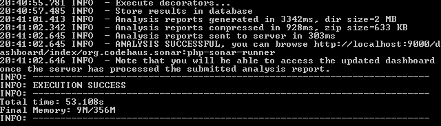
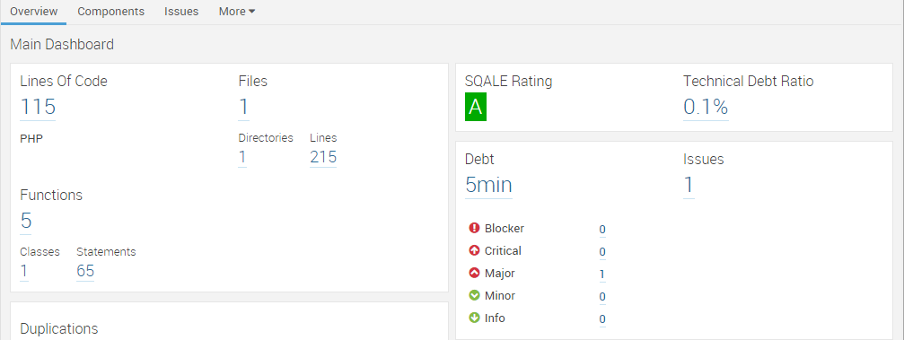
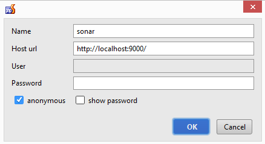
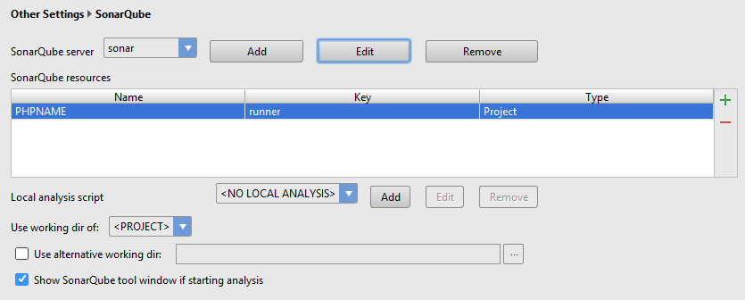
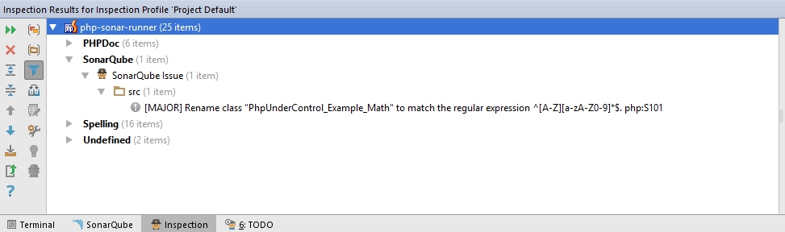

# SonarQube. Checking code quality

[origin]https://habr.com/ru/articles/259149

**SonarQube** is a platform for analyzing code quality based on rules and standards. It supports over 20 programming languages.
You can view the complete list of coding rules [here](http://nemo.sonarqube.org/coding_rules).

## SonarQube Installation

This guide explains how to integrate SonarQube with PhpStorm and your project on Windows. The steps are similar for other operating systems.
Get the latest version of SonarQube from the [official site](http://www.sonarqube.org/downloads/).
Extract the downloaded file into a folder.
```bash
C:\sonarqube
```

Download the plugin for your desired programming language from the [plugin library](http://docs.sonarqube.org/display/PLUG/Plugin+Library).
For PHP, download the [PHP plugin](http://docs.sonarqube.org/display/PLUG/PHP+Plugin) and place it in the plugins folder of SonarQube.
```bash
C:\sonarqube\extensions\plugins
```

Download the SonarQube Runner from the same [plugin library](http://docs.sonarqube.org/display/PLUG/Plugin+Library).
Add it to your system's environment variables if needed.
```bash
C:\sonar-runner
```

In your project's root folder, create a file named `sonar-project.properties` with the necessary configuration.
```bash
sonar.projectKey=runner // Unique key identifying the project (used for accessing results in the browser)
sonar.projectName=PHPNAME // The name of the project (visible in the SonarQube dashboard)
sonar.projectVersion=1.0 // Version number of the analysis (useful for tracking changes across releases)
sonar.sources=src // Paths to the source folders to be analyzed (comma-separated if multiple)
sonar.language=php // Programming language of the project 
sonar.dynamicAnalysis=false // Disable dynamic analysis (e.g., unit testing)
sonar.sourceEncoding=UTF-8 // Encoding of the source files (default: UTF-8) 
```

SonarQube requires Java Virtual Machine (JVM). Install it if it’s not already available.
Launch the SonarQube server.
```bash
 C:\sonarqube\bin\windows-x86-xx\StartSonar.bat
```

Run the Tests
Navigate to your project’s root folder and execute the SonarQube Runner.
If successful, a summary will appear.



Double-check your configuration file, especially paths to directories.
If the JVM runs out of memory, increase the allocated memory for the SonarQube daemon.
```bash
C:\sonarqube\conf\sonar.properties
```

```bash
%JAVA_EXEC% -Xmx1024m -XX:MaxPermSize=512m -XX:ReservedCodeCacheSize=128m %SONAR_RUNNER_OPTS%
```

After running the tests, visit the web interface to view results, including:
* Number of errors.
* Types of errors.
* Detailed explanations and solutions for each error.

```bash
http://localhost:9000/dashboard/index/runner
```




## SonarQube Plugin for PhpStorm

Open PhpStorm and navigate to `File → Settings → Plugins → Browse Repositories`.
Search for SonarQube, and install the plugin.
Go to `File → Settings → Other Settings → SonarQube`.
Add your SonarQube server configuration (click "Add" and input server details).



Click the green "+" icon.
Refresh the project list by clicking Download Resources, then select and add your project.



Inspect your code in PhpStorm: `Code → Inspect Code → Whole Project`.
Review and fix the errors detected based on SonarQube standards.



I hope this guide helps you improve your code quality with SonarQube and PhpStorm. Happy coding!
