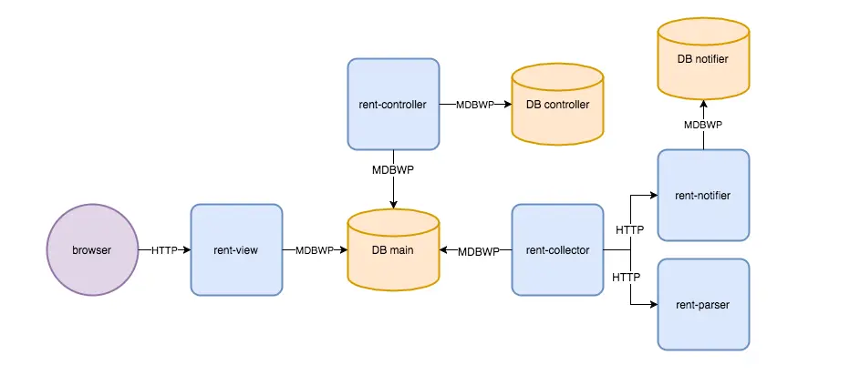
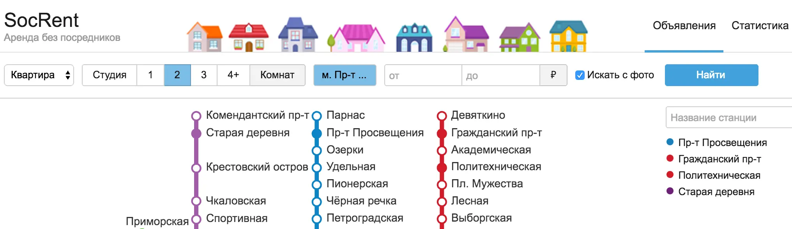
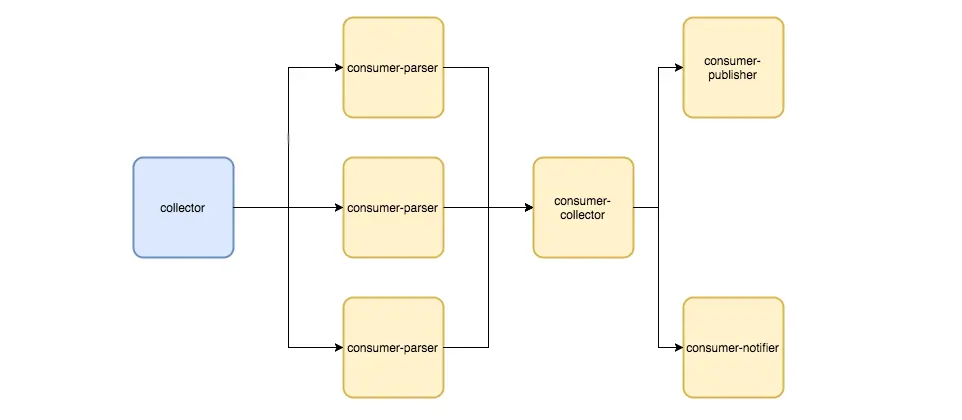
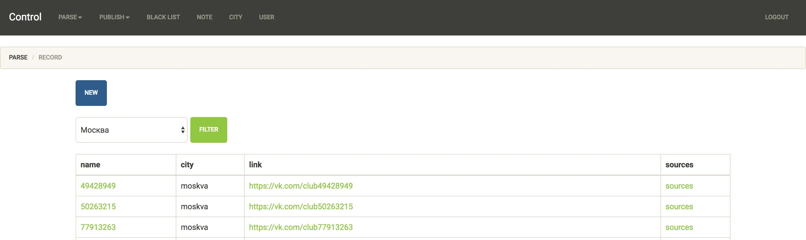
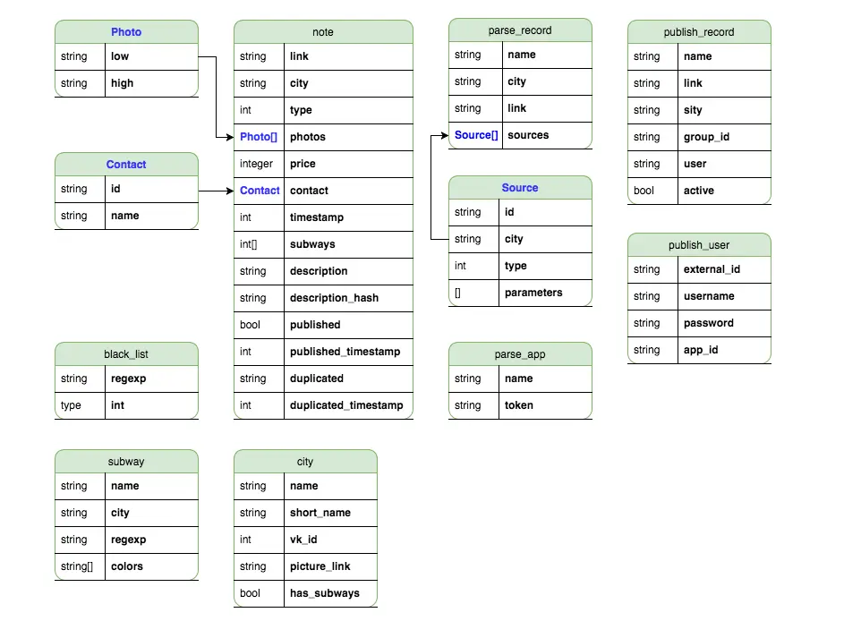

# Architecture of a service for collecting and classifying housing ads

[origin]https://habr.com/ru/articles/342220

In this article, I will talk about how the service for finding rental ads from vk.com is designed and developed, why a service-oriented architecture (SOA) was chosen, and what technologies and solutions were used during development.
The service has been running for over nine months.

During this time:
* The service expanded to cover 21 major Russian cities, including Moscow, Saint Petersburg, Yekaterinburg, and Kazan.
* The total number of metro stations increased from 65 to 346.
* The average number of ads grew from 131.2 to 519.41 per day.
* A settings management panel was added.
* Bots for Telegram and vk.com were introduced to automatically notify subscribers about new ads.

Throughout the article, I will use the word **service** to mean a SOA module, not the entire web service.

I chose a SOA architecture because it allowed:
* Using different technologies to solve specific tasks.
* Developing services independently of one another.
* Deploying services separately.
* Scaling services horizontally.

While it could be called a microservice architecture, there were some differences. Services exchange data using a "Shared Database" approach based on the MDBWP protocol instead of the traditional HTTP API with separate databases for each service. This approach enabled faster development while keeping the benefits of the SOA method.

To automate deployment, I chose Ansible, a configuration management tool with a low entry barrier.

As the database, I selected MongoDB. This document-oriented database was well-suited for storing rental ads, metro station lists, landlord contact information, and ad descriptions.

Currently, the overall interaction scheme of the services looks like this:



## Services

#### Service for displaying and searching ads



https://github.com/mrsuh/rent-view

This service is written in NodeJS because the most important quality criteria were fast server response times for users.
The service fetches ads from MongoDB, renders HTML pages using the doT.js templating engine, and sends them to the browser.
The service is built with Grunt.
For the browser, scripts are written in pure JS, and styles are created with LESS. Nginx is used as a proxy server to cache some responses and enable HTTPS connections.

#### Ad Collection Service



https://github.com/mrsuh/rent-collector

This service collects ads, classifies them, and saves them to the database.
It is written in PHP for several reasons: familiarity with the necessary libraries and fast development speed.
The framework used is Symfony 3.
Beanstalk was chosen as the queue service. It is lightweight but doesn't have its own message broker, making it ideal for a small virtual server and non-critical data.

Using Beanstalk, four message exchange channels were created:
* parser: Extracts facts like ad type, price, description, and links from the text. To speed up processing, multiple consumers were launched for this channel. Note: The consumer communicates with the rent-parser service.
* collector: Saves processed ad data to the database.
* notifier: Notifies users about new ads. Note: The consumer communicates with the rent-notifier service.
* publisher: Publishes ads in several vk groups.

#### Ad Classification Service

https://github.com/mrsuh/rent-parser

The service is written in Golang.
To extract structured data from text, the service uses the Tomita parser. It performs both preprocessing of the text and postprocessing of parsing results.
You can read more about ad classification in [this article](/articles/2017/classifying-housing-ads-in-search-of-the-best-solution/).

#### Settings Management Service



https://github.com/mrsuh/rent-control

The service is written in PHP for its familiarity with the required libraries and fast development speed.
Framework: Symfony 3
Style Library: Bootstrap 3

This service manages settings such as:
* Advertisements
* Blacklist
* Publishing configurations
* Parsing configurations

Originally, all parsing management data was stored in configuration files. However, as the number of cities grew, it became necessary to:
* Visualize the data
* Simplify editing records
* Make adding new parameters easier

#### Notification service

*Notification Example*


The Service is written in Golang

How it works:
* You subscribe to receive new ads.
* As new ads are added, the bot sends messages to you.
* Each message includes a link to the original ad.

## Helper Repositories

#### Code for the Shared Database in PHP

*Shared Database Schema*


https://github.com/mrsuh/rent-schema

When the rent-control service was added, database schema code started to duplicate across services. To avoid this, the schema code was moved to a separate package.
Now, any PHP service can easily use this package by adding it as a dependency with composer:
```bash
composer require mrsuh/rent-schema
```

#### ODM for mongoDB

https://github.com/mrsuh/mongo-odm

The first ODM for PHP MongoDB I considered was Doctrine 2. It comes with Symfony 3 and has excellent documentation.
However, at the time of building the service, for Doctrine 2 to work with the latest version of Mongo PHP drivers, you needed to install an additional package as a bridge between the new and old API. Doctrine 2 is already a large project, and adding another package made it even heavier.
I wanted something more lightweight. So, I decided to write my own ODM with a minimal set of features. And it worked! The ODM handles its tasks perfectly.

## Statistics

The service adds an average of **519.41** listings to the site every day.
The most popular metro stations in the largest cities of Russia are:
* Saint Petersburg: Devyatkino
* Moscow: Komsomolskaya
* Kazan: Prospekt Pobedy
* Yekaterinburg: Uralmash
* Nizhny Novgorod: Avtozavodskaya
* Novosibirsk: Ploshchad Marksa
* Samara: Moskovskaya

## Conclusion

If you are unsure whether you need SOA architecture, start by building a monolithic application with modular breakdowns. This way, it will be easier to transition to services if needed. However, if you choose to use SOA architecture, be aware that it may increase the complexity of development, deployment, the amount of code, and the volume of messages between services.

P.S. I found my last two apartments using my service. I hope it helps you too.
