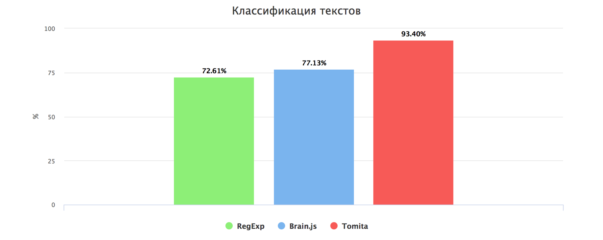
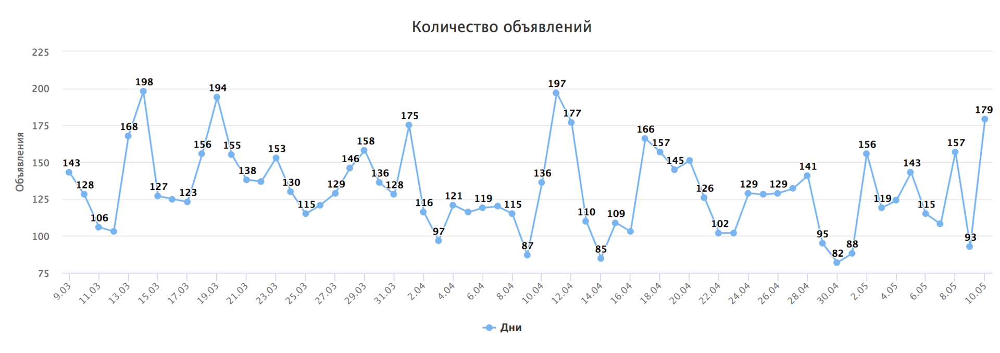
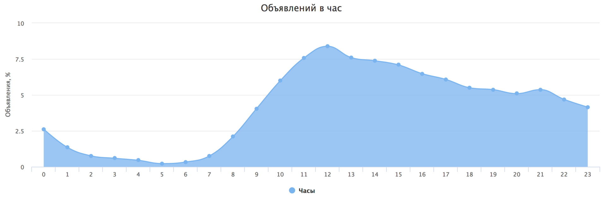

# Classifying listings from social networks: In search of the best solution

I’ll share how text classification helped me find an apartment, why I stopped using regular expressions and neural networks, and why I switched to a lexical analyzer.

About a year ago, I needed to find an apartment to rent. Most private listings are posted on social networks, where ads are written in free form, and there are no filters for searching. Manually browsing posts in various groups was slow and inefficient.

At that time, there were already a few services that collected ads from social networks and published them on websites. These services allowed you to see all the listings in one place. Unfortunately, they lacked filters for types of ads or prices. So, I decided to create my own service with the features I needed.

## Text Classification

### First Attempt (RegExp)

At first, I tried to solve the problem simply using regular expressions.

Besides writing the expressions themselves, I also had to process the results afterward. It was necessary to account for the number of matches and how they were positioned relative to each other. Another issue was processing text sentence by sentence—it was impossible to separate one sentence from another, so the entire text was processed at once.

As regular expressions and result processing became more complex, it got harder to improve the accuracy of the results in the test set.

*Examples of regular expressions used in the tests*
```yaml
- '/(комнат|\d.{0,10}комнат[^н])/u'
- '/(квартир\D{4})/u'
- '/(((^|\D)1\D{0,30}(к\.|кк|кв)|одноком|однуш)|(квартир\D{0,3}1(\D).{0,10}комнатн))/u'
- '/(((^|\D)2\D{0,30}(к\.|кк|кв)|двух.{0,5}к|двуш|двух.{5,10}(к\.|кк|кв))|(квартир\D{0,3}2(\D).{0,10}комнатн))/u'
- '/(((^|\D)3\D{0,30}(к\.|кк|кв)|тр(е|ё)х.{0,5}к|тр(е|ё)ш|тр(е|ё)х.{5,10}(к\.|кк|кв))|(квартир\D{0,3}3(\D).{0,10}комнатн))/u'
- '/(((^|\D)4\D{0,30}(к\.|кк|кв)|четыр\Sх)|(квартир\D{0,3}4(\D).{0,10}комнатн))/u'
- '/(студи)/u'
- '/(ищ.{1,5}сосед)/u'
- '/(сда|засел|подсел|свобо(ж|д))/u'
- '/(\?)$/u'</source>
```

This method gave **72.61%.** correct answers on the test set.

### Second Attempt (Neural Networks)

Recently, using machine learning for almost anything has become very popular. After training, it’s hard or even impossible to explain why a neural network makes certain decisions, but this doesn’t stop it from being successful in text classification. For the tests, I used a multilayer perceptron with backpropagation learning.
The following neural network libraries were used:
* [FANN](http://leenissen.dk/fann/wp) - written in C
* [Brain](https://github.com/harthur/brain) - written in JavaScript

The challenge was converting texts of varying lengths into a format suitable for input into a neural network with a fixed number of inputs.
To do this, I extracted n-grams (sequences of more than 2 characters) that appeared in more than 15% of the texts from the test dataset. There were slightly over 200 such n-grams.

*Example of n-grams*
```yaml
- /ные/u
- /уютн/u
- /доб/u
- /кон/u
- /пол/u
- /але/u
- /двух/u
- /так/u
- /даю/u
```

To classify one ad, the program searched for n-grams in the text, determined their positions, and sent this data to the neural network. The values were scaled between 0 and 1.
This method gave **77.13%** correct answers on the test set (but tests were done on the same dataset used for training).

I’m sure that with a much larger dataset and using recurrent neural networks, it would be possible to get much better results.

### Third Attempt (Syntax Analyzer)

At the same time, I started reading more articles about [natural language processing](https://en.wikipedia.org/wiki/Natural_language_processing) and found a great parser called [Tomita](https://tech.yandex.ru/tomita). Its main advantage over other similar tools is that it supports the Russian language and has clear documentation. You can even use regular expressions in the configuration, which was useful because I already had some written.

Essentially, Tomita is a much more advanced version of the approach using regular expressions but far more powerful and user-friendly. However, it also required preprocessing the text. Social media posts often don't follow grammatical or syntactical rules, so the parser struggles with tasks like splitting text into sentences, breaking sentences into lexemes, and normalizing words.

*Example configuration*
```bash
#encoding "utf8"
#GRAMMAR_ROOT ROOT

Rent -> Word<kwset=[rent, populate]>;
Flat -> Word<kwset=[flat]> interp (+FactRent.Type="квартира");
AnyWordFlat -> AnyWord<kwset=~[rent, populate, studio, flat, room, neighbor, search, number, numeric]>;

ROOT -> Rent AnyWordFlat* Flat { weight=1 };</source>
```

All configurations can be found [here](https://github.com/mrsuh/rent-parser/tree/master/tomita). This method gave **93.40%** correct answers on the test set.
In addition to classifying text, it also extracts facts like rent price, apartment size, metro station, and phone number.
In the end, with a small test set and the need for high accuracy, it was better to write algorithms manually.



## Service Development

While working on text classification, several services were created to collect ads and display them in a user-friendly way.

https://github.com/mrsuh/rent-view
This service handles ad display.
Features:
* NodeJS
* doT.js
* MongoDB

https://github.com/mrsuh/rent-collector
This service collects ads. It was designed to gather data from various sources, but almost all ads are posted on vk.com. Since vk.com has an excellent API, it was easy to collect ads from walls and discussions in public groups.
Features:
* PHP
* Symfony3
* MongoDB

https://github.com/mrsuh/rent-parser
This service classifies ads. Essentially, it’s a wrapper around the parser but also does text preprocessing and post-processing of parsing results.
Features:
* Go
* Tomita parser

CI is set up for all services using Travis-CI and Ansible. More details about automated deployment can be found in [this article](https://mrsuh.com/articles/2017/continuous-delivery-with-travis-ci-and-ansible/).

## Statistics

The service has been running for about two months for Saint-Petersburg and has collected over 8000 ads during this time. Here's some interesting data from the ads collected so far:

On average, *131.2* ads (or texts classified as ads) are added daily.


The busiest hour for posting is 12 PM.


The most popular metro station is "Девяткино".


## Conclusions

If you don’t have a large dataset to train a network but need high accuracy, it’s better to use custom-written algorithms.
If you want to try solving a similar task, you can find a test dataset with *8000* texts and their types [here](https://github.com/mrsuh/rent-parser/tree/master/tests).
