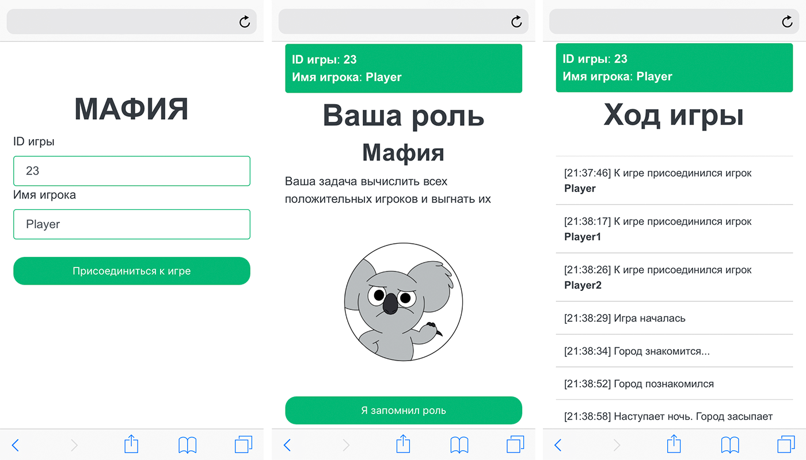

# Mafia with Go, Vanila JS, and WebSockets

[origin]https://habr.com/ru/articles/423821



This is a web version of the popular card game [Mafia](https://en.wikipedia.org/wiki/Mafia_(party_game)). The project was created for fun and to learn more about making games. 
The first version was built in two weeks during free time, and then rewritten in another two weeks. A key feature is that the game works without a host.

### Must-Have Features:

* A basic working game that follows the classic Mafia rules.
* Voice instructions for players on their devices.
* The game continues even after a browser tab is reloaded.

### Optional or Postponed Features:

* Player registration.
* An admin interface.
* Storing game data in a database.
* Time synchronization between devices.

### Backend

[https://github.com/mrsuh/mafia-backend](https://github.com/mrsuh/mafia-backend)
Written in Go. It manages the game state and logic.

`Game Info API`: Players can request game information:
```bash
curl 'http://127.0.0.1:8000/info?game=23' | python -m json.tool
```
Example response:
```json
{
    "event": "greet_mafia",
    "event_status": 2,
    "id": 23,
    "is_over": false,
    "iter": 1,
    "players": [
        {
            "addr": "172.18.0.1:51438",
            "createdAt": "2018-09-23T14:39:29.631475779Z",
            "id": 33309,
            "name": "Anton",
            "role": 4
        },
        {
            "addr": "172.18.0.1:51440",
            "createdAt": "2018-09-23T14:39:32.867080927Z",
            "id": 5457,
            "name": "username:0",
            "role": 2
        },
        {
            "addr": "172.18.0.1:51442",
            "createdAt": "2018-09-23T14:39:32.882463945Z",
            "id": 14214,
            "name": "username:2",
            "role": 1
        },
        {
            "addr": "172.18.0.1:51444",
            "createdAt": "2018-09-23T14:39:32.895209072Z",
            "id": 63759,
            "name": "username:1",
            "role": 3
        }
    ],
    "win": 0
}
```

`Server Health API`: You can check the server status:
```bash
curl 'http://127.0.0.1:8000/health' | python -m json.tool
```
Example response:
```json
    "runtime.MemStats.Alloc": 764752,
    "runtime.MemStats.NumGC": 0,
    "runtime.MemStats.Sys": 4165632,
    "runtime.MemStats.TotalAlloc": 764752,
    "runtime.NumGoroutine": 14
```

The server checks if players are still active. If a player doesn't respond in time, they are removed. However, if they reconnect within the time limit (e.g., due to network issues), they can continue playing.
The backend is tested with Go’s built-in testing tools:
```bash
go test mafia-backend/src -cover
ok      mafia-backend/src       1.315s  coverage: 70.7% of statements
```

### Frontend

[https://github.com/mrsuh/mafia-frontend](https://github.com/mrsuh/mafia-frontend)
The frontend has no game logic. It renders pages and plays event sounds based on backend messages.
Game ID and player ID are stored in LocalStorage or the browser’s query string (useful for running multiple tabs for different players).
Sound playback is handled by a single JavaScript Audio object. Players must click a button to enable sound. After that, the src of the object can change to play different sounds automatically.

You can simulate the game with bots by opening a browser tab with the following URL:
```bash
http://127.0.0.1?master=1&test=1&sound=0&testUsersCount=5
```
This will open 5 new tabs for bot players, and they will play the game automatically.

### Communication Protocol

The backend and frontend use WebSockets for real-time two-way communication.
The game is divided into events like this:
```json
{
  "game": ["create", "join", "start", "over", "reconnect"],
  "day": ["start"],
  "night": ["start"],
  "citizens-greeting": ["start", "role", "end"],
  "mafia-greeting": ["start", "players", "end"],
  "court": ["start", "players", "end"],
  "mafia": ["start", "players", "end"],
  "doctor": ["start", "players", "end"],
  "girl": ["start", "players", "end"],
  "sherif": ["start", "players", "end"]
}
```

Events have a start, content, and end. Notifications are sent to all players at the beginning and end of each event. The game continues only after all active players confirm the event (e.g., after a sound finishes playing). 

### Docker Setup

You can run the entire game using Docker with this `docker-compose.yml` file:
`docker-compose.yml`
```yaml
version: '3'

services:
  mafia-frontend:
    image: mrsuh/mafia-frontend:latest
    container_name: mafia_frontend
    ports:
      - 9080:80

  mafia-backend:
    image: mrsuh/mafia-backend:latest
    container_name: mafia_backend
    ports:
      - 8000:8000
```

Run the command:
```bash
docker-compose up
```

Open the game in your browser:
```bash
http://127.0.0.1:9080
```

### Заключение

Here is a video of the game in action (1.5x speed):
<iframe class="rounded" src="https://www.youtube.com/embed/u4B-5DpXbwA?si=K8UWIAVTW7VyTKrx" title="YouTube video player" frameborder="0" allow="accelerometer; autoplay; clipboard-write; encrypted-media; gyroscope; picture-in-picture; web-share" referrerpolicy="strict-origin-when-cross-origin" allowfullscreen></iframe>

After a month of development in free time, the result is a stable game that works well with friends. It handles page reloads and network interruptions gracefully. Events play with sound on client devices, though without time synchronization. Further development is not planned.

P.S. Thanks to Lera for the game voiceovers!
