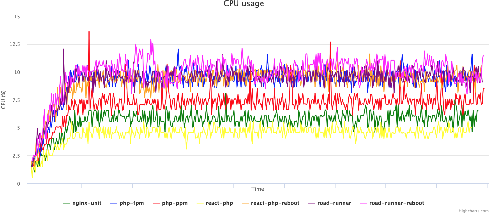
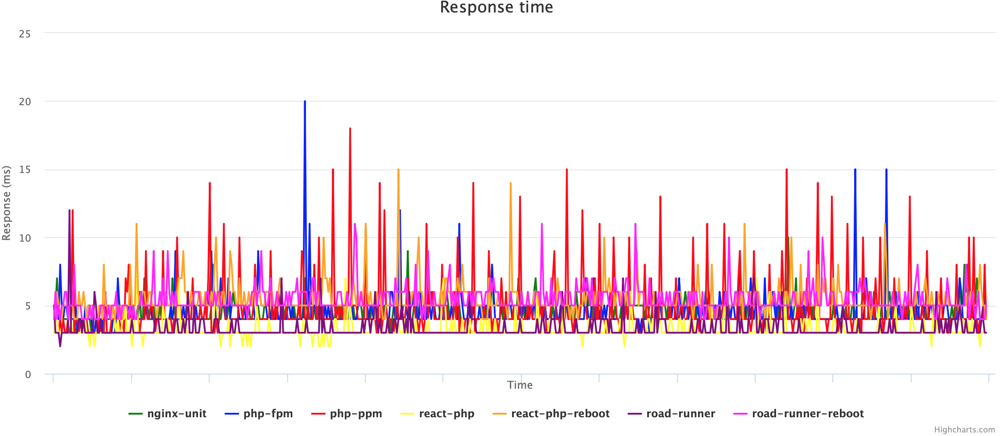
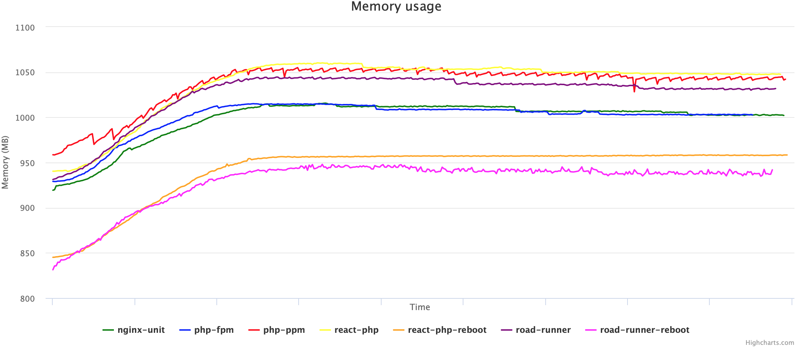
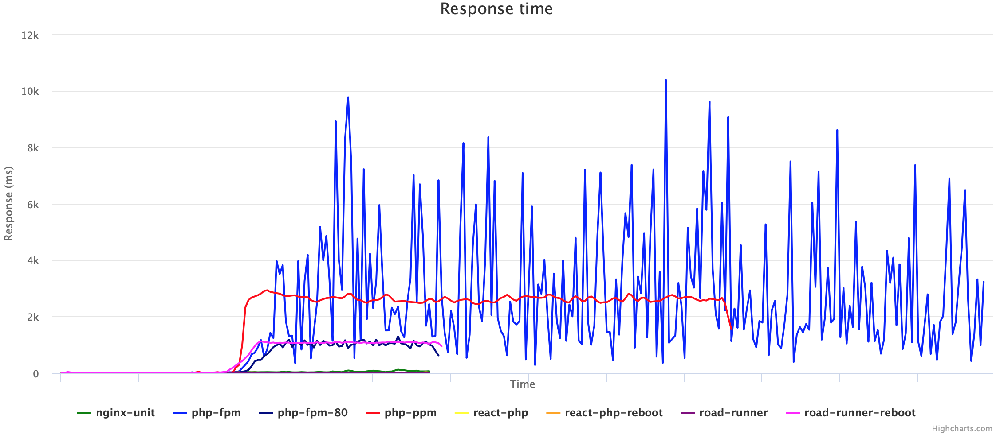
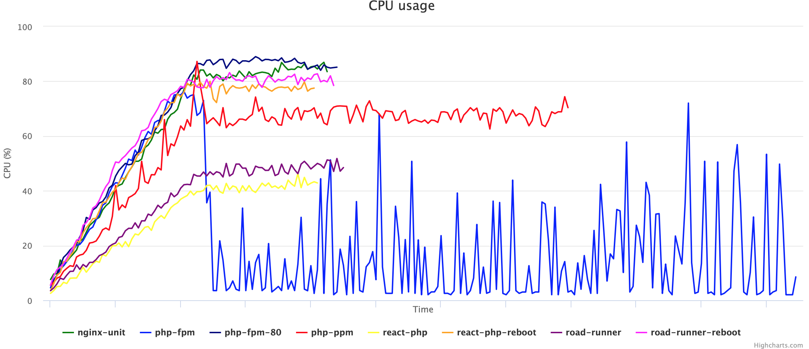
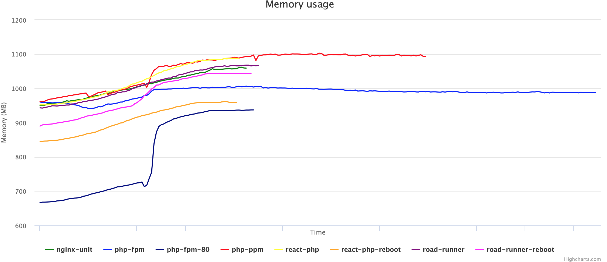
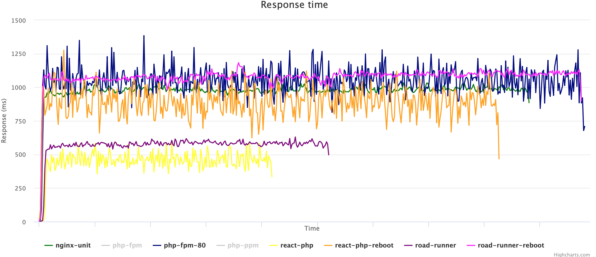
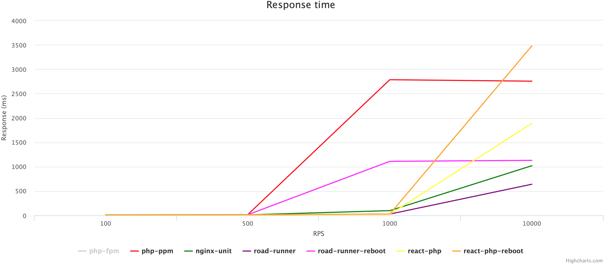
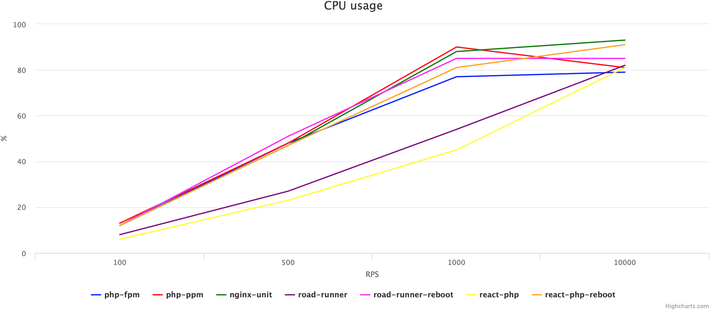

# Comparing PHP FPM, PHP PPM, Nginx Unit, React PHP, and RoadRunner

[origin]https://habr.com/ru/articles/431818

Testing was conducted using Yandex Tank.
Symfony 4 and PHP 7.2 were used as the application.
The goal was to compare the performance of the services under different loads and identify the optimal solution.
For convenience, everything was packaged into Docker containers and launched with docker-compose.
The source code is available [here](https://github.com/mrsuh/php-load-test).
All command examples mentioned in the article should be run from the project directory.

## Application
The application runs on Symfony 4 and PHP 7.2.
It responds to only one route and returns:
* random number;
* environment;
* process pid;
* application name;
* php.ini variables.

Response example:
```bash
curl 'http://127.0.0.1:8000/' | python -m json.tool
{
    "env": "prod",
    "type": "php-fpm",
    "pid": 8,
    "random_num": 37264,
    "php": {
        "version": "7.2.12",
        "date.timezone": "Europe/Paris",
        "display_errors": "",
        "error_log": "/proc/self/fd/2",
        "error_reporting": "32767",
        "log_errors": "1",
        "memory_limit": "256M",
        "opcache.enable": "1",
        "opcache.max_accelerated_files": "20000",
        "opcache.memory_consumption": "256",
        "opcache.validate_timestamps": "0",
        "realpath_cache_size": "4096K",
        "realpath_cache_ttl": "600",
        "short_open_tag": ""
    }
}
```

Each container is configured with PHP:
* OPcache enabled;
* bootstrap cache configured using Composer;
* php.ini settings aligned with [Symfony's best practices](https://symfony.com/doc/current/performance.html#performance-install-apcu-polyfill).

Logs are written to stderr:
/config/packages/prod/monolog.yaml
```yaml
monolog:
    handlers:
        main:
            type: stream
            path: "php://stderr"
            level: error
        console:
            type: console
```

The cache is stored in /dev/shm:
/src/Kernel.php
```php
...
class Kernel extends BaseKernel
{
    public function getCacheDir()
    {
        if ($this->environment === 'prod') {
            return '/dev/shm/symfony-app/cache/' . $this->environment;
        } else {
            return $this->getProjectDir() . '/var/cache/' . $this->environment;
        }
    }
}
...
```

Each docker-compose setup includes three main containers:
* nginx - reverse proxy server;
* app - the prepared application code with all dependencies;
* PHP FPM / Nginx Unit / RoadRunner / ReactPHP - the application server.

Request handling is limited to two application instances (equal to the number of CPU cores).

## Services

### PHP FPM

[PHP Process Manager](https://www.php.net/manual/en/install.fpm.php). Written in C.

Pros:
* no need to monitor memory usage.
* no changes required in the application.

Cons:
* PHP initializes variables for every request.

Command to run the application with docker-compose:
```bash
cd docker/php-fpm && docker-compose up -d
```

### PHP PPM

[PHP Process Manager](https://github.com/php-pm/php-pm). Written in PHP.

Pros:
* initializes variables once and reuses them afterward.
* no changes required in the application (ready-made modules available for Symfony, Laravel, Zend, and CakePHP).

Cons:
* requires memory management.

Command to run the application with docker-compose:
```bash
cd docker/php-ppm && docker-compose up -d
```

### Nginx Unit

[Application Server by the Nginx Team](https://unit.nginx.org). Written in C

Pros:
* configuration can be modified via HTTP API.
* allows running multiple instances of the same application with different configurations and language versions simultaneously.
* no need to manage memory.
* no changes required in the application.

Cons:
* PHP initializes variables for each request.

To pass environment variables from the Nginx Unit configuration file, you need to adjust the php.ini:
```ini
; Nginx Unit
variables_order=E
```

Command to run the application with docker-compose:
```bash
cd docker/nginx-unit && docker-compose up -d
```

### React PHP

[Event-Driven Programming Library](https://reactphp.org). Written in PHP.

Pros:
* the library allows you to write a server that initializes variables only once and then continues to reuse them.

Cons:
* requires custom server implementation.
* memory management is necessary.

If you use the `--reboot-kernel-after-request` flag for the worker, the Symfony Kernel will reinitialize for each request. With this approach, memory management is no longer required.

```php
#!/usr/bin/env php

<?php

use App\Kernel;
use Symfony\Component\Debug\Debug;
use Symfony\Component\HttpFoundation\Request;

require __DIR__ . '/../config/bootstrap.php';

$env   = $_SERVER['APP_ENV'] ?? $_ENV['APP_ENV'] ?? 'dev';
$debug = (bool)($_SERVER['APP_DEBUG'] ?? $_ENV['APP_DEBUG'] ?? ('prod' !== $env));

if ($debug) {
    umask(0000);

    Debug::enable();
}

if ($trustedProxies = $_SERVER['TRUSTED_PROXIES'] ?? $_ENV['TRUSTED_PROXIES'] ?? false) {
    Request::setTrustedProxies(explode(',', $trustedProxies), Request::HEADER_X_FORWARDED_ALL ^ Request::HEADER_X_FORWARDED_HOST);
}

if ($trustedHosts = $_SERVER['TRUSTED_HOSTS'] ?? $_ENV['TRUSTED_HOSTS'] ?? false) {
    Request::setTrustedHosts(explode(',', $trustedHosts));
}

$loop   = React\EventLoop\Factory::create();
$kernel = new Kernel($env, $debug);
$kernel->boot();
$rebootKernelAfterRequest = in_array('--reboot-kernel-after-request', $argv);

/** @var \Psr\Log\LoggerInterface $logger */
$logger = $kernel->getContainer()->get('logger');
$server = new React\Http\Server(function (Psr\Http\Message\ServerRequestInterface $request) use ($kernel, $logger, $rebootKernelAfterRequest) {

    $method  = $request->getMethod();
    $headers = $request->getHeaders();
    $content = $request->getBody();
    $post    = [];
    if (in_array(strtoupper($method), ['POST', 'PUT', 'DELETE', 'PATCH']) &&
        isset($headers['Content-Type']) && (0 === strpos($headers['Content-Type'], 'application/x-www-form-urlencoded'))
    ) {
        parse_str($content, $post);
    }
    $sfRequest = new Symfony\Component\HttpFoundation\Request(
        $request->getQueryParams(),
        $post,
        [],
        $request->getCookieParams(),
        $request->getUploadedFiles(),
        [],
        $content
    );
    $sfRequest->setMethod($method);
    $sfRequest->headers->replace($headers);
    $sfRequest->server->set('REQUEST_URI', $request->getUri());

    if (isset($headers['Host'])) {
        $sfRequest->server->set('SERVER_NAME', current($headers['Host']));
    }

    try {
        $sfResponse = $kernel->handle($sfRequest);
    } catch (\Exception $e) {
        $logger->error('Internal server error', ['error' => $e->getMessage(), 'trace' => $e->getTraceAsString()]);
        $sfResponse = new \Symfony\Component\HttpFoundation\Response('Internal server error', 500);
    } catch (\Throwable $e) {
        $logger->error('Internal server error', ['error' => $e->getMessage(), 'trace' => $e->getTraceAsString()]);
        $sfResponse = new \Symfony\Component\HttpFoundation\Response('Internal server error', 500);
    }

    $kernel->terminate($sfRequest, $sfResponse);
    if ($rebootKernelAfterRequest) {
        $kernel->reboot(null);
    }

    return new React\Http\Response(
        $sfResponse->getStatusCode(),
        $sfResponse->headers->all(),
        $sfResponse->getContent()
    );
});

$server->on('error', function (\Exception $e) use ($logger) {
    $logger->error('Internal server error', ['error' => $e->getMessage(), 'trace' => $e->getTraceAsString()]);
});

$socket = new React\Socket\Server('tcp://0.0.0.0:9000', $loop);
$server->listen($socket);

$logger->info('Server running', ['addr' => 'tcp://0.0.0.0:9000']);

$loop->run();
```

Command to run the application with docker-compose:
```bash
cd docker/react-php && docker-compose up -d --scale php=2
```

### Road Runner

[Web Server and PHP Process Manager](https://github.com/spiral/roadrunner/wiki/About-RoadRunner). Written in Go

Pros:
* you can write a worker that initializes variables only once and continues to reuse them.

Cons:
* custom worker implementation is required.
* memory management is necessary.

* If the `--reboot-kernel-after-request` flag is used for the worker, the Symfony Kernel will reinitialize for every request. This eliminates the need for memory management.

```php
#!/usr/bin/env php

<?php

use App\Kernel;
use Spiral\Goridge\SocketRelay;
use Spiral\RoadRunner\PSR7Client;
use Spiral\RoadRunner\Worker;
use Symfony\Bridge\PsrHttpMessage\Factory\DiactorosFactory;
use Symfony\Bridge\PsrHttpMessage\Factory\HttpFoundationFactory;
use Symfony\Component\Debug\Debug;
use Symfony\Component\HttpFoundation\Request;

require __DIR__ . '/../config/bootstrap.php';

$env   = $_SERVER['APP_ENV'] ?? $_ENV['APP_ENV'] ?? 'dev';
$debug = (bool)($_SERVER['APP_DEBUG'] ?? $_ENV['APP_DEBUG'] ?? ('prod' !== $env));

if ($debug) {
    umask(0000);

    Debug::enable();
}

if ($trustedProxies = $_SERVER['TRUSTED_PROXIES'] ?? $_ENV['TRUSTED_PROXIES'] ?? false) {
    Request::setTrustedProxies(explode(',', $trustedProxies), Request::HEADER_X_FORWARDED_ALL ^ Request::HEADER_X_FORWARDED_HOST);
}

if ($trustedHosts = $_SERVER['TRUSTED_HOSTS'] ?? $_ENV['TRUSTED_HOSTS'] ?? false) {
    Request::setTrustedHosts(explode(',', $trustedHosts));
}

$kernel = new Kernel($env, $debug);
$kernel->boot();
$rebootKernelAfterRequest = in_array('--reboot-kernel-after-request', $argv);
$relay                    = new SocketRelay('/tmp/road-runner.sock', null, SocketRelay::SOCK_UNIX);
$psr7                     = new PSR7Client(new Worker($relay));
$httpFoundationFactory    = new HttpFoundationFactory();
$diactorosFactory         = new DiactorosFactory();

while ($req = $psr7->acceptRequest()) {
    try {
        $request  = $httpFoundationFactory->createRequest($req);
        $response = $kernel->handle($request);
        $psr7->respond($diactorosFactory->createResponse($response));
        $kernel->terminate($request, $response);
        if($rebootKernelAfterRequest) {
            $kernel->reboot(null);
        }
    } catch (\Throwable $e) {
        $psr7->getWorker()->error((string)$e);
    }
}
```

Command to run the application with docker-compose:
```bash
cd docker/road-runner && docker-compose up -d
```

## Testing

The testing was conducted using Yandex Tank. The application and Yandex Tank were on different virtual servers.

Specifications of the virtual server with the application:
**Virtualization**: KVM
**CPU**: 2 cores
**RAM**: 4096 MB
**SSD**: 50 GB
**Connection**: 100MBit
**OS**: CentOS 7 (64x)

Services:
* php-fpm
* php-ppm
* nginx-unit
* road-runner
* road-runner-reboot (with `--reboot-kernel-after-request` flag)
* react-php
* react-php-reboot (with `--reboot-kernel-after-request` flag)

For the 1000/10000 rps tests, the php-fpm-80 service was added.
The php-fpm configuration used for it was:
```ini
pm = dynamic
pm.max_children = 80
```

Yandex Tank decides beforehand how many times it needs to hit the target and doesn't stop until it runs out of "ammo." Depending on how quickly the service responds, the test may take longer than the time specified in the configuration. As a result, the graphs for different services may have different lengths. The slower the service responds, the longer its graph will be.
For each service and configuration, Yandex Tank ran only one test. So, the numbers may not be exact. The goal was to compare the performance of the services against each other.

## 100 rps
### Phantom Yandex Tank configuration
```yaml
phantom:
    load_profile:
        load_type: rps
        schedule: line(1, 100, 60s) const(100, 540s)
```

### Here are the links to the detailed report
* php-fpm https://overload.yandex.net/150666
* php-ppm https://overload.yandex.net/150670
* nginx-unit https://overload.yandex.net/150675
* road-runner https://overload.yandex.net/150681
* road-runner-reboot https://overload.yandex.net/151961
* react-php https://overload.yandex.net/150697
* react-php-reboot https://overload.yandex.net/152063

### Response Time Percentiles
|                    | 95%(ms) | 90%(ms) | 80%(ms) | 50%(ms) | HTTP OK(%) | HTTP OK(count) |
| ------------------ | ------- | ------- | ------- | ------- | ---------- | -------------- |
| php-fpm            | 9.9     | 6.3     | 4.35    | 3.59    | 100        | 57030          |
| php-ppm            | 9.4     | 6       | 3.88    | 3.16    | 100        | 57030          |
| nginx-unit         | 11      | 6.6     | 4.43    | 3.69    | 100        | 57030          |
| road-runner        | 8.1     | 5.1     | 3.53    | 2.92    | 100        | 57030          |
| road-runner-reboot | 12      | 8.6     | 5.3     | 3.85    | 100        | 57030          |
| react-php          | 8.5     | 4.91    | 3.29    | 2.74    | 100        | 57030          |
| react-php-reboot   | 13      | 8.5     | 5.5     | 3.95    | 100        | 57030          |

### Monitoring
|                    | cpu median(%) | cpu max(%) | memory median(MB) | memory max(MB) |
| ------------------ | ------------- | ---------- | ----------------- | -------------- |
| php-fpm            | 9.15          | 12.58      | 880.32            | 907.97         |
| php-ppm            | 7.08          | 13.68      | 901.72            | 913.80         |
| nginx-unit         | 9.56          | 12.54      | 923.02            | 943.90         |
| road-runner        | 5.57          | 8.61       | 992.71            | 1,001.46       |
| road-runner-reboot | 9.18          | 12.67      | 848.43            | 870.26         |
| react-php          | 4.53          | 6.58       | 1,004.68          | 1,009.91       |
| react-php-reboot   | 9.61          | 12.67      | 885.92            | 892.52         |

### Charts

Chart 1.1 Average Response Time per Second

Chart 1.2 Average CPU Load per Second

Chart 1.3 Average Memory Usage per Second

## 500 rps
### Phantom Yandex Tank configuration
```yaml
phantom:
    load_profile:
        load_type: rps
        schedule: line(1, 500, 60s) const(500, 540s)
```

### Here are the links to the detailed report
* php-fpm https://overload.yandex.net/150705
* php-ppm https://overload.yandex.net/150710
* nginx-unit https://overload.yandex.net/150711
* road-runner https://overload.yandex.net/150715
* road-runner-reboot https://overload.yandex.net/152011
* react-php https://overload.yandex.net/150717
* react-php-reboot https://overload.yandex.net/152064

### Response Time Percentiles

|                    | 95%(ms) | 90%(ms) | 80%(ms) | 50%(ms) | HTTP OK(%) | HTTP OK(count) |
| ------------------ | ------- | ------- | ------- | ------- | ---------- | -------------- |
| php-fpm            | 13      | 8.4     | 5.3     | 3.69    | 100        | 285030         |
| php-ppm            | 15      | 9       | 4.72    | 3.24    | 100        | 285030         |
| nginx-unit         | 12      | 8       | 5.5     | 3.93    | 100        | 285030         |
| road-runner        | 9.6     | 6       | 3.71    | 2.83    | 100        | 285030         |
| road-runner-reboot | 14      | 11      | 7.1     | 4.45    | 100        | 285030         |
| react-php          | 9.3     | 5.8     | 3.57    | 2.68    | 100        | 285030         |
| react-php-reboot   | 15      | 12      | 7.2     | 4.21    | 100        | 285030         |

### Monitoring

|                    | cpu median(%) | cpu max(%) | memory median(MB) | memory max(MB) |
|--------------------|---------------|------------|-------------------|----------------|
| php-fpm            | 41.68         | 48.33      | 1,006.06          | 1,015.09       |
| php-ppm            | 33.90         | 48.90      | 1,046.32          | 1,055.00       |
| nginx-unit         | 42.13         | 47.92      | 1,006.67          | 1,015.73       |
| road-runner        | 24.08         | 28.06      | 1,035.86          | 1,044.58       |
| road-runner-reboot | 46.23         | 52.04      | 939.63            | 948.08         |
| react-php          | 19.57         | 23.42      | 1,049.83          | 1,060.26       |
| react-php-reboot   | 41.30         | 47.89      | 957.01            | 958.56         |

### Charts

Chart 2.1 Average Response Time per Second

Chart 2.2 Average CPU Load per Second

Chart 2.3 Average Memory Usage per Second

## 1000 rps
### Phantom Yandex Tank configuration
```yaml
phantom:
    load_profile:
        load_type: rps
        schedule: line(1, 1000, 60s) const(1000, 60s)
```
### Here are the links to the detailed report
* php-fpm https://overload.yandex.net/150841
* php-fpm-80 https://overload.yandex.net/153612
* php-ppm https://overload.yandex.net/150842
* nginx-unit https://overload.yandex.net/150843
* road-runner https://overload.yandex.net/150844
* road-runner-reboot https://overload.yandex.net/152068
* react-php https://overload.yandex.net/150846
* react-php-reboot https://overload.yandex.net/152065

### Response Time Percentiles
|                    | 95%(ms) | 90%(ms) | 80%(ms) | 50%(ms) | HTTP OK(%) | HTTP OK(count) |
| ------------------ | ------- | ------- | ------- | ------- | ---------- | -------------- |
| php-fpm            | 11050   | 11050   | 9040    | 195     | 80.67      | 72627          |
| php-fpm-80         | 3150    | 1375    | 1165    | 152     | 99.85      | 89895          |
| php-ppm            | 2785    | 2740    | 2685    | 2545    | 100        | 90030          |
| nginx-unit         | 98      | 80      | 60      | 21      | 100        | 90030          |
| road-runner        | 27      | 15      | 7.1     | 3.21    | 100        | 90030          |
| road-runner-reboot | 1110    | 1100    | 1085    | 1060    | 100        | 90030          |
| react-php          | 23      | 13      | 5.6     | 2.86    | 100        | 90030          |
| react-php-reboot   | 28      | 24      | 19      | 11      | 100        | 90030          |

### Monitoring
|                    | cpu median(%) | cpu max(%) | memory median(MB) | memory max(MB) |
| ------------------ | ------------- | ---------- | ----------------- | -------------- |
| php-fpm            | 12.66         | 78.25      | 990.16            | 1,006.56       |
| php-fpm-80         | 83.78         | 91.28      | 746.01            | 937.24         |
| php-ppm            | 66.16         | 91.20      | 1,088.74          | 1,102.92       |
| nginx-unit         | 78.11         | 88.77      | 1,010.15          | 1,062.01       |
| road-runner        | 42.93         | 54.23      | 1,010.89          | 1,068.48       |
| road-runner-reboot | 77.64         | 85.66      | 976.44            | 1,044.05       |
| react-php          | 36.39         | 46.31      | 1,018.03          | 1,088.23       |
| react-php-reboot   | 72.11         | 81.81      | 911.28            | 961.62         |

### Charts

Chart 3.1 Average Response Time per Second

Chart 3.2 Average Response Time per Second (без php-fpm, php-ppm, road-runner-reboot)

Chart 3.3 Average CPU Load per Second

Chart 3.4 Average Memory Usage per Second

## 10000 rps
### Phantom Yandex Tank configuration
```yaml
phantom:
    load_profile:
        load_type: rps
        schedule: line(1, 10000, 30s) const(10000, 30s)
```

### Here are the links to the detailed report
* php-fpm https://overload.yandex.net/150849
* php-fpm-80 https://overload.yandex.net/153615
* php-ppm https://overload.yandex.net/150874
* nginx-unit https://overload.yandex.net/150876
* road-runner https://overload.yandex.net/150881
* road-runner-reboot https://overload.yandex.net/152069
* react-php https://overload.yandex.net/150885
* react-php-reboot https://overload.yandex.net/152066

### Response Time Percentiles
|                    | 95%(ms) | 90%(ms) | 80%(ms) | 50%(ms) | HTTP OK(%) | HTTP OK(count) |
| ------------------ | ------- | ------- | ------- | ------- | ---------- | -------------- |
| php-fpm            | 11050   | 11050   | 11050   | 1880    | 70.466     | 317107         |
| php-fpm-80         | 3260    | 3140    | 1360    | 1145    | 99.619     | 448301         |
| php-ppm            | 2755    | 2730    | 2695    | 2605    | 100        | 450015         |
| nginx-unit         | 1020    | 1010    | 1000    | 980     | 100        | 450015         |
| road-runner        | 640     | 630     | 615     | 580     | 100        | 450015         |
| road-runner-reboot | 1130    | 1120    | 1110    | 1085    | 100        | 450015         |
| react-php          | 1890    | 1090    | 1045    | 58      | 99.996     | 449996         |
| react-php-reboot   | 3480    | 3070    | 1255    | 91      | 99.72      | 448753         |

### Monitoring
|                    | cpu median(%) | cpu max(%) | memory median(MB) | memory max(MB) |
| ------------------ | ------------- | ---------- | ----------------- | -------------- |
| php-fpm            | 5.57          | 79.35      | 984.47            | 998.78         |
| php-fpm-80         | 85.05         | 92.19      | 936.64            | 943.93         |
| php-ppm            | 66.86         | 82.41      | 1,089.31          | 1,097.41       |
| nginx-unit         | 86.14         | 93.94      | 1,067.71          | 1,069.52       |
| road-runner        | 73.41         | 82.72      | 1,129.48          | 1,134.00       |
| road-runner-reboot | 80.32         | 86.29      | 982.69            | 984.80         |
| react-php          | 73.76         | 82.18      | 1,101.71          | 1,105.06       |
| react-php-reboot   | 85.77         | 91.92      | 975.85            | 978.42         |


Chart 4.1 Average Response Time per Second

Chart 4.2 Average Response Time per Second (без php-fpm, php-ppm)

Chart 4.3 Average CPU Load per Second

Chart 4.4 Average Memory Usage per Second

## Summary

Here are the graphs showing how the performance characteristics of services change depending on the load. When viewing the graphs, keep in mind that not all services responded to 100% of the requests.


Chart 5.1 95% response time percentile

Chart 5.2 95% response time percentile (without php-fpm)

Chart 5.3 Maximum CPU load

Chart 5.4 Maximum memory usage

In my opinion, the optimal solution (without changing the code) is the Nginx Unit process manager. It shows good performance in response times and has support from the company.
In any case, the approach to development and the tools should be chosen individually, depending on your load, server resources, and the capabilities of your developers.
