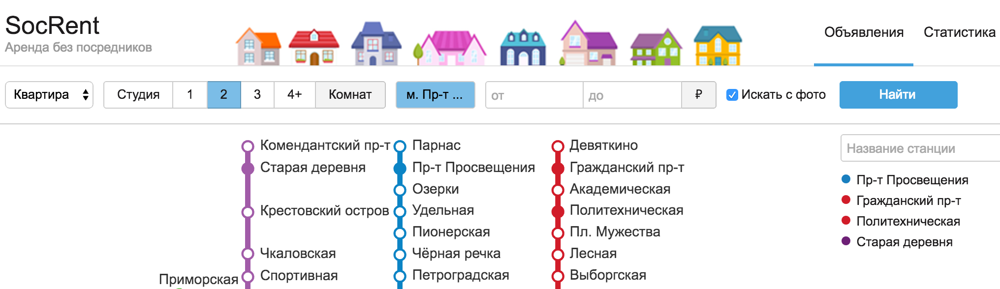
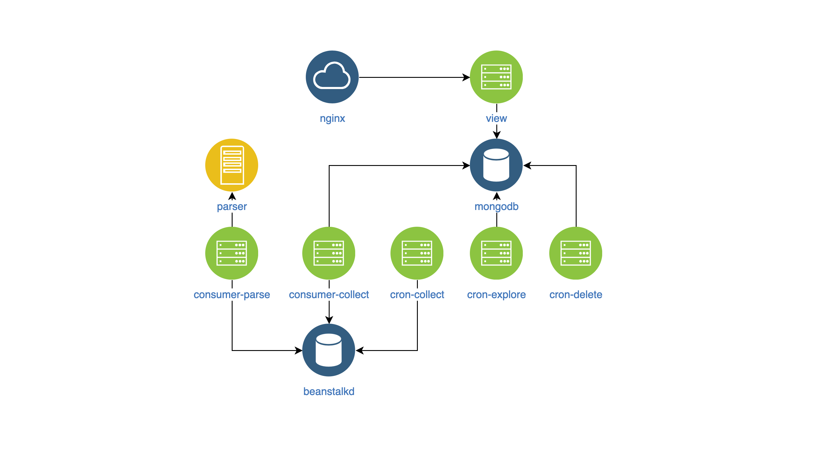
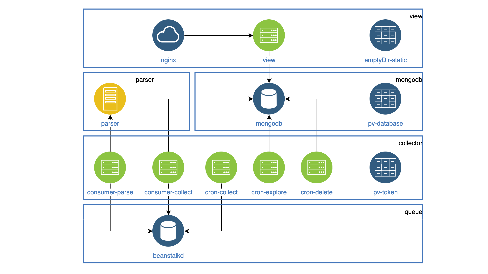

# How I migrated my hobby project to k8s

[origin]https://habr.com/ru/articles/484528

In this article, I want to talk about my hobby project for searching and classifying apartment rental ads from the social network vk.com and my experience moving it to k8s.

## A bit about the project



In March 2017, I launched a service for parsing and classifying apartment rental ads from vk.com.

You can read more [here](/articles/2017/classifying-housing-ads-in-search-of-the-best-solution/) about how I tried different ways to classify ads and eventually settled on the lexical parser Yandex Tomita Parser.

You can also read [here](/articles/2017/architecture-of-a-service-for-collecting-and-classifying-housing-ads/) about the project's architecture at the start and the technologies used and why.

The development of the first version of the service took about a year. I wrote scripts in Ansible to deploy each service component. Occasionally, the service didn't work due to bugs in the overly complicated code or incorrect component settings.

In June 2019, an error in the parser code was found that prevented new ads from being collected. Instead of fixing it, I decided to temporarily turn off the parser.

The reason for restoring the service was learning k8s.

## Getting to know k8s

[k8s](https://ru.wikipedia.org/wiki/Kubernetes) is open-source software for automating the deployment, scaling, and management of containerized applications.

The entire infrastructure of the service is described in configuration files, usually in yaml format.

I won't go into the inner workings of k8s, but I'll give some information about some of its components.

### k8s components

* Pod: The smallest unit in Kubernetes. It can have several containers running on the same node.
    Containers inside a Pod:
    + Share the same network and can communicate via 127.0.0.1:$containerPort.
    + Don't share a filesystem, so they can’t directly exchange files.
* Deployment: Manages Pods. It can: Maintain the desired number of Pod instances. Restart Pods if they crash. Deploy new Pods.
* PersistentVolumeClaim (PVC): Data storage. By default, it uses the node’s local filesystem.  For shared storage across Pods on different nodes, you need a network filesystem like Ceph.
* Service: Routes requests to and from Pods.
    Service types:
    + LoadBalancer: Balances requests to multiple Pods and exposes them to the external network.
    + NodePort: Exposes Pods to the external network on ports 30000-32767 without load balancing.
    + ClusterIP: Enables communication within the cluster's local network.
    + ExternalName: Connects Pods to external services.
* ConfigMap: Stores configuration data.  To ensure Kubernetes restarts Pods with updated configs, include a version in your ConfigMap’s name and update it when the ConfigMap changes. The same applies to Secrets.

*Example of a config with ConfigMap*
```yaml
containers:
    -   name: collect-consumer
        image: mrsuh/rent-collector:1.3.1
        envFrom:
            -   configMapRef:
                    name: collector-configmap-1.1.0
            -   secretRef:
                    name: collector-secrets-1.0.0
```

* Secret: A secure way to store sensitive configurations like passwords, keys, and tokens.
* Label: Key-value pairs assigned to Kubernetes components, like Pods. Labels help organize, group, or select components. They are very flexible and useful as you get more familiar with Kubernetes.8

*Example of a config with Labels*
```yaml
apiVersion: apps/v1
kind: Deployment
metadata:
    name: deployment-name
    labels:
        app: deployment-label-app
spec:
    selector:
        matchLabels:
            app: pod-label-app
    template:
        metadata:
            name: pod-name
            labels:
                app: pod-label-app
        spec:
            containers:
                -   name: container-name
                    image: mrsuh/rent-parser:1.0.0
                    ports:
                        -   containerPort: 9080

---

apiVersion: v1
kind: Service
metadata:
    name: service-name
    labels:
        app: service-label-app
spec:
    selector:
        app: pod-label-app
ports:
    -   protocol: TCP
        port: 9080
        type: NodePort
```

## Getting Ready to Move

### Simplifying Features

To make the service more stable and predictable, I removed extra components that didn’t work well and rewrote some main parts. 
I decided to stop using:
* code for parsing sites other than vk.com,
* the request proxying component,
* the notification component for new posts in vk.com and Telegram.

### Service сomponents

After all the changes, the service now looks like this:


* view - searches and shows posts on the website (NodeJS).
* parser - classifies posts (Go).
* collector - gathers, processes, and deletes posts (PHP):
* cron-explore - a command-line tool that finds vk.com groups about renting apartments.
* cron-collect - a command-line tool that visits the groups found by cron-explore and collects the posts.
* cron-delete - a command-line tool that removes expired posts.
* consumer-parse - a queue processor that receives tasks from cron-collect and classifies posts using the parser component.
* consumer-collect - a queue processor that gets tasks from consumer-parse and filters out bad or duplicate posts.


### Building Docker Images

To manage and monitor components in a consistent way, I decided to:
* move component configurations to environment variables (env),
* log everything to stdout.

The Docker images themselves don’t have anything special.

## Developing k8s Configuration

Now that I had the components in Docker images, I started creating the k8s configuration.

All components that run as daemons were set up in Deployment.
Each daemon needs to be accessible inside the cluster, so all of them have a Service.
Tasks that need to run on a schedule were set up as CronJob.
Static files (like images, JavaScript, and CSS) are stored in the view container, but they need to be served by an Nginx container. Both containers are in the same Pod.

The file system in a Pod isn’t shared by default, but you can copy all the static files to a shared folder (like emptyDir) when the Pod starts. This folder will be shared between containers but only inside the same Pod.       

*Example of a config with emptyDir*
```yaml
apiVersion: apps/v1
kind: Deployment
metadata:
    name: view
spec:
    selector:
        matchLabels:
            app: view
    replicas: 1
    template:
        metadata:
            labels:
                app: view
        spec:
            volumes:
                -   name: view-static
                    emptyDir: {}
            containers:
                -   name: nginx
                    image: mrsuh/rent-nginx:1.0.0
                -   name: view
                    image: mrsuh/rent-view:1.1.0
                    volumeMounts:
                        -   name: view-static
                            mountPath: /var/www/html
                    lifecycle:
                        postStart:
                            exec:
                                command: ["/bin/sh", "-c", "cp -r /app/web/. /var/www/html"]
```

The collector component is used in both Deployment and CronJob.

All these components need to access the vk.com API and share the same access token. To handle this, I used a PersistentVolumeClaim. This storage is connected to each Pod and shared between them, but only on the same node.

*Example of a config with PersistentVolumeClaim*
```yaml
apiVersion: apps/v1
kind: Deployment
metadata:
    name: collector
spec:
    selector:
        matchLabels:
            app: collector
    replicas: 1
    template:
        metadata:
            labels:
                app: collector
        spec:
            volumes:
                -   name: collector-persistent-storage
                    persistentVolumeClaim:
                        claimName: collector-pv-claim
            containers:
                -   name: collect-consumer
                    image: mrsuh/rent-collector:1.3.1
                    volumeMounts:
                        -   name: collector-persistent-storage
                            mountPath: /tokenStorage
                    command: ["php"]
                    args: ["bin/console", "app:consume", "--channel=collect"]

                -   name: parse-consumer
                    image: mrsuh/rent-collector:1.3.1
                    volumeMounts:
                        -   name: collector-persistent-storage
                            mountPath: /tokenStorage
                    command: ["php"]
                    args: ["bin/console", "app:consume", "--channel=parse"]
```

A PersistentVolumeClaim is also used to store database data.
Here’s the final structure (each block groups the Pods of one component):

                  

## Setting up the k8s Cluster

First, I set up the cluster locally using [Minikube](https://minikube.sigs.k8s.io/docs/).
Of course, there were some errors, so the following commands helped me a lot:
```bash
kubectl logs -f pod-name
kubectl describe pod pod-name 
```

After I learned how to set up a cluster in Minikube, it was easy for me to set it up in DigitalOcean.
In conclusion, I can say that the service has been working steadily for 2 months. You can see the full configuration [here](https://github.com/mrsuh/rent-k8s).
