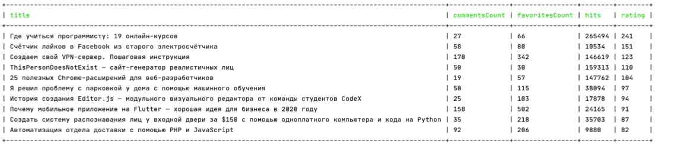
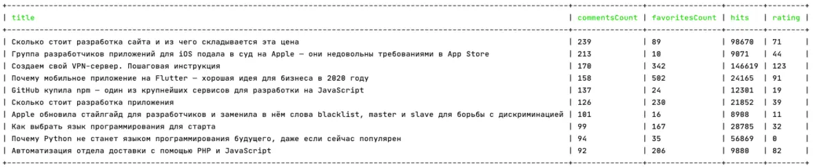
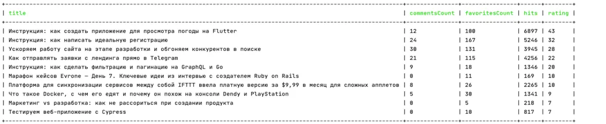
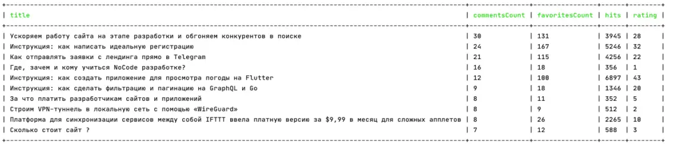
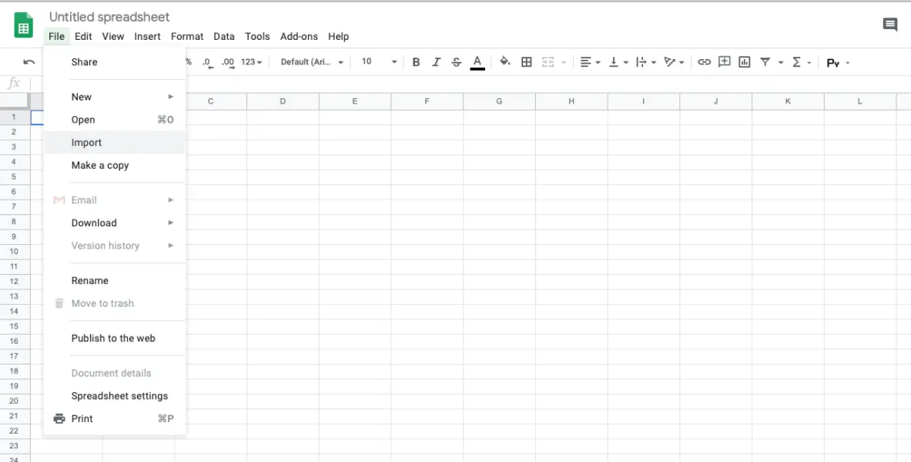
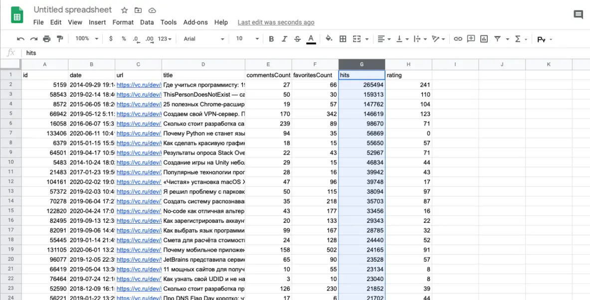

# Looking for the most interesting articles on the site

[origin]https://vc.ru/dev/159230-ishem-samye-interesnye-stati-v-razdelah-na-saitah-vcru-tjournalru-i-dtfru

How can you avoid getting lost in the sea of content on massive websites and quickly find the most valuable and impactful articles?

Large information portals covering a wide range of topics and niches are becoming increasingly popular. As someone who loves browsing such websites, and as a fan of analytics due to my profession and personality, I’m always curious about which articles resonate the most with readers.
This curiosity isn’t just about satisfying my interest—it’s also about understanding how to write content that grabs the audience’s attention and stays at the top.
That’s why I created a small tool that can scrape information about articles from the sections of websites like vc.ru, tjournal.ru, and dtf.ru. The tool can filter the most interesting articles based on a few criteria.
I’m sure I’m not the only one with this interest, so I’m excited to share my tool with you.

## Getting Started:
* make sure you have Docker or PHP installed
* choose a website from the ones mentioned above and select your favorite section
* find the technical name of the section from your browser's address bar

I will provide the commands without mentioning Docker. To run the commands in Docker, simply add the following prefix to each command:
```bash
docker run -v "$(pwd)/db:/app/db" mrsuh/platform-analyzer
```
For example:
```bash
docker run -v "$(pwd)/db:/app/db" mrsuh/platform-analyzer php bin/console collect --help
```

## Now, let's understand how the utility works.
It has only two commands:
#### A command for collecting data.
```bash
php bin/console collect --help
Options:
      --platform=PLATFORM  доступные значения: vc, tjournal, dtf
      --section=SECTION    ваш выбранный раздел на сайте
```

#### A command for displaying the collected data in different formats with various filters.
```bash
php bin/console analyze --help
Options:
      --platform=PLATFORM  Доступные значения: vc, tjournal, dtf
      --section=SECTION    Ваш выбранный раздел на сайте
      --sort=SORT          Сортировка. Доступные значения: date, rating, hits, commentsCount, favoritesCount
      --limit=LIMIT        Лимит на количество выводимых строк
      --format=FORMAT      Формат. Доступные значения: cli, csv, md
      --short=SHORT        Вывод только основных полей. Доступные значения: 0, 1
      --fromDate=FROMDATE  Фильтрация по дате, с которой нужно искать статьи. Формат даты: 2020-01-01
```

First, we collect the data (collect), and then we display it in the desired format (analyze).

For example, let's take the "Development" section (dev).
Run the data collection command:
```bash
php bin/console collect --platform=vc --section=dev -vv
```

After some time, the command completes, and you have data on all the articles from the "Development" section.
Now you can take a curious look at the collected information. Let's go!

## Experiments

### Articles with the highest rating of all time:
```bash
php bin/console analyze --platform=vc --section=dev --format=cli --limit=5 --sort=rating --short=1
```


### Articles with the most comments of all time:
```bash
php bin/console analyze --platform=vc --section=dev --format=cli --limit=5 --sort=commentsCount --short=1
```


### Articles with the highest rating in September:
```bash
php bin/console analyze --platform=vc --section=dev --format=cli --limit=5 --sort=rating --short=1 --fromDate=2020-09-01
```


### Articles with the most comments in September:
```bash
php bin/console analyze --platform=vc --section=dev --format=cli --limit=5 --sort=commentsCount --short=1 --fromDate=2020-09-01
```


You can also export all the data in CSV format and load it into Excel, where you’ll have much more flexibility for sorting and modifying the data.
```bash
php bin/console analyze --platform=vc --section=dev --format=csv > data.csv
```





Happy surfing!
[Here](https://github.com/mrsuh/platform-analyzer)'s where you can check out the utility’s code.
