# RC car with ESP8266 NodeMCU and LEGO

[origin]https://vc.ru/dev/160142-rc-mashinka-iz-esp8266-nodemcu-i-lego


Build a Remote-Controlled Model with a Microcontroller and Wi-Fi Module
After assembling an impressive LEGO collection (as any grown-up should), I wanted to get even more joy from it. Combining colorful LEGO pieces with my love for programming led to a fascinating project. If you share both hobbies, let’s build a dream from childhood—a remote-controlled LEGO car! 
Let’s go!

## About the ESP8266 NodeMCU

The ESP8266 NodeMCU is a development board based on the ESP8266 chip. This chip is a UART-Wi-Fi module designed for Internet of Things (IoT) projects, with ultra-low power consumption. The board simplifies development because it:
* Includes a USB connection.
* Has a built-in voltage regulator.
* Exposes all chip pins via standard 2.54 mm headers, making it easy to use on a breadboard for prototyping.
* Additionally, the board comes preloaded with the NodeMCU firmware, so it can be programmed using the Arduino IDE.

## How It Works

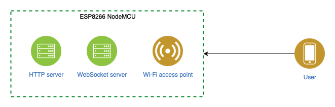

On the ESP8266 NodeMCU, we set up a Wi-Fi access point, an HTTP server, and a WebSocket server. 
Here's how it works:
* Connect to the Wi-Fi: Use your smartphone to connect to the Wi-Fi network created by the NodeMCU.
* Access the Control Page: The HTTP server delivers an HTML page with embedded JavaScript.
* Control the Car:
  + The JavaScript automatically connects to the WebSocket server.
  + When you touch the screen, the JavaScript sends the touch coordinates to the WebSocket server.
  + For example, touching the top of the screen signals the car to move forward. Similarly, other touch areas correspond to different directions.
  
This setup lets you control the LEGO car intuitively, directly from your smartphone screen!


## Materials

* ESP8266 NodeMCU (Wi-Fi development board)
* Mini L298N (motor driver)
* Breadboard (for prototyping)
* 4 TT 130 Motors with gearboxes and wheels
* Wires (for connections)
* Power bank (for power supply)
* USB to microUSB adapter
* USB cable compatible with the breadboard
* LEGO blocks (to build the car frame)

## Setting Up the Arduino IDE for ESP8266 NodeMCU

Adding the ESP8266 NodeMCU Board to Arduino IDE.
Download Arduino IDE: Get it from the official website: [Arduino Software](https://www.arduino.cc/en/Main/Software).

Add the ESP8266 Board Manager URL:
Open Preferences from the File menu.
Find the Additional Boards Manager URLs field and add the following URL:
```bash
http://arduino.esp8266.com/staging/package_esp8266com_index.json
```
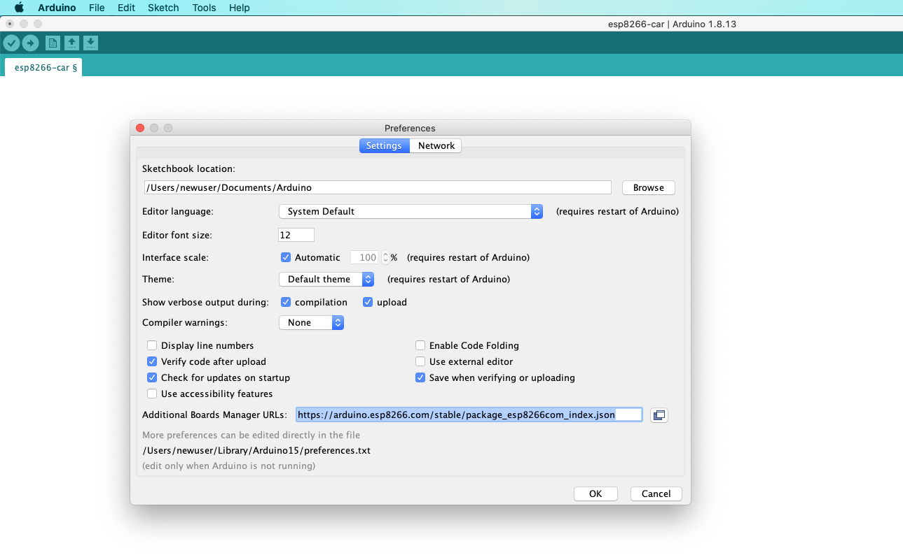

Install the ESP8266 Board:
Go to Tools > Boards > Boards Manager.
In the search box, type ESP.
Select ESP8266 by ESP8266 Community and click Install.
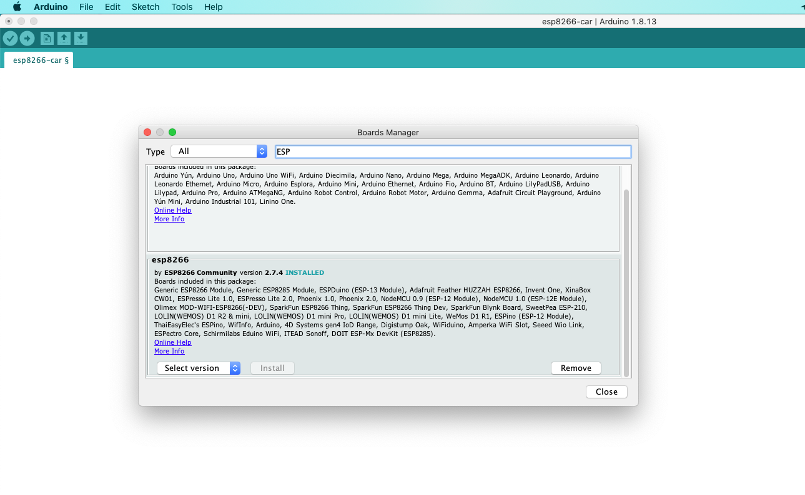

Select the NodeMCU Board:
Go to Tools > Boards > ESP8266 Boards.
Choose NodeMCU 1.0.
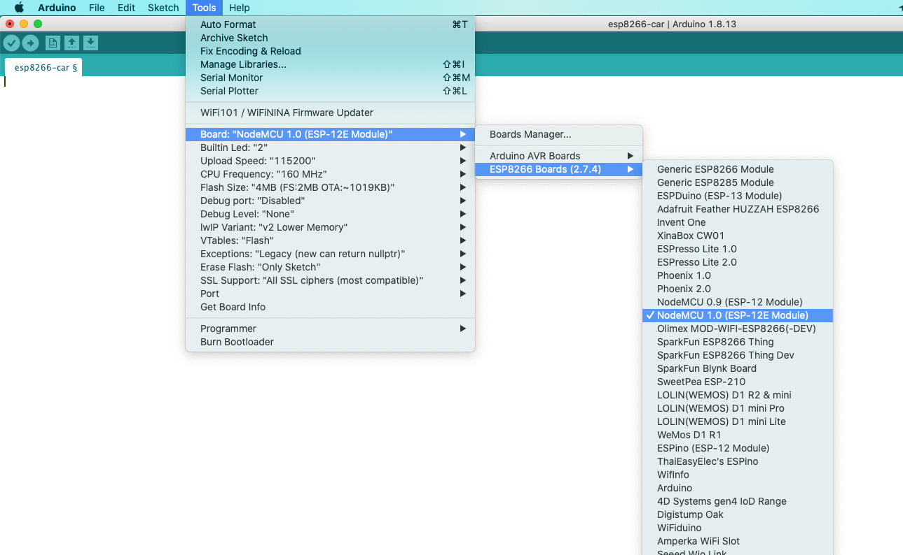

Adding Required Libraries

Download Libraries:
* https://github.com/me-no-dev/ESPAsyncWebServer
* https://github.com/bblanchon/ArduinoJson


Install Libraries in Arduino IDE:
Open Sketch > Include Library > Add .ZIP Library.
Select the downloaded .zip files one by one to add them.


## Flashing the ESP8266 Controller

Create a New Project:
Open Arduino IDE.
Go to File > New to create a new project.
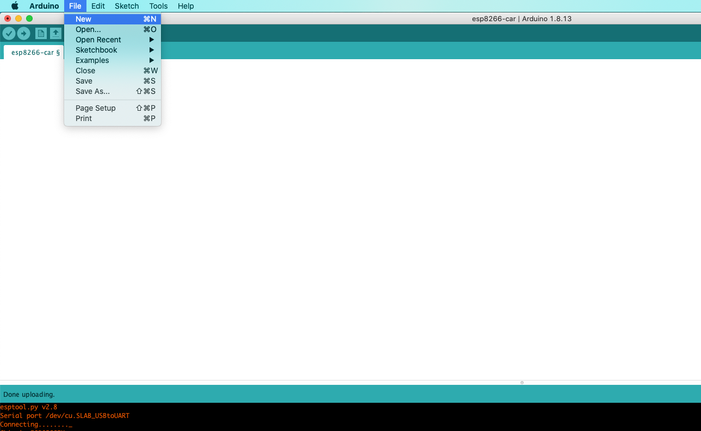

Save the Project:
Click File > Save, and name the project esp8266-car.


Copy the code from this [link](https://raw.githubusercontent.com/mrsuh/car-esp8266/master/main.ino).
Paste it into the Arduino IDE.

In the code, you can change the Wi-Fi access point name and password:
```cpp
const char *ssid = "car-esp8266";//название Wi-Fi точки доступа
const char *password = "password";//пароль Wi-Fi точки доступа
```

Upload the Code to the Controller:
Connect the ESP8266 NodeMCU to your computer using a USB cable.
Click the Upload button in the Arduino IDE.
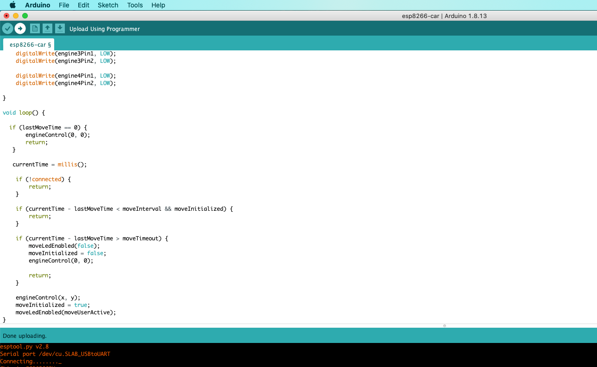

## Building the Car

View the Wiring Diagram:
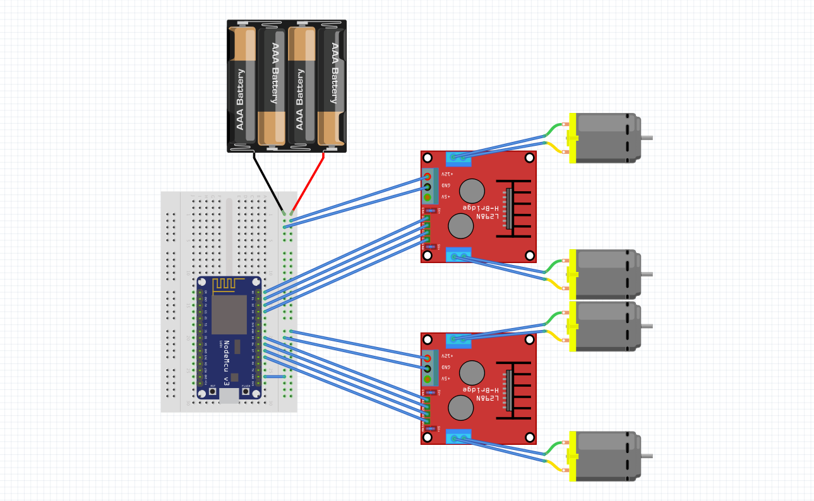


Prepare the Motors and L298N:
Attach small LEGO pieces to the motors using a hot glue gun.
Solder wires to the L298N motor driver as per the wiring diagram.
Assemble the Car:
Use your creativity to build a unique LEGO car around the motors and ESP8266 NodeMCU.


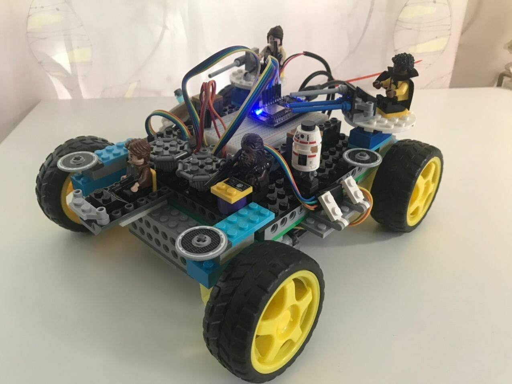
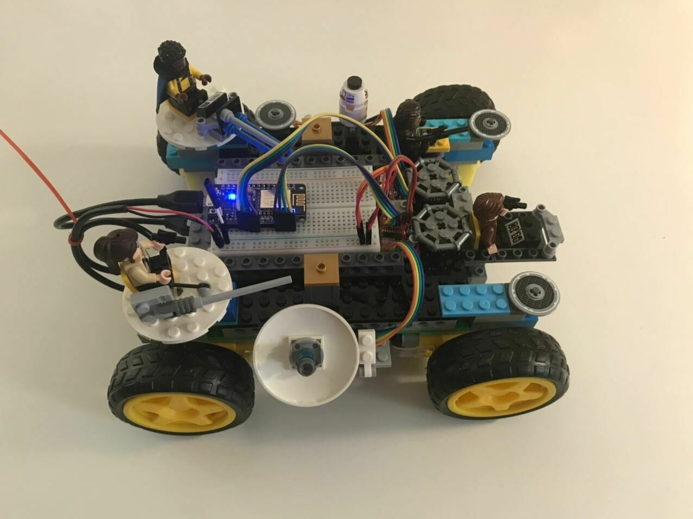

Initial Connection:
Power up your car using the connected power source (e.g., a power bank).
Connect to the Access Point:
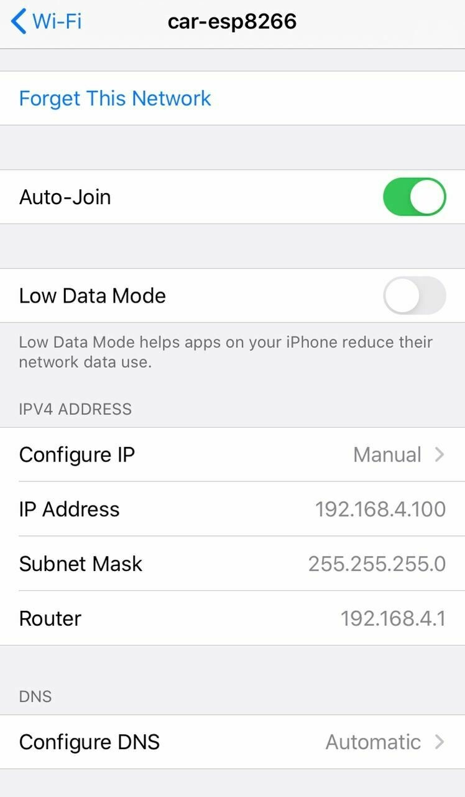
Look for your car's Wi-Fi access point in the available networks list (e.g., car-esp8266).
Connect to it.
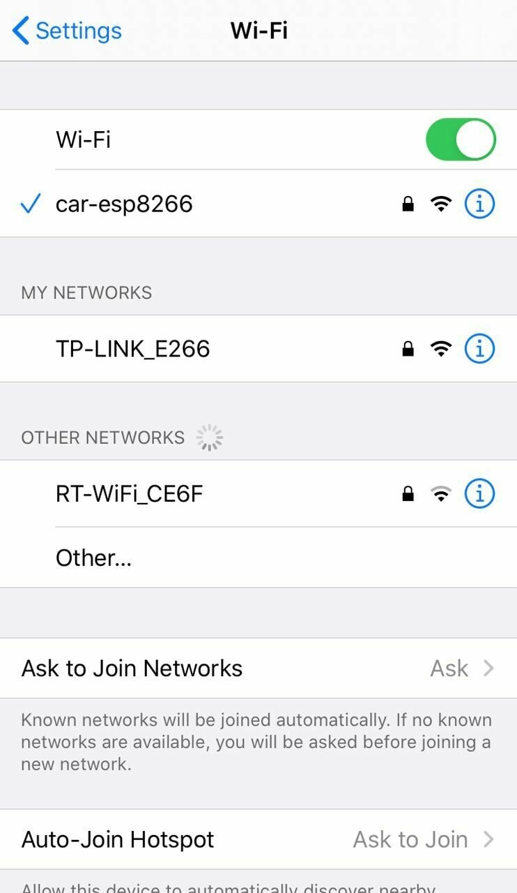

If needed, configure the network settings on your device to use a manual IP address for this connection.
```bash
Configure: Manual
IP: 192.168.4.100
Subnet mask: 255.255.255.0
Router: 192.168.4.1
```

## First launch!
<iframe class="rounded" src="https://www.youtube.com/embed/eQIDCTf4-K4?si=4ObjRgaso9gTZzQT" title="YouTube video player" frameborder="0" allow="accelerometer; autoplay; clipboard-write; encrypted-media; gyroscope; picture-in-picture; web-share" referrerpolicy="strict-origin-when-cross-origin" allowfullscreen></iframe>

That's all! Good luck with your creative projects!
