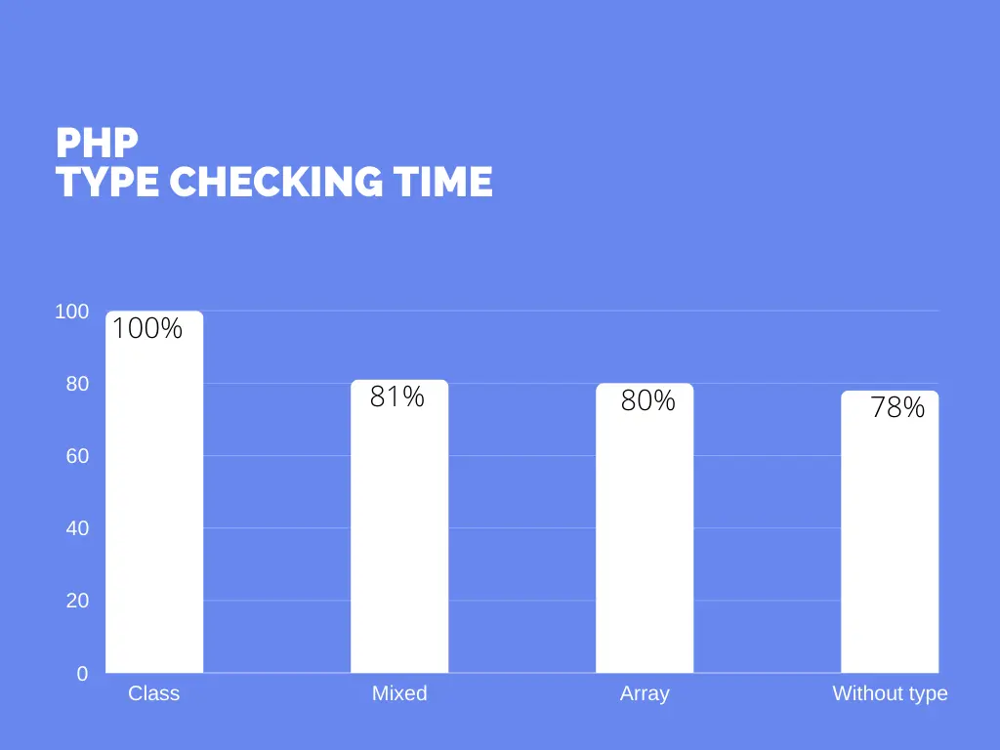
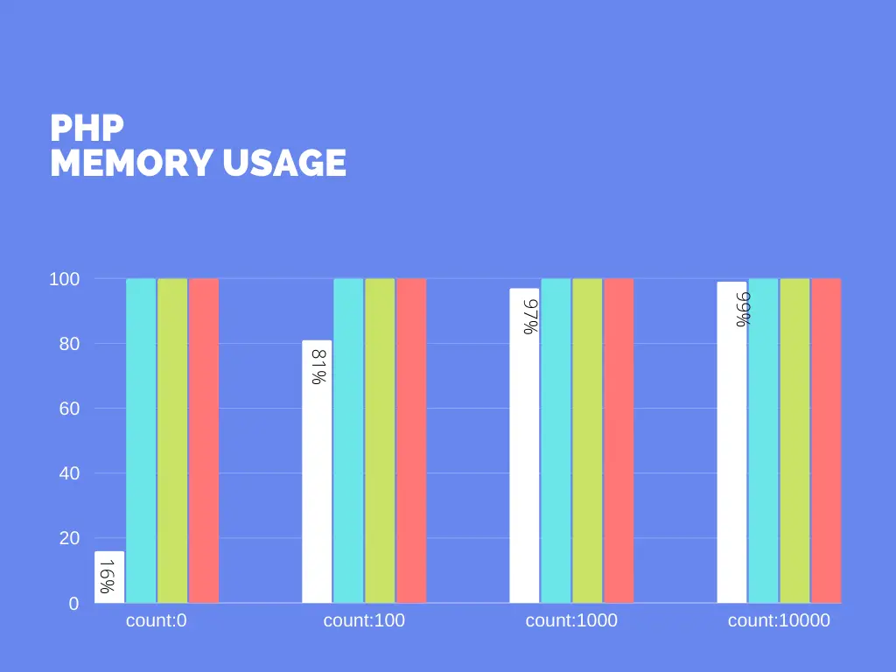

# Comparing PHP Collections

[origin]https://dev.to/mrsuh/comparing-php-collections-5cca

Let's imagine that we want to store a `collection` of `Item` objects:
```php
<?php

namespace App\Entity;

class Item {
    public string $name = '';
    public int $value = 0;
}
```

Working with this collection we want to:
* PHP does a type checks to make sure collection only stores `Item` objects
* IDE makes hints about the type of `Item` objects in a collection
* static analyses tool can find type errors

I want to compare:
* [array](https://www.php.net/manual/en/language.types.array.php)
* [Psalm annotation templates](https://psalm.dev/docs/annotating_code/templated_annotations)
* [Monomorphic generics](https://github.com/mrsuh/php-generics#monomorphization)
* [Type-erased generics](https://github.com/mrsuh/php-generics#type-erasure)

## Usage

Let's first compare usage.

### Array
```php
<?php

/** @var Item[] $collection */
$collection = [];
$collection[] = new Item();

/**
 * @param Item[] $collection
 */
function test(array $collection): array {}
```

**pros**
* easy to implement
* IDE makes hints about the type of `Item` objects in collection
* static analyses tool can find type errors

**cons**
* PHP doesn't check types

[pagebreak]

### Psalm annotations
```php
<?php

/**
 * @template T
 */
class Collection implements \Iterator
{
    protected \ArrayIterator $iterator;

    public function __construct()
    {
        $this->iterator = new \ArrayIterator();
    }

    /** @param T $item */
    public function append($item): void
    {
        $this->iterator->append($item);
    }

    /** @return T|null */
    public function current(): mixed
    {
        return $this->iterator->current();
    }
...
}
```

```php
<?php
/** @var Collection<Item> $collection */
$collection = new Collection();
$collection->append(new Item());

/**
 * @param Collection<Item> $data
 * @return Collection<Item>
 */
function test(Collection $data): Collection {}
```
**pros**
* IDE makes hints about the type of `Item` objects in collection
* static analyses tool can find type errors

**cons**
* PHP doesn't check types

[pagebreak]

### Monomorphic generics

```php
<?php

class Collection<T> implements \Iterator
{
    protected \ArrayIterator $iterator;

    public function __construct()
    {
        $this->iterator = new \ArrayIterator();
    }

    public function append(T $item): void
    {
        $this->iterator->append($item);
    }

    public function current(): ?T
    {
        return $this->iterator->current();
    }
..
}
```

```php
<?php

$collection = new Collection<Item>;
$collection->append(new Item());

function test(Collection<Item> $data): Collection<Item> {}
```

**pros**
* PHP does a type checks to make sure collection only stores `Item` objects

**cons**
* static analyses tool can't find type errors
* IDE doesn't make hints about the type of `Item` objects in a collection

[pagebreak]

### Type erased generics

```php
<?php

class Collection<T> implements \Iterator
{
    protected \ArrayIterator $iterator;

    public function __construct()
    {
        $this->iterator = new \ArrayIterator();
    }

    public function append(T $item): void
    {
        $this->iterator->append($item);
    }

    public function current(): ?T
    {
        return $this->iterator->current();
    }
...
}
```

```php
<?php

$collection = new Collection<Item>;
$collection->append(new Item());

function test(Collection<Item> $data): Collection<Item> {}
```

**cons**
* PHP doesn't check types
* static analyses tool can't find type errors
* IDE doesn't make hints about the type of `Item` objects in a collection

[pagebreak]

## Memory

Memory test is very simple.
It creates `$collection` and puts `Item` objects into it `count` times.
For measurement I use [var_sizeof()](https://github.com/mrsuh/php-var-sizeof) and `memory_get_usage()`.

*Items in collection: 0*

| type                  | var_class_sizeof(bytes) | var_sizeof(bytes) | memory_get_usage(bytes) |
|-----------------------|-------------------------|-------------------|-------------------------|
| array(count: 0)       | 0                       | 336               | 0                       |
| psalm(count: 0)       | 1,510                   | 544               | 240                     |
| monomorphic(count: 0) | 1,528                   | 544               | 240                     |
| type-erased(count: 0) | 1,512                   | 544               | 240                     |

*Items in collection: 100*

| type                    | var_class_sizeof(bytes) | var_sizeof(bytes) | memory_get_usage(bytes) |
|-------------------------|-------------------------|-------------------|-------------------------|
| array(count: 100)       | 0                       | 7,728             | 12,248                  |
| psalm(count: 100)       | 1,510                   | 7,936             | 12,432                  |
| monomorphic(count: 100) | 1,528                   | 7,936             | 12,432                  |
| type-erased(count: 100) | 1,512                   | 7,936             | 12,432                  |

*Items in collection: 1000*

| type                     | var_class_sizeof(bytes) | var_sizeof(bytes) | memory_get_usage(bytes) |
|--------------------------|-------------------------|-------------------|-------------------------|
| array(count: 1000)       | 0                       | 72,464            | 76,920                  |
| psalm(count: 1000)       | 1,510                   | 72,672            | 77,104                  |
| monomorphic(count: 1000) | 1,528                   | 72,672            | 77,104                  |
| type-erased(count: 1000) | 1,512                   | 72,672            | 77,104                  |

*Items in collection: 10000*

| type                      | var_class_sizeof(bytes) | var_sizeof(bytes) | memory_get_usage(bytes) |
|---------------------------|-------------------------|-------------------|-------------------------|
| array(count: 10000)       | 0                       | 822,224           | 1,051,320               |
| psalm(count: 10000)       | 1,510                   | 822,432           | 1,051,560               |
| monomorphic(count: 10000) | 1,528                   | 822,432           | 1,051,560               |
| type-erased(count: 10000) | 1,512                   | 822,432           | 1,051,560               |

It's not surprising an `array` requires the least amount of memory.
Other approaches have roughly the same internal structure and require the same amount of memory.

[pagebreak]

## Performance

I used [phpbench](https://github.com/phpbench/phpbench) to measure performance.
I think one of the big differences between all the solutions is the type checking. So I decided to try measure it.
How much faster will code with/without type checking?

```bash
PHPBench (1.2.3) running benchmarks...
with configuration file: /app/phpbench.json
with PHP version 8.1.3, xdebug ❌, opcache ❌

\App\Tests\TypHintBench

    benchWithoutType........................R1 I6 - Mo240.713μs (±0.47%)
    benchWithArrayType......................R1 I70 - Mo247.663μs (±0.45%)
    benchWithMixedType......................R2 I59 - Mo249.293μs (±0.54%)
    benchWithClassType......................R1 I26 - Mo306.533μs (±0.48%)

Subjects: 4, Assertions: 0, Failures: 0, Errors: 0
+--------------+--------------------+-----+------+-----+-----------+-----------+--------+
| benchmark    | subject            | set | revs | its | mem_peak  | mode      | rstdev |
+--------------+--------------------+-----+------+-----+-----------+-----------+--------+
| TypHintBench | benchWithoutType   |     | 1000 | 100 | 674.272kb | 240.713μs | ±0.47% |
| TypHintBench | benchWithArrayType |     | 1000 | 100 | 674.272kb | 247.663μs | ±0.45% |
| TypHintBench | benchWithMixedType |     | 1000 | 100 | 674.272kb | 249.293μs | ±0.54% |
| TypHintBench | benchWithClassType |     | 1000 | 100 | 674.272kb | 306.533μs | ±0.48% |
+--------------+--------------------+-----+------+-----+-----------+-----------+--------+
```

If the tests are correct, the difference between a function argument with `class` type and a function argument without a type is ~20%.

[pagebreak]

## Conclusions

I have drawn some charts so you can compare all measurements in percentage. The results may vary slightly on different machines, but the percentage result should be the same





If you are only using simple collections you can use `array` - it is very fast and requires little memory.
PHP doesn't support generic syntax and IDE can't make hints about the type of objects in a collection (yet),
but if you want PHP to do type checks at runtime you can test the [php-generics](https://github.com/mrsuh/php-generics) library.

I think for now the best solution is a combination of `array` with annotations for simple collections and [Psalm annotation templates](https://psalm.dev/docs/annotating_code/templated_annotations) for complex objects.

If you want to reproduce the tests result you can find the source code and instructions [here](https://github.com/mrsuh/php-collections-comparison).
