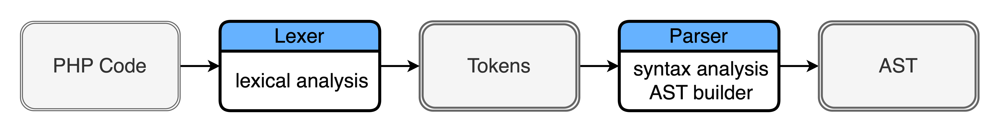
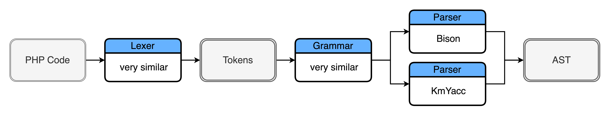
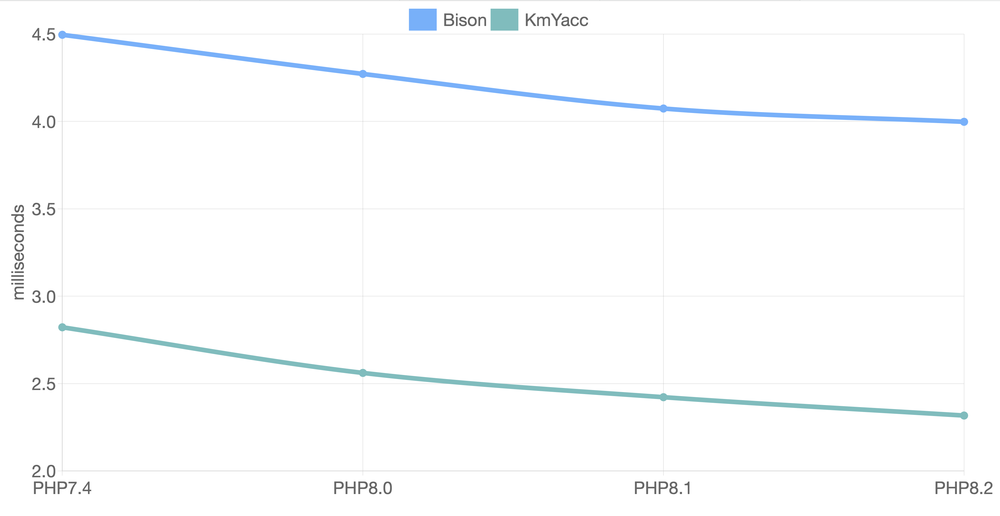

# How I Wrote PHP Skeleton For Bison

<a href="https://devm.io/php/php-skeleton-bison-generics" class="link-secondary" target="_blank">devm.io/php/php-skeleton-bison-generics</a>

Do you dream of generics in PHP?<br>
I wanted it so much - I made a library that brings generics in PHP.
```php
<?php

namespace App;

class Box<T> {

    private ?T $data = null;

    public function set(T $data): void {
        $this->data = $data;
    }

    public function get(): ?T {
        return $this->data;
    }
}
```
If you are interested you can [test it](https://github.com/mrsuh/php-generics). Only native PHP is required (without extensions).<br>
But in this article, I want to tell you about a very important part of my library - [AST](https://en.wikipedia.org/wiki/Abstract_syntax_tree) parser.<br>
I use a very popular library [nikic/php-parser](https://github.com/nikic/PHP-Parser). Many other software uses it.<br>
It helps you to build AST from source code like this:

```php
<?php

namespace App;

class Test
{
    public function test($foo) {}
}
```

```bash
.
├── ZEND_AST_STMT_LIST
    ├── ZEND_AST_NAMESPACE
    │   └── ZEND_AST_ZVAL 'App'
    └── ZEND_AST_CLASS 'Test'
        └── ZEND_AST_STMT_LIST
            └── ZEND_AST_METHOD 'test'
                └── ZEND_AST_PARAM_LIST
                    └── ZEND_AST_PARAM
                        └── ZEND_AST_ZVAL 'foo'
```

Every AST parser has a lexical analyzer, syntax analyzer, and AST builder. Usually, it grouped into Lexer and Parser.



You don't need to write Lexer and Parser from scratch.<br>
To build Lexer you can use tools:
* [re2c](https://re2c.org) - PHP engine uses it to parse source code
* [get_token_all()](https://www.php.net/manual/en/function.token-get-all.php) - php-parser uses this function to parse source code
* [doctrine lexer](https://github.com/doctrine/lexer) - doctrine uses it to parse annotations

How do Lexers work?


Lexers help you to parse text into tokens.<br>
For example PHP engine's Lexer use [re2c](https://re2c.org).

[php-src Lexer example](https://github.com/php/php-src/blob/master/Zend/zend_language_scanner.l)
```c
/*!re2c
re2c:yyfill:check = 0;
LNUM	[0-9]+(_[0-9]+)*
DNUM	({LNUM}?"."{LNUM})|({LNUM}"."{LNUM}?)

<ST_IN_SCRIPTING>"exit" {
	RETURN_TOKEN_WITH_IDENT(T_EXIT);
}

<ST_IN_SCRIPTING>"return" {
	RETURN_TOKEN_WITH_IDENT(T_RETURN);
}
*/
```

Below you can see PHP code and tokens from Lexer.
```bash
<?php    |   T_OPEN_TAG
         |   T_WHITESPACE
$a = 1;  |   T_VARIABLE T_WHITESPACE = T_WHITESPACE T_LNUMBER ;
         |   T_WHITESPACE
echo $a; |   T_ECHO T_WHITESPACE T_VARIABLE ;
```

We can think about PHP engine and php-parser Lexers as similar Lexers because function `get_token_all()` calls `re2c` functions under the hood.<br>
After the Lexer we have tokens, and we need a Parser to build AST.

To build Parser you can use the tools:
* [Bison](https://www.gnu.org/software/bison/) - PHP engine uses it
* [KmYacc](https://github.com/ircmaxell/PHP-Yacc) - php-parser uses it
* [ANTLR](https://www.antlr.org) - Twitter search uses ANTLR for query parsing

How do parser generators work?


A generator takes your `grammar.y` [BNF](https://en.wikipedia.org/wiki/Backus–Naur_form) file, parses it, extracts all definitions, and then constructs a bunch of tables like this:
```php
$yytable = [
    6, 3, 7, 20, 8, 51, 28, 1, 52, 4,
    9, 13, 10, 29, 15, 30, 18, 31, 16, 19,
    32, 22, 33, 34, 23, 24, 35, 11, 37, 25,
    21, 38, 39, 26, 45, 0, 40, 42, 0, 43,
    41, 0, 0, 49, 0, 0, 0, 0, 0, 47,
    48, 0, 50, 0, 53, 54
];
```

Then, this data is passed to a template that is called a `Skeleton`.<br>
For Bison, `Skeleton` is a special file written in [M4](https://en.wikipedia.org/wiki/M4_(computer_language)) language that renders your `parser` file.<br>
By default, Bison Skeletons supports C/C++/D/Java languages.

PHP engine and php-parser use different parser generators but use very similar grammar files.

[php-src grammar example](https://github.com/php/php-src/blob/master/Zend/zend_language_parser.y)
```bnf
statement:
    |   T_BREAK optional_expr ';'    { $$ = zend_ast_create(ZEND_AST_BREAK, $2); }
    |   T_CONTINUE optional_expr ';' { $$ = zend_ast_create(ZEND_AST_CONTINUE, $2); }
    |   T_RETURN optional_expr ';'   { $$ = zend_ast_create(ZEND_AST_RETURN, $2); }
```

[php-parser grammar example](https://github.com/nikic/PHP-Parser/blob/4.x/grammar/php7.y)
```bnf
non_empty_statement:
    |   T_BREAK optional_expr semi    { $$ = Stmt\Break_[$2]; }
    |   T_CONTINUE optional_expr semi { $$ = Stmt\Continue_[$2]; }
    |   T_RETURN optional_expr semi   { $$ = Stmt\Return_[$2]; }
```

After all this information about parsers, we can summarize it on the scheme:



I had thought about replacing `KmYacc` with `Bison` in php-parser.<br>
It is great for PHP engine and php-parser to use the same tools to make the same job.<br>
Even the fact, that Bison doesn't have PHP Skeleton didn't stop me.<br>
I decided to create my own skeleton.<br>
I translated Java skeleton to PHP. It took a few months for me.<br>
Translating Java code to PHP is not very hard, but if your code is not written with m4 and has not very many options.

[Java-skeleton example](https://github.com/akimd/bison/blob/master/data/skeletons/lalr1.java)
```bash
]b4_yystype[ lval = yylexer.getLVal();]b4_locations_if([[
]b4_location_type[ yyloc = new ]b4_location_type[(yylexer.getStartPos(), yylexer.getEndPos());
status = push_parse(token, lval, yyloc);]], [[
status = push_parse(token, lval);]])[
```

[PHP-skeleton example](https://github.com/mrsuh/php-bison-skeleton/blob/master/src/lalr1.php)
```bash
/** @@var ]b4_yystype[ */
$lval = $this->yylexer->getLVal();]b4_locations_if([[
/** @@var ]b4_location_type[ */
$yyloc = new ]b4_location_type[($this->yylexer->getStartPos(), $this->yylexer->getEndPos());
$status = $this->push_parse($token, $lval, $yyloc);]], [[
$status = $this->push_parse($token, $lval);]])[
```

After a few months and many auto tests [php-skeleton](https://github.com/mrsuh/php-bison-skeleton) was ready!

```bash
[php-bison-skeleton] composer test
> php vendor/bin/phpunit
PHPUnit 9.6.5 by Sebastian Bergmann and contributors.

................................................................. 65 / 72 ( 90%)
.......                                                           72 / 72 (100%)

Time: 00:04.037, Memory: 6.00 MB

OK (72 tests, 384 assertions)
```

Then I tried to replace `KmYacc` with `Bison`.<br>
You can reproduce the replacement with the steps:

* install required libraries:
```bash
composer require --dev mrsuh/php-bison-skeleton
composer require nikic/php-parser
```

* generate grammar file of php-parser:
```bash
cd vendor/nikic/php-parser/
composer install
php grammar/rebuildParsers.php --keep-tmp-grammar
cp grammar/tmp_parser.phpy ../../../../../examples/php/nikic-grammar.y
```

* replace the dollar sign before Bison generate Parser and replace it back after because Bison [doesn't support dollar sign](https://github.com/akimd/bison/issues/100) in the grammar:
```bash
php bin/replace-dollar-sign.php in nikic-grammar.y nikic-grammar-replaced.y
bison -S ../../src/php-skel.m4 -o lib/parser-tmp.php nikic-grammar-replaced.y
php bin/replace-dollar-sign.php out lib/parser-tmp.php lib/parser.php
```

Great! The parser is ready.

Time to compare PHP parser generated with `Bison` and `KmYacc`.<br>
I had run tests with 3 different files sizes and different PHP versions (smaller is better):

#### [PHP file 684 bytes](https://github.com/mrsuh/php-bison-skeleton/blob/master/examples/php/bin/parse-bison.php)


#### [PHP file 8.8 kilobytes](https://github.com/nikic/PHP-Parser/blob/4.x/lib/PhpParser/Lexer/Emulative.php)


#### [PHP file 329 kilobytes](https://github.com/mrsuh/php-bison-skeleton/blob/master/examples/php/lib/parser.php)


As you can see performance of the parser generated with `Bison` is slower than the parser generated with `KmYacc`.<br>
I tried to optimize generated parser code, but it gave maximum  ~15 percent improvement. Not such much.<br>

In the end, I replaced `KmYacc` with `Bison` in php-parser, but it works not such well as I imagined.<br>
Now I have a well-working php-skeleton for `Bison`.<br>
Maybe next time I'll try to replace `KmYacc` with `ANTLR`.

You can found php-bison-skeleton, many examples and tests into this [repository](https://github.com/mrsuh/php-bison-skeleton)

Thank you for your time. Hope you find this article useful.
