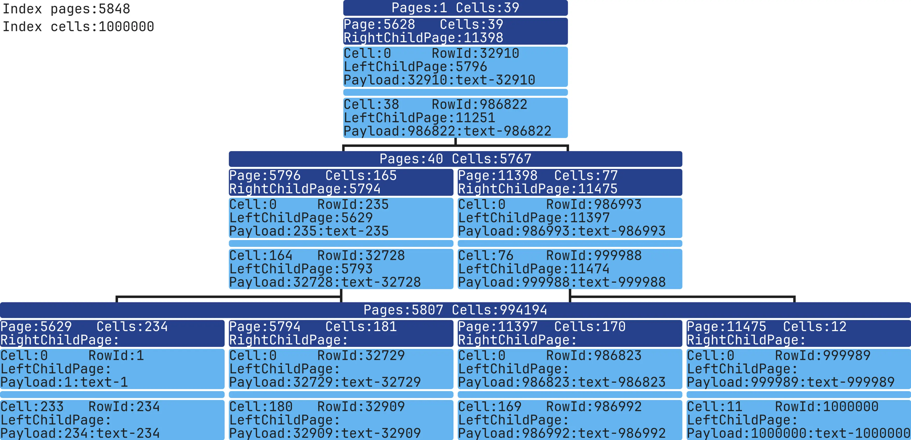

# SQLite Index Visualization: Structure

While reading articles on index theory, I gained a general understanding of their structure. 
However, I always wanted to look inside, see the data structure, understand the algorithm implementations, and how index data is stored in persistent memory. 
Theory and actual implementation can vary significantly, so I decided to dive into this topic.

I wanted to visually see how a database management system (DBMS) stores an index in both persistent and random-access memory and understand how a cursor navigates the index during a search. 
I chose [SQLite](https://en.wikipedia.org/wiki/SQLite) for this because:
* It’s a very common DBMS, used in browsers, mobile development, and operating systems
* It’s simple: no separate server and works on the client-side.
* The SQLite codebase is much smaller than MySQL or PostgreSQL, although it uses similar data structures for main indexes.
* It’s open-source.

## Node and Page Structure

According to SQLite3 documentation, indexes are stored in a B-Tree structure, which is a balanced tree where each node can have several children.
Usually, it’s depicted as follows:


To understand how SQLite stores nodes, let's look at the Page and Cell structures. 
A Page (analogous to a Node) stores Cells data and a reference to its right child Page. 
A Cell contains index data, a rowId, and a reference to its left child Page.
By default, every row in an SQLite table has a unique rowid identifier, which acts similarly to a primary key if one isn’t explicitly defined.

Чтобы понять, как SQLite хранит узлы, рассмотрим структуру Page и Cell. 
Page (аналог Node) хранит данные всех Cell и ссылку на правого ребёнка Page. 
Cell содержит индексные данные, [rowId](https://www.sqlite.org/lang_createtable.html#rowid) и ссылку на левого ребёнка Page.
SQLite используется rowID Вместо Primary Key в таблицах.

Here’s a representation of index B-Tree:


Index data is stored in persistent memory like this:


Each page has a size that’s a power of two, between 512 and 65,536 bytes. 
All database pages are the same size. Page and Cell headers occupy 4 bytes each and aren’t stored in C structures. 
To find a child’s page number, you need to read the header separately using function:
```c
get4byte(...)
```

Here’s how these structures appear in code:

### Page
sqlite/src/btreeInt.h
```c
struct MemPage {
  Pgno pgno;           /* Page number for this page */
  u16 nCell;           /* Number of cells on this page, local and ovfl */
  u8 *aCellIdx;        /* The cell index area */
  u8 *aData;           /* Pointer to disk image of the page data */ 
  ...
};
```

### Cell
sqlite/src/btreeInt.h
```c
struct CellInfo {
  u8 *pPayload;  /* Pointer to the start of payload */
  ...
};
```

You can read more about the storage format [here](https://sqlite.org/fileformat2.html).

To view index data, you can use [sqlite3 analyzer](https://www.sqlite.org/sqlanalyze.html):
```bash
sqlite3_analyzer database.sqlite
...
Page size in bytes................................ 4096      
...
*** Index IDX of table TABLE_TEST *********************************************  
Number of entries................................. 1000      
B-tree depth...................................... 2         
Total pages used.................................. 4        
... 
```
This tool analyzes the structure and usage of indexes within your SQLite database.
Sqlite3 analyzer provides general information about index pages and size, though it doesn’t detail pages or their data per tree level.

## Analyzing SQLite Source Code

After a few weeks of experimenting, I wrote my first version of functions for index analysis.
The function reads the content of the pages and cells of the selected index, outputting data to STDOUT in this format:
```bash
SQL query -> selected index -> dump
```

You can view the code [here](https://github.com/mrsuh/sqlite-index/blob/main/sqlite.patch):
```c
char *sqlite3DebugGetMemoryPayload(Mem *mem);

char **sqlite3DebugGetCellPayloadAndRowId(BtCursor *pCur, MemPage *pPage, int cellIndex);

void sqlite3DebugBtreeIndexDump(BtCursor *pCur, int pageNumber);
```

The function outputs data by page, then by each cell on that page, recursively for all pages in the tree.
Output example:
```bash
sqlite3BtreeIndexDump: page, number=3, rightChildPageNumber=99
sqlite3BtreeIndexDump: cell, number=0, leftChildPageNumber=7, payload=384, rowId=384
sqlite3BtreeIndexDump: cell, number=1, leftChildPageNumber=8, payload=742, rowId=742
...
```

I packed everything into a docker if you want to test it: 
```bash
docker run -it --rm -v "$PWD":/app/data --platform linux/x86_64 mrsuh/sqlite-index bash
```

You can run the script like this:
```bash
sh bin/dump-index.sh database.sqlite "SELECT * FROM table INDEXED BY index WHERE column=1" dump.txt
```

dump.txt
```bash
sqlite3BtreeIndexDump: page, number=3, rightChildPageNumber=99
sqlite3BtreeIndexDump: cell, number=0, leftChildPageNumber=7, payload=384, rowId=384
sqlite3BtreeIndexDump: cell, number=1, leftChildPageNumber=8, payload=742, rowId=742
...
sqlite3BtreeIndexDump: page, number=99, rightChildPageNumber=-1
sqlite3BtreeIndexDump: cell, number=0, leftChildPageNumber=-1, payload=9642, rowId=9642
sqlite3BtreeIndexDump: cell, number=1, leftChildPageNumber=-1, payload=9643, rowId=9643
...
sqlite3BtreeIndexDump: page, number=7, rightChildPageNumber=-1
sqlite3BtreeIndexDump: cell, number=0, leftChildPageNumber=-1, payload=1, rowId=1
sqlite3BtreeIndexDump: cell, number=1, leftChildPageNumber=-1, payload=2, rowId=2
...
```

Great! Now the easiest part remains — displaying all of this visually.

I found a library [d3-org-tree](https://github.com/benyasin/d3-org-tree) for visualizing index structures. 
Here’s what it looked like in early stages:


There was a problem: spacing between pages wasn’t customizable, and as tree depth and page count per level increased, 
the image became very large, making details hard to view.


I tried editing JS/CSS, but it wasn’t effective.

After several trials with d3-org-tree, I decided it was more convenient to use text.
Example:
```bash
------------------------------------------------------------------------------------------------------------------------
 Total Pages: 29
 Total Cells: 1000
------------------------------------------------------------------------------------------------------------------------
 Level: 1                           |============================================|
 Pages: 1                           |Page: 3   | RightChildPage: 53  | Cells: 27 │
 Cells: 29                          |============================================|
                                    |Cell: 0   | LeftChildPage: 47   | RowId: 1  │
                                    |Payload: 000000000000000000000000000000     │
                                    |--------------------------------------------│
                                    |                  * * *                     │
                                    |--------------------------------------------│
                                    |Cell: 26   | LeftChildPage: 78   | RowId: 5 │
                                    |Payload: 000000000000000000000000000000     │
                                    |============================================|
------------------------------------------------------------------------------------------------------------------------
 Level: 2      |============================================| |============================================|
 Pages: 50     |Page: 3   | RightChildPage: 53  | Cells: 27 | │Page: 3   | RightChildPage: 53  | Cells: 27 |
 Cells: 400    |============================================| |============================================|
               |Cell: 0   | LeftChildPage: 47   | RowId: 1  | │Cell: 0   | LeftChildPage: 47   | RowId: 1  |
               |Payload: 000000000000000000000000000000     | │Payload: 000000000000000000000000000000     |
               |--------------------------------------------| │--------------------------------------------|
               |                  * * *                     | │                  * * *                     |
               |--------------------------------------------| │--------------------------------------------|
               |Cell: 26   | LeftChildPage: 78   | RowId: 5 | │Cell: 26   | LeftChildPage: 78   | RowId: 5 |
               |Payload: 000000000000000000000000000000     | │Payload: 000000000000000000000000000000     |
               |============================================| |============================================|
------------------------------------------------------------------------------------------------------------------------
```

Not bad, but I could go further. PHP has an extension for drawing images, [imagemagick](https://www.php.net/manual/en/intro.imagick.php), allowing even more customization than the text-based version. 
After a dozen iterations, here’s the final result:


The image now contains all the necessary data and can be clearly viewed.
In the top-left corner, there's general information about the index:
Each level shows the total number of pages and cells for that level. 
Each page displays its number, the link to its right child, and data about the first and last cell. 
Each level displays only a few pages, including the first and last pages of the level. 
At the first level, the root page is located.

To generate an image from the dump:
```bash
php bin/console app:render-index --dumpIndexPath=dump.txt --outputImagePath=image.webp
```

Now it’s time to experiment!
We can generate different data for the indexes and explore what's inside them.

To start, it would be interesting to see how the index size increases from 1 to 1,000,000 records.
Before each index image, I'll show the table's data structure, how the index was created, and how the table was populated with data.

## Index with 1 record

```sql
CREATE TABLE table_test (column1 INT NOT NULL);
INSERT INTO table_test (column1) VALUES (1);
CREATE INDEX idx ON table_test (column1 ASC);
```


One level, one page, one cell. Simple!

## Index with 1000 records
```sql
CREATE TABLE table_test (column1 INT NOT NULL);
INSERT INTO table_test (column1) VALUES (1),(2),(3),...,(998),(999),(1000);
CREATE INDEX idx ON table_test (column1 ASC);
```


## Index with 1.000.000 records

```sql
CREATE TABLE table_test (column1 INT NOT NULL);
INSERT INTO table_test (column1) VALUES (1),(2),(3),...,(999998),(999999),(1000000);
CREATE INDEX idx ON table_test (column1 ASC);
```


Now we've reached the image used earlier as an example. 
It has 3 levels, 2,930 pages, and 1,000,000 cells. Since the data was incrementally inserted, for rowId = 1, column1 = 1. 
The index stores data from column1 as specified.

## Comparing ASC and DESC Indexes

Adding two indexes with different sort directions.
```sql
CREATE TABLE table_test (column1 INT NOT NULL);
INSERT INTO table_test (column1) VALUES (1),(2),(3),...,(999998),(999999),(1000000);
CREATE INDEX idx_asc ON table_test (column1 ASC);
CREATE INDEX idx_desc ON table_test (column1 DESC);
```


The ASC index is the same as above, as ASC sorting is used by default. 
In the first cell of the leftmost page, it contains the table's first entry: rowId=1, column1=1, payload=1. 
In the last cell on the rightmost page, we see rowId=1,000,000, column1=1,000,000, payload=1,000,000.


The DESC index is reversed.
In the first cell of the leftmost page, it contains the table's last entry: rowId=1,000,000, column1=1,000,000, payload=1,000,000.
In the last cell on the rightmost page, we see rowId=1, column1=1, payload=1.

## Index with expression-based data

```sql
CREATE TABLE table_test (column1 TEXT NOT NULL);
INSERT INTO table_test (column1) VALUES ('{"timestamp":1}'),('{"timestamp":2}'),('{"timestamp":3}'),...,('{"timestamp":999998}'),('{"timestamp":999999}'),('{"timestamp":1000000}');
CREATE INDEX idx ON table_test (strftime('%Y-%m-%d %H:%M:%S', json_extract(column1, '$.timestamp'), 'unixepoch') ASC);
```


The index now holds a string generated by the expression. You can use complex expressions, and the index will store the result for quick searches.

## Unique index with NULL values

SQLite supports unique indexes with NULL values:
```sql
CREATE TABLE table_test (column1 INT)
INSERT INTO table_test (column1) VALUES (1),(NULL),(NULL),...,(NULL),(NULL),(1000000);
CREATE UNIQUE INDEX idx ON table_test (column1 ASC);
```


This index behaves the same as if we were storing only non-NULL values, with no change in the number of pages or cells.

## Filtering NULL Values with Partial Indexes 

An index containing only non-NULL values:
```sql
CREATE TABLE table_test (column1 INT)
INSERT INTO table_test (column1) VALUES (1),(NULL),(NULL),...,(NULL),(NULL),(1000000);
CREATE INDEX idx ON table_test (column1 ASC) WHERE column1 IS NOT NULL;
```


The index now contains just one page, leading to faster searches than the previous example.

## Multi-Column Index

Данные по всем полям в ячейке хранятся следом друг за другом.
```sql
CREATE TABLE table_test (column1 INT NOT NULL, column2 INT NOT NULL);
INSERT INTO table_test (column1, column2) VALUES (1,1),(2,2),(3,3),...,(999998,999998),(999999,999999),(1000000,1000000);
CREATE INDEX idx ON table_test (column1 ASC, column2 ASC);
```


The fields are separated visually with a colon `:`.

## Comparing Indexes Created Before and After Data Population

When adding data, the tree must rebalance itself, potentially less efficiently than creating it with pre-existing data.
```sql
CREATE TABLE table_test (column1 INT NOT NULL);
CREATE INDEX idx_before ON table_test (column1 ASC);
INSERT INTO table_test (column1) VALUES (1),(2),(3),...,(999998),(999999),(1000000);
CREATE INDEX idx_after ON table_test (column1 ASC);
```

### Before


### After


While the indexes look similar, the page count differs. With fewer pages, the second index must be faster:
```bash
+--------+-------------+-------------+
|        | Total pages | Total cells |
+--------+-------------+-------------+
| Before | 3342        | 1000000     |
| After  | 2930        | 1000000     |
+--------+-------------+-------------+
```

## VACUUM and REINDEX for Existing Index Optimization

To achieve similar optimization, you can rebuild an existing index with these commands:

[VACUUM](https://www.sqlite.org/lang_vacuum.html) recreates indexes and tables with data:
```sql
CREATE TABLE table_test (column1 INT NOT NULL);
CREATE INDEX idx ON table_test (column1 ASC);
INSERT INTO table_test (column1) VALUES (1),(2),(3),...,(999998),(999999),(1000000);
VACUUM;
```

```bash
+--------+-------------+-------------+
|        | Total pages | Total cells |
+--------+-------------+-------------+
| Before | 3342        | 1000000     |
| After  | 2930        | 1000000     |
+--------+-------------+-------------+
```


[REINDEX](https://www.sqlite.org/lang_reindex.html) -  recreates indexes only:
```sql
CREATE TABLE table_test (column1 INT NOT NULL);
CREATE INDEX idx ON table_test (column1 ASC);
INSERT INTO table_test (column1) VALUES (1),(2),(3),...,(999998),(999999),(1000000);
REINDEX idx;
```

```bash
+--------+-------------+-------------+
|        | Total pages | Total cells |
+--------+-------------+-------------+
| Before | 3342        | 1000000     |
| After  | 2930        | 1000000     |
+--------+-------------+-------------+
```
After performing VACUUM/REINDEX, the number of pages in the index significantly decreased. 

## Text Data in Indexes

Let's see how text is stored.
In fact, short strings are stored directly in the index cells. Longer text must be stored separately.

```sql
CREATE TABLE table_test (column1 text NOT NULL);
INSERT INTO table_test (column1) VALUES ('text-1'),('text-2'),('text-3'),...,('text-999998'),('text-999999'),('text-1000000');
CREATE INDEX idx ON table_test (column1 ASC);
```


You can clearly see the actual string stored directly in the index.


## Float-point Data in Indexes
```sql
CREATE TABLE table_test (column1 REAL NOT NULL);
INSERT INTO table_test (column1) VALUES ('1.14'),('2.14'),('3.14'),...,('999998.14'),('999999.14'),('1000000.14');
CREATE INDEX idx ON table_test (column1 ASC);
```


## Combining integer and text in a single index:
```sql
CREATE TABLE table_test (column1 INT NOT NULL, column2 TEXT NOT NULL);
INSERT INTO table_test (column1, column2) VALUES (1,'text-1'),(2,'text-2'),(3,'text-3'),...,(999998,'text-999998'),(999999,'text-999999'),(1000000,'text-1000000');
CREATE INDEX idx ON table_test (column1 ASC, column2 ASC);
```


The integer and string are stored together in the cell, just as we specified when creating the index.

To recreate all of these examples, you can run the following:
```bash
docker run -it --rm -v "$PWD":/app/data --platform linux/x86_64 mrsuh/sqlite-index bash
sh bin/test-index.sh
```

Code and examples are available [here](https://github.com/mrsuh/sqlite-index) 

## Conclusion

Based on the work performed, it was possible to visualize the internal structure of indexes in SQLite, 
examining how record data is stored in persistent and operational memory, and how the B-Tree organizes storage and access to data. 
Using custom tools for analyzing and visualizing the structure of index trees, along with creating detailed images across various data volumes, 
we can clearly observe differences in page sizes, page arrangement, the number of cells at each level, and the effect of sort order or expressions on index content. 
The visualization has helped demonstrate how the structure changes with the addition of new records and how using VACUUM and REINDEX can optimize and reduce the number of pages needed to store the same data.

In the next part, I'll try to visualize index-based searches and look into some interesting SQL queries.
