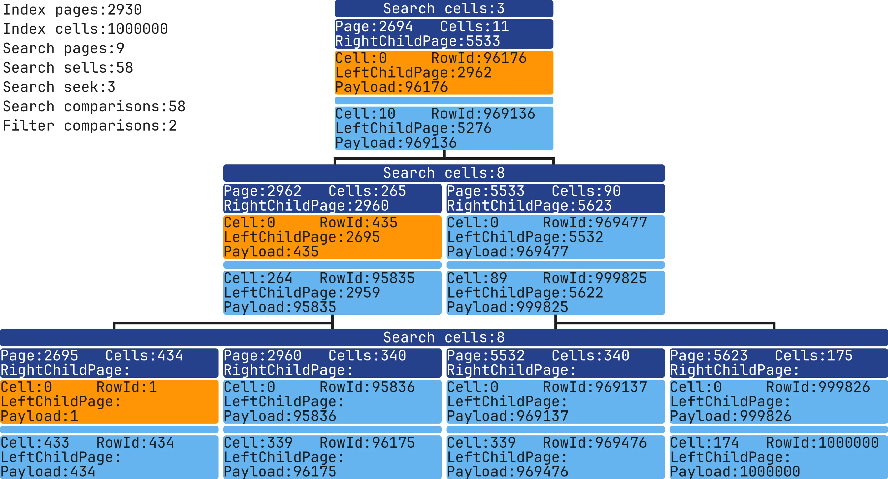
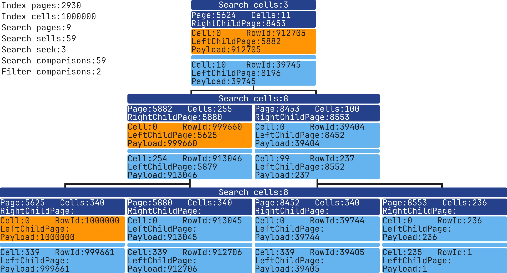
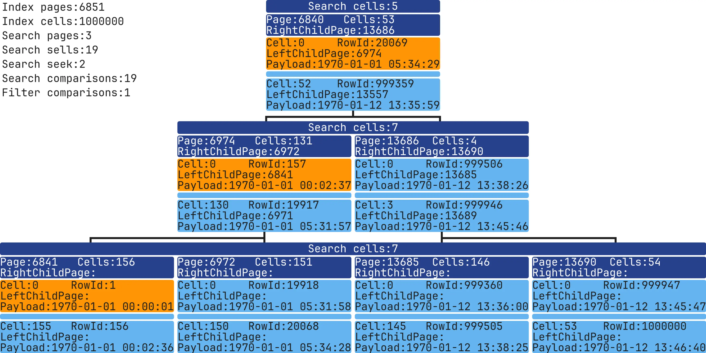
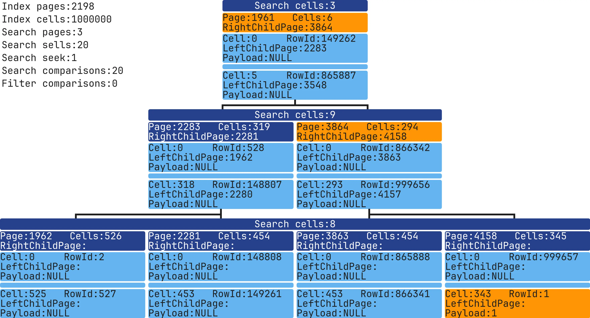
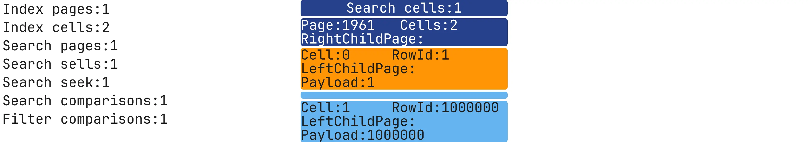
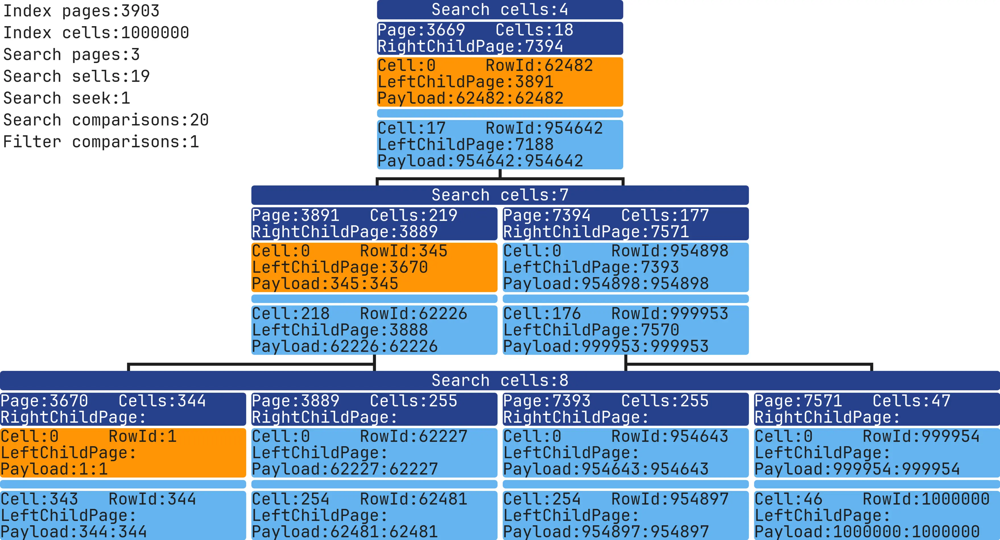
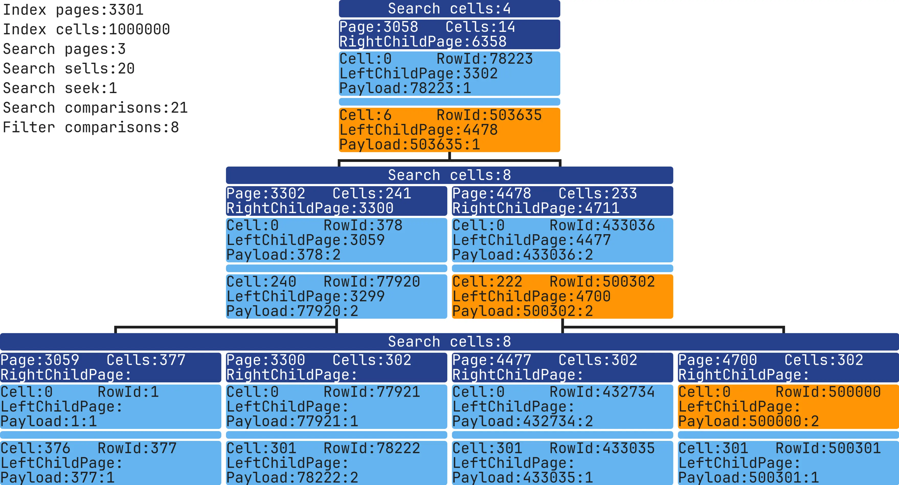
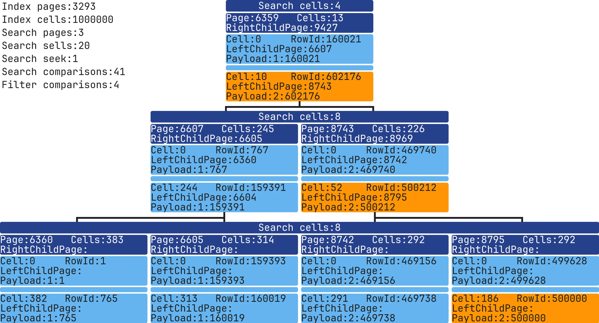

# SQLite Index Visualization: Search 

In the previous [post](/articles/2024/sqlite-index-visualization-structure/), I explained how to extract data from SQLite Indexes and make it visual. 
This time, I'll try to show what a search inside an Index looks like.

## How does SQLite search within an Index?


Inside each Page, SQLite performs a binary search among Cell values. After finding the closest match, it picks the left child of that Cell. 
If all Cell values on the Page are smaller than the target, it selects the Page’s right child.

[pagebreak]

If we compile SQLite with [debugging](https://www.sqlite.org/debugging.html) enabled and turn it on for queries, we can get detailed information about how the query work internally.
First, we should know that SQLite has a virtual machine. Even using a simple EXPLAIN command, we can view the virtual machine’s OPCODEs, its registers (p1, p2...), and comments. 
You can learn more about its internals [here](https://www.sqlite.org/opcode.html).
```sql
EXPLAIN SELECT rowId, column1 FROM table_test INDEXED BY idx WHERE column1 = 1;
addr  opcode         p1    p2    p3    p4             p5  comment      
----  -------------  ----  ----  ----  -------------  --  -------------
0     Init           0     11    0                    0   Start at 11
1     OpenRead       1     2694  0     k(2,,)         2   root=2694 iDb=0; idx
2     Explain        2     0     0     SEARCH table_test USING COVERING INDEX idx (column1=?) 0   
3     Integer        1     1     0                    0   r[1]=1
4     SeekGE         1     10    1     1              0   key=r[1]
5       IdxGT          1     10    1     1              0   key=r[1]
6       IdxRowid       1     2     0                    0   r[2]=rowid; table_test.rowid
7       Column         1     0     3                    0   r[3]= cursor 1 column 0
8       ResultRow      2     2     0                    0   output=r[2..3]
9     Next           1     5     1                    0   
10    Halt           0     0     0                    0   
11    Transaction    0     0     3     0              1   usesStmtJournal=0
12    TableLock      0     2     0     table_test     0   iDb=0 root=2 write=0
13    Goto           0     1     0                    0
```

The EXPLAIN output shows the root Page number of the Index, the OPCODEs used to search within the Index, and the related values for each step:
```bash
1     OpenRead       1     2694  0     k(2,,)         2   root=2694 iDb=0; idx
...
3     Integer        1     1     0                    0   r[1]=1
4     SeekGE         1     10    1     1              0   key=r[1]
```

Once the query finishes, we can look at the search counter to see how many times the data was searched in the Index:
```sql
SELECT rowId, column1 FROM table_test INDEXED BY idx WHERE column1 = 1;
.testctrl seek_count
1
```

[pagebreak]

We can't get more detailed information about pages and cells from the EXPLAIN output.
I dug into the code and [added](https://github.com/mrsuh/sqlite-index/blob/main/sqlite.patch) functions to track all the Pages and Cells read during the search.
Example of code:
```c
if (sqlite3DebugIsBtreeIndexSeekEnabled()) {
  char **payload = sqlite3DebugGetCellPayloadAndRowId(pCur, pPage, idx);
  printf(
      "sqlite3DebugBtreeIndexMoveto: pageNumber=%d, cellNumber=%d, payload=%s, rowId=%s\n",
      pPage->pgno,
      idx,
      payload[0],
      payload[1]
  );
  sqlite3DebugFreeCellPayloadAndRowId(payload);
}
```

The output looks like this:
```bash
sqlite3DebugMoveToRoot:
sqlite3DebugBtreeIndexMoveto: pageNumber=2694, cellNumber=5, payload=532656, rowId=532656
sqlite3DebugBtreeIndexCompare: index=1, type=int, value=1
sqlite3DebugBtreeIndexMoveto: pageNumber=2694, cellNumber=2, payload=270768, rowId=270768
sqlite3DebugBtreeIndexCompare: index=1, type=int, value=1
...
sqlite3DebugBtreeIndexMoveto: pageNumber=2695, cellNumber=0, payload=1, rowId=1
sqlite3DebugBtreeIndexCompare: index=1, type=int, value=1
sqlite3DebugResultRow:
1|1
```

[pagebreak]

This provides a detailed trace of the Pages and Cells used in the search, letting us count the basic operations and compare them to the expected complexity of the algorithm. 
Then, I updated the Index visualization code, and here’s the result:


In the top-left corner, we can see general information about the Index and specific search details:
* total Pages and Cells in the Index;
* number of Pages loaded during the search;
* number of Cells checked during the search;
* count of Index searches for the data;
* count of Cell comparisons;
* number of filtered Cells.

The searched Cell and its linked Cells are highlighted in bright colors.


Information about the number of filtered Cells:
```sql
SELECT * FROM table WHERE column = 10;
```
In this query, SQLite first finds the cell with the value 10, then checks the following cells since they could also have the value 10. 
So, instead of performing more searching, it reads the next cells to filter them. This means that for simple queries, there’s usually at least one filtering step.

[pagebreak]

To create this image, we’ll need dumps of both the Index and the search. 
We can get these with the following commands:
```bash
docker run -it --rm -v "$PWD":/app/data --platform linux/x86_64 mrsuh/sqlite-index bash
sh bin/dump-index.sh database.sqlite "SELECT column1 FROM table_test INDEXED BY idx WHERE column1 = 1;" dump-index.txt
sh bin/dump-search.sh database.sqlite "SELECT column1 FROM table_test INDEXED BY idx WHERE column1 = 1;" dump-search.txt
php bin/console app:render-search --dumpIndexPath=dump-index.txt --dumpSearchPath=dump-search.txt --outputImagePath=image.webp
```

The search dump file contain a lot of useful details about the query:
```bash
### QUERY
SELECT rowId, column1 FROM table_test INDEXED BY idx WHERE column1 = 1;

### EXPLAIN QUERY PLAN
`--SEARCH table_test USING COVERING INDEX idx (column1=?)

### EXPLAIN QUERY
addr  opcode         p1    p2    p3    p4             p5  comment      
----  -------------  ----  ----  ----  -------------  --  -------------
0     Init           0     11    0                    0   Start at 11
1     OpenRead       1     2694  0     k(2,,)         2   root=2694 iDb=0; idx

...

### RESULT
rowid  column1
-----  -------
1      1      
```

Let’s experiment!
Before each Index image, I'll show the table's data structure, the way the Index was made, and how the table was filled with data.

[pagebreak]

## Query with a single column and equality condition

```sql
CREATE TABLE table_test (column1 INT NOT NULL);
INSERT INTO table_test (column1) VALUES (1),(2),(3),...,(999998),(999999),(1000000);
CREATE INDEX idx ON table_test (column1 ASC);
```
```sql
SELECT rowId, column1 FROM table_test INDEXED BY idx WHERE column1 = 1;
rowid  column1
-----  -------
1      1
```


We read 3 Pages, compared 19 Cells, and filtered out one Cell. In this example, the actual number of comparisons is 19, which is lower than the theoretical worst-case for binary search: 
```bash
O(log2(n)) -> O(log2(1.000.000)) -> 19.93
```

[pagebreak]

## Query with multiple values in IN()

```sql
CREATE TABLE table_test (column1 INT NOT NULL);
INSERT INTO table_test (column1) VALUES (1),(2),(3),...,(999998),(999999),(1000000);
CREATE INDEX idx ON table_test (column1 ASC);
```
```sql
SELECT rowId, column1 FROM table_test INDEXED BY idx WHERE column1 IN (1,1000000);
rowid    column1
-------  -------
1        1      
1000000  1000000
```


For each value in the `IN()` list, SQLite performs a separate search in the Index. Sometimes, optimizations can reduce the number of searches, but generally, the database will go through the Index from the root to the target value for each item in the `IN()` list.

[pagebreak]

## Comparing searches in ASC/DESC Indexes
```sql
CREATE TABLE table_test (column1 INT NOT NULL);
INSERT INTO table_test (column1) VALUES (1),(2),(3),...,(999998),(999999),(1000000);
CREATE INDEX idx_asc ON table_test (column1 ASC);
CREATE INDEX idx_desc ON table_test (column1 DESC);
```
```sql
SELECT rowId, column1 FROM table_test INDEXED BY idx_asc WHERE column1 IN (1,500000,1000000);
rowid    column1
-------  -------
1        1      
500000   500000 
1000000  1000000
```



Here, three values are being searched, and each one requires an Index lookup. There are fewer filters than lookups because no filtering is needed after the last value.

[pagebreak]

## Descending order search

```sql
SELECT rowId, column1 FROM table_test INDEXED BY idx_desc WHERE column1 IN (1,500000,1000000);
rowid    column1
-------  -------
1000000  1000000
500000   500000 
1        1
```



As shown, searching in a DESC Index works the same as searching in an ASC Index in general cases.

[pagebreak]

## Range searches

```sql
CREATE TABLE table_test (column1 INT NOT NULL);
INSERT INTO table_test (column1) VALUES (1),(2),(3),...,(999998),(999999),(1000000);
CREATE INDEX idx ON table_test (column1 ASC);
```
```sql
SELECT rowId, column1 FROM table_test INDEXED BY idx WHERE column1 >= 500000 LIMIT 5;
rowid   column1
------  -------
500000  500000 
500001  500001 
500002  500002 
500003  500003 
500004  500004
```


In this query, the target value was found after 20 comparisons, with 0 filtering. This is because the search was done on an ascending (ASC) Index with a `>=` comparison. 
SQLite just read the next several values, and no further comparisons were needed since the data in the Index was already sorted in the required order.

[pagebreak]

## Expression-based searches

```sql
CREATE TABLE table_test (column1 TEXT NOT NULL);
INSERT INTO table_test (column1) VALUES ('{"timestamp":1}'),('{"timestamp":2}'),('{"timestamp":3}'),...,('{"timestamp":999998}'),('{"timestamp":999999}'),('{"timestamp":1000000}');
CREATE INDEX idx ON table_test (strftime('%Y-%m-%d %H:%M:%S', json_extract(column1, '$.timestamp'), 'unixepoch') ASC);
```
```sql
SELECT rowId, strftime('%Y-%m-%d %H:%M:%S',json_extract(column1, '$.timestamp'), 'unixepoch') AS date FROM table_test INDEXED BY idx WHERE strftime('%Y-%m-%d %H:%M:%S',json_extract(column1, '$.timestamp'), 'unixepoch') = '1970-01-01 00:00:01';
rowid  date               
-----  -------------------
1      1970-01-01 00:00:01
```



A search for an exact value created by an expression is just as fast as a simple number search in terms of the number of Cells compared. 
No matter how complex the expression, the search using the Index will still be quick. The key is that the expression in the Index must exactly match the expression in the query.

For example, if we have an Index like this:
```sql
CREATE INDEX idx ON table_test (column1 + column2);
```
SQLite will not use the Index for this query:
```sql
SELECT * FROM table_test WHERE (column2 + column1) = 1
```
The expressions are the same in meaning but different in how they are written. You must use the exact expression as it is in the Index:
```sql
SELECT * FROM table_test WHERE (column1 + column2) = 1
```

## Searching within a unique Index where nearly all values are filled with NULL

```sql
CREATE TABLE table_test (column1 INT)
INSERT INTO table_test (column1) VALUES (1),(NULL),(NULL),...,(NULL),(NULL),(1000000);
CREATE UNIQUE INDEX idx ON table_test (column1 ASC);
```
```sql
SELECT rowId, column1 FROM table_test INDEXED BY idx WHERE column1 = 1;
rowid  column1
-----  -------
1      1
```



This query does not differ from an Index without NULL values in terms of the number of Cells read.

[pagebreak]

## Searching in an Index without NULL values

We modified the Index slightly, and now it has no NULL values.
```sql
CREATE TABLE table_test (column1 INT)
INSERT INTO table_test (column1) VALUES (1),(NULL),(NULL),...,(NULL),(NULL),(1000000);
CREATE INDEX idx ON table_test (column1 ASC) WHERE column1 IS NOT NULL;
```
```sql
SELECT rowId, column1 FROM table_test INDEXED BY idx WHERE column1 = 1;
rowid  column1
-----  -------
1      1
```



Now, the Index has only the needed values, and the query runs very fast!

[pagebreak]

## Searching in a two-column Index

```sql
CREATE TABLE table_test (column1 INT NOT NULL, column2 INT NOT NULL);
INSERT INTO table_test (column1, column2) VALUES (1,1),(2,2),(3,3),...,(999998,999998),(999999,999999),(1000000,1000000);
CREATE INDEX idx ON table_test (column1 ASC, column2 ASC);
```
```sql
SELECT rowId, column1, column2 FROM table_test INDEXED BY idx WHERE column1 = 1 AND column2 = 1;
rowid  column1  column2
-----  -------  -------
1      1        1
```



The only difference from an Index with one column is the slightly more complex comparison process.
First, the first column is checked. If it matches the target value, then the second column is checked. If the first column doesn’t match, the second column is skipped.
In this case, 19 Cells were read, and 20 comparisons were made. The first 18 Cells were filtered out after the first comparison, and in the 19th Cell, two comparisons were made.

[pagebreak]

## Searching in Index with different data cardinality

Let's try searching in an Index with two columns, where the columns have different cardinalities. The `column1` has high cardinality, with values ranging from 1 to 1,000,000, while the `column2` has low cardinality, with only the values 1 and 2.
We will create two Indexes with different column orders and see how they perform.

```sql
CREATE TABLE table_test (column1 INT NOT NULL, column2 INT NOT NULL);
INSERT INTO table_test (column1, column2) VALUES (1,1),(2,2),(3,1),...,(999998,2),(999999,1),(1000000,2);
CREATE INDEX idx_column1_column2 ON table_test (column1 ASC, column2 ASC);
CREATE INDEX idx_column2_column1 ON table_test (column2 ASC, column1 ASC);
```

### idx_column1_column2

```sql
SELECT rowId, column1, column2 FROM table_test INDEXED BY idx_column1_column2 WHERE column1 >= 500000 AND column2 = 2  LIMIT 5;
rowid   column1  column2
------  -------  -------
500000  500000   2      
500002  500002   2      
500004  500004   2      
500006  500006   2      
500008  500008   2
```



Query details:

| column1 (>= 5000) | column2 (=2) | comments                                     |
|-------------------|--------------|----------------------------------------------|
| ...               | ...          | search: 19 comparisons on column1            |
| 500000            | 2            | search: 2 comparisons on column1 and column2 |
| 500001            | 1            | filter: 1 comparison on column2              |
| 500002            | 2            | filter: 1 comparison on column2              |
| 500003            | 1            | filter: 1 comparison on column2              |
| 500004            | 2            | filter: 1 comparison on column2              |
| 500005            | 1            | filter: 1 comparison on column2              |
| 500006            | 2            | filter: 1 comparison on column2              |
| 500007            | 1            | filter: 1 comparison on column2              |
| 500008            | 2            | filter: 1 comparison on column2              |
| ...               | ...          |                                              |

It took only 21 comparisons to find the first row, but there’s no guarantee that SQLite can quickly filter the remaining rows. In the case below, SQLite has to scan the rest of the Index to ensure there are no more rows that match the query.

| column1 (>= 500000) | column2 (=2) | comments                                          |
|---------------------|--------------|---------------------------------------------------|
| ...                 | ...          | search: 19 comparisons on column1                 |
| 500000              | 2            | search: 2 comparisons on column1 and column2      |
| 500001              | 1            | filter: 2 comparisons on column1 and column2      |
| 500002              | 1            | filter: 2 comparisons on column1 and column2      |
| 500003              | 1            | filter: 2 comparisons on column1 and column2      |
| 500004              | 1            | filter: 2 comparisons on column1 and column2      |
| 500005              | 1            | filter: 2 comparisons on column1 and column2      |
| 500006              | 1            | filter: 2 comparisons on column1 and column2      |
| 500007              | 1            | filter: 2 comparisons on column1 and column2      |
| 500008              | 1            | filter: 2 comparisons on column1 and column2      |
| ...                 | ...          | filter: 999980 comparisons on column1 and column2 |
| 1000000             | 1            | filter: 2 comparisons on column1 and column2      |

### idx_column2_column1

```sql
SELECT rowId, column1, column2 FROM table_test INDEXED BY idx_column2_column1 WHERE column1 >= 500000 AND column2 = 2 LIMIT 5;
rowid   column1  column2
------  -------  -------
500000  500000   2      
500002  500002   2      
500004  500004   2      
500006  500006   2      
500008  500008   2
```



Query details:

| column2 (=2) | column1 (>= 5000) | comments                              |
|--------------|-------------------|---------------------------------------|
| ...          | ...               | 39 comparisons on column1 and column2 |
| 2            | 500000            | 2 comparisons on column1 and column2  |
| 2            | 500002            | filter: 1 comparison on column1       |
| 2            | 500004            | filter: 1 comparison on column1       |
| 2            | 500006            | filter: 1 comparison on column1       |
| 2            | 500008            | filter: 1 comparison on column1       |
| ...          | ...               |                                       |

When the low-cardinality column is placed first, it takes more comparisons to find the first match, but SQLite can quickly filter any remaining rows. 
If there are no other matching rows, SQLite knows this after just 2 comparisons.

For a query with only one result row, it’s better to use an Index where the high-cardinality column is placed first.
For a query with many result rows, it’s better to use an Index with the range column at the end, regardless of the column's cardinality.

[pagebreak]

## Conclusion

The visualization of Index search operations in SQLite gives us a better understanding of how the database works with its internal data structures. 
Detailed logs allow us to see not just the number of operations but also the steps taken to find the desired values. 
Understanding SQLite's inner workings helps us optimize queries and makes working with Indexes more predictable and manageable.

All the images generated above can be reproduced using the following commands:
```bash
docker run -it --rm -v "$PWD":/app/data --platform linux/x86_64 mrsuh/sqlite-index bash
sh bin/test-search.sh
```

The code and examples are available [here](https://github.com/mrsuh/sqlite-index)
