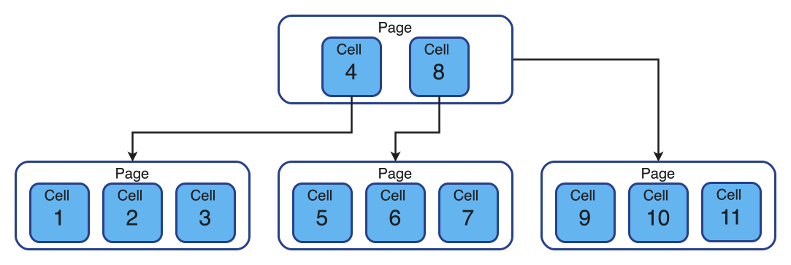
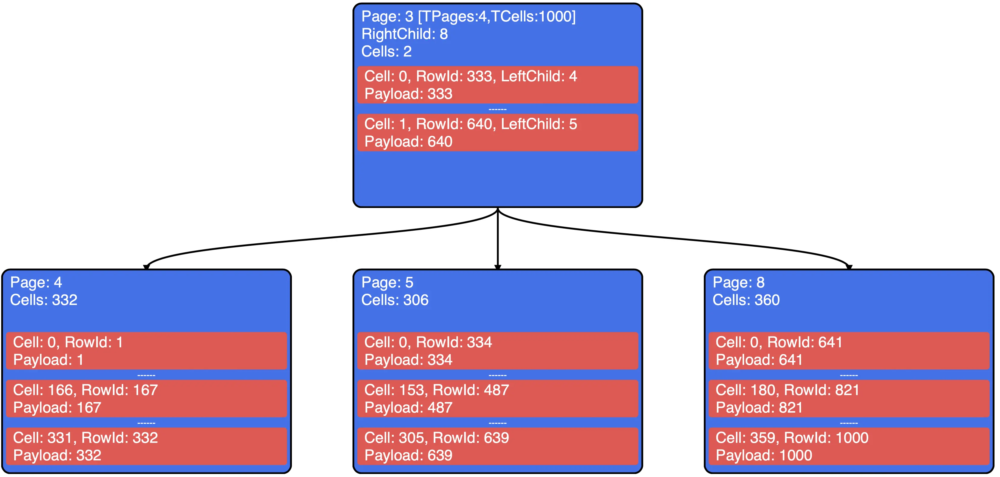
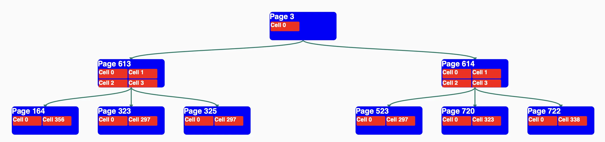
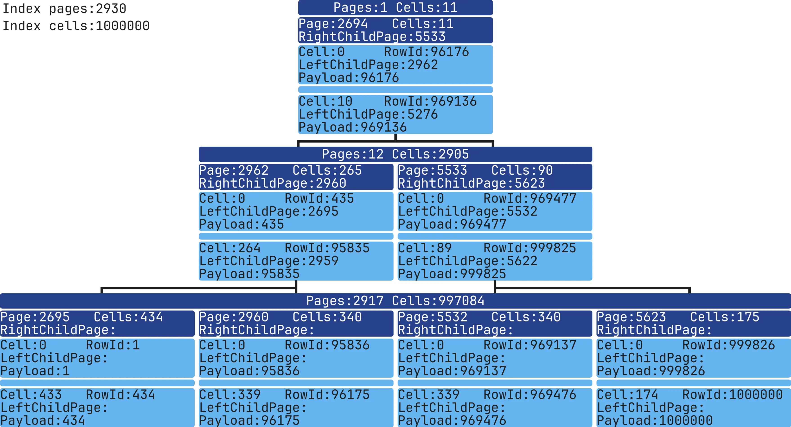
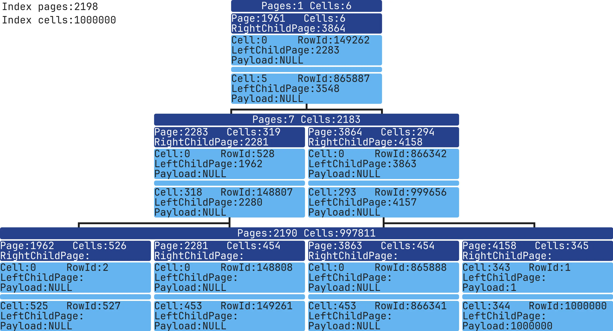
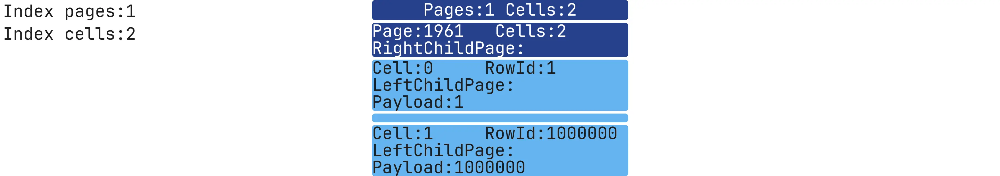

# SQLite Index Visualization: Structure

After learning about indexes, I understood their basic structure, but I wanted to dig deeper — to explore the data structure, understand the algorithm, and learn how the index data is stored on disk. 
The theory and actual implementation can differ, so I decided to explore this topic further.

I wanted to see how a database management system (DBMS) stores an index in both disk and memory, and how it searches through an Index.
I chose SQLite for my experiments:
* it’s a widely used DBMS, found in browsers, mobile apps, and operating systems;
* it's easier to debug: no separate server, just a client-side application;
* its codebase is smaller than MySQL or PostgreSQL but uses similar data structures for Indexes;
* it’s open-source.

## Node and Page Structure

According to SQLite [documentation](https://sqlite.org/fileformat2.html), Indexes are stored in a B-Tree structure, which is a balanced tree where each node has multiple children. 
It typically looks like this:


To understand how SQLite stores Nodes, let’s look at the Page and Cell structures. 
A Page (analog of a Node on SQLite) stores Cells data and has a link to its right child Page. 
A Cell contains Index data, a rowId, and a link to its left child Page. 
By default, each SQLite table row has a unique rowId, which works like a primary key if one isn’t explicitly defined.

[pagebreak]

Here’s a visual example of a B-Tree Index in SQLite:



Index data is stored on disk in this structure:


Each Page has a fixed size, ranging from 512 to 65,536 bytes. Page and Cell headers use 4 bytes to store child links. 
If we want to know child Page number - we need to read the header separately with this function:

```c
get4byte(...)
```

For other Page and Cell data, we can use these C structures:

### Page
sqlite/src/btreeInt.h
```c
struct MemPage {
  Pgno pgno;           /* Page number for this page */
  u16 nCell;           /* Number of cells on this page, local and ovfl */
  u8 *aCellIdx;        /* The cell index area */
  u8 *aData;           /* Pointer to disk image of the page data */ 
  ...
};
```

[pagebreak]

### Cell
sqlite/src/btreeInt.h
```c
struct CellInfo {
  u8 *pPayload;  /* Pointer to the start of payload */
  ...
};
```

To view index data, we can use [sqlite3 analyzer](https://www.sqlite.org/sqlanalyze.html):
```bash
sqlite3_analyzer database.sqlite
...
Page size in bytes................................ 4096      
...
*** Index IDX of table TABLE_TEST *********************************************  
Number of entries................................. 1000      
B-tree depth...................................... 2         
Total pages used.................................. 4        
..
```
This tool provides only general information about index.

## Analyzing SQLite Source Code

After a few weeks of experimenting, I wrote my functions for index analysis.

You can view the code [here](https://github.com/mrsuh/sqlite-index/blob/main/sqlite.patch):
```c
char *sqlite3DebugGetMemoryPayload(Mem *mem);

char **sqlite3DebugGetCellPayloadAndRowId(BtCursor *pCur, MemPage *pPage, int cellIndex);

void sqlite3DebugBtreeIndexDump(BtCursor *pCur, int pageNumber);
```

The function reads the content of selected index and outputting data to STDOUT:
```bash
SQL query -> selected index -> stdout
```

[pagebreak]

Here’s an example output:
```bash
sqlite3BtreeIndexDump: page, number=3, rightChildPageNumber=99
sqlite3BtreeIndexDump: cell, number=0, leftChildPageNumber=7, payload=384, rowId=384
sqlite3BtreeIndexDump: cell, number=1, leftChildPageNumber=8, payload=742, rowId=742
...
```

I packed everything into a docker if you want to test it: 
```bash
docker run -it --rm -v "$PWD":/app/data --platform linux/x86_64 mrsuh/sqlite-index bash
```

You can use the script like this:
```bash
sh bin/dump-index.sh database.sqlite "SELECT * FROM table INDEXED BY index WHERE column=1" dump.txt
```

dump.txt
```bash
sqlite3BtreeIndexDump: page, number=3, rightChildPageNumber=99
sqlite3BtreeIndexDump: cell, number=0, leftChildPageNumber=7, payload=384, rowId=384
sqlite3BtreeIndexDump: cell, number=1, leftChildPageNumber=8, payload=742, rowId=742
...
sqlite3BtreeIndexDump: page, number=99, rightChildPageNumber=-1
sqlite3BtreeIndexDump: cell, number=0, leftChildPageNumber=-1, payload=9642, rowId=9642
sqlite3BtreeIndexDump: cell, number=1, leftChildPageNumber=-1, payload=9643, rowId=9643
...
sqlite3BtreeIndexDump: page, number=7, rightChildPageNumber=-1
sqlite3BtreeIndexDump: cell, number=0, leftChildPageNumber=-1, payload=1, rowId=1
sqlite3BtreeIndexDump: cell, number=1, leftChildPageNumber=-1, payload=2, rowId=2
...
```

Great!
The next step was to display everything visually — an easy part of the process.

[pagebreak]

I found a library called [d3-org-tree](https://github.com/benyasin/d3-org-tree) for visualizing index structures. 
Here’s how it looked in the early stages:



However, there was a problem: I couldn’t adjust the spacing between Pages, so as the tree became deeper and more Pages were added at each level, the image became too large and hard to read.



I tried adjusting it with JavaScript and CSS, but it didn’t work well.
After a few tries with d3-org-tree, I decided that using text to display the structure would be simpler.

[pagebreak]

Example:
```bash
------------------------------------------------------------------------------------------------------------------------
 Total Pages: 29
 Total Cells: 1000
------------------------------------------------------------------------------------------------------------------------
 Level: 1                           |============================================|
 Pages: 1                           |Page: 3   | RightChildPage: 53  | Cells: 27 │
 Cells: 29                          |============================================|
                                    |Cell: 0   | LeftChildPage: 47   | RowId: 1  │
                                    |Payload: 000000000000000000000000000000     │
                                    |--------------------------------------------│
                                    |                  * * *                     │
                                    |--------------------------------------------│
                                    |Cell: 26   | LeftChildPage: 78   | RowId: 5 │
                                    |Payload: 000000000000000000000000000000     │
                                    |============================================|
------------------------------------------------------------------------------------------------------------------------
 Level: 2      |============================================| |============================================|
 Pages: 50     |Page: 3   | RightChildPage: 53  | Cells: 27 | │Page: 3   | RightChildPage: 53  | Cells: 27 |
 Cells: 400    |============================================| |============================================|
               |Cell: 0   | LeftChildPage: 47   | RowId: 1  | │Cell: 0   | LeftChildPage: 47   | RowId: 1  |
               |Payload: 000000000000000000000000000000     | │Payload: 000000000000000000000000000000     |
               |--------------------------------------------| │--------------------------------------------|
               |                  * * *                     | │                  * * *                     |
               |--------------------------------------------| │--------------------------------------------|
               |Cell: 26   | LeftChildPage: 78   | RowId: 5 | │Cell: 26   | LeftChildPage: 78   | RowId: 5 |
               |Payload: 000000000000000000000000000000     | │Payload: 000000000000000000000000000000     |
               |============================================| |============================================|
------------------------------------------------------------------------------------------------------------------------
```

Not bad, but I could go further.
PHP's [ImageMagick](https://www.php.net/manual/en/intro.imagick.php) extension lets us create images with more control over design and spacing than text alone. After about a dozen tries, here's the final version I came up with:



The image now includes all the needed data and is easy to read.

In the top-left corner, there’s general information about the Index.
Each level shows the total number of Pages and Cells.
Each Page shows its Page number, the link to its right child, and details about the first and last Cell.
Only a few Pages are shown per level, including the first and last Pages for each level.
The root Page is located at the first level.

Use this command to generate an image from the dump 
```bash
php bin/console app:render-index --dumpIndexPath=dump.txt --outputImagePath=image.webp
```

Now it's time to experiment!

We can create different data for the Indexes and explore what's inside them.
To start, it would be interesting to see how the Index size grows from 1 to 1,000,000 records.
Before each Index image, I'll show the table's data structure, the way the Index was made, and how the table was filled with data.

[pagebreak]

## Index with 1 record

```sql
CREATE TABLE table_test (column1 INT NOT NULL);
INSERT INTO table_test (column1) VALUES (1);
CREATE INDEX idx ON table_test (column1 ASC);
```


One level, one Page, one Cell. Simple!

## Index with 1000 records
```sql
CREATE TABLE table_test (column1 INT NOT NULL);
INSERT INTO table_test (column1) VALUES (1),(2),(3),...,(998),(999),(1000);
CREATE INDEX idx ON table_test (column1 ASC);
```


[pagebreak]

## Index with 1.000.000 records

```sql
CREATE TABLE table_test (column1 INT NOT NULL);
INSERT INTO table_test (column1) VALUES (1),(2),(3),...,(999998),(999999),(1000000);
CREATE INDEX idx ON table_test (column1 ASC);
```


Now we’ve reached the image I used earlier as an example.
This Index has 3 levels, 2,930 Pages, and 1,000,000 Cells. The data was added in order, so for rowId = 1, column1 = 1.

[pagebreak]

## Comparing ASC and DESC Indexes

Now, let's add two Indexes with different sort directions.
```sql
CREATE TABLE table_test (column1 INT NOT NULL);
INSERT INTO table_test (column1) VALUES (1),(2),(3),...,(999998),(999999),(1000000);
CREATE INDEX idx_asc ON table_test (column1 ASC);
CREATE INDEX idx_desc ON table_test (column1 DESC);
```


The ASC Index is the same as above, as ASC sorting is used by default. 
The table's first entry, rowId=1,000,000, column1=1,000,000, payload=1,000,000, is in the last Cell of the rightmost Page.
The table's last entry, rowId=1, column1=1, payload=1, is in the first Cell of the leftmost Page.

[pagebreak]


The DESC Index is reversed.
The table's first entry, rowId=1, column1=1, payload=1, is in the last Cell of the rightmost Page.
The table's last entry, rowId=1,000,000, column1=1,000,000, payload=1,000,000, is in the first Cell of the leftmost Page.

[pagebreak]

## Index with expression-based data

```sql
CREATE TABLE table_test (column1 TEXT NOT NULL);
INSERT INTO table_test (column1) VALUES ('{"timestamp":1}'),('{"timestamp":2}'),('{"timestamp":3}'),...,('{"timestamp":999998}'),('{"timestamp":999999}'),('{"timestamp":1000000}');
CREATE INDEX idx ON table_test (strftime('%Y-%m-%d %H:%M:%S', json_extract(column1, '$.timestamp'), 'unixepoch') ASC);
```


The Index now stores a string generated by the expression.
You can use more complex expressions, and the Index will save the only result.

[pagebreak]

## Unique Index with NULL values

```sql
CREATE TABLE table_test (column1 INT)
INSERT INTO table_test (column1) VALUES (1),(NULL),(NULL),...,(NULL),(NULL),(1000000);
CREATE UNIQUE INDEX idx ON table_test (column1 ASC);
```



SQLite supports unique Indexes with NULL values.
This index looks like we are storing only non-NULL values.

[pagebreak]

## Filtering NULL Values with Partial Indexes 

```sql
CREATE TABLE table_test (column1 INT)
INSERT INTO table_test (column1) VALUES (1),(NULL),(NULL),...,(NULL),(NULL),(1000000);
CREATE INDEX idx ON table_test (column1 ASC) WHERE column1 IS NOT NULL;
```



The Index now contains just one Page, leading to faster searches than the previous example.

## Multi-Column Index

```sql
CREATE TABLE table_test (column1 INT NOT NULL, column2 INT NOT NULL);
INSERT INTO table_test (column1, column2) VALUES (1,1),(2,2),(3,3),...,(999998,999998),(999999,999999),(1000000,1000000);
CREATE INDEX idx ON table_test (column1 ASC, column2 ASC);
```


As we can see, the data for all fields in a cell are stored one after another.
The fields are separated visually with a colon `:`.

[pagebreak]

## Comparing Indexes Created Before and After Data Population

```sql
CREATE TABLE table_test (column1 INT NOT NULL);
CREATE INDEX idx_before ON table_test (column1 ASC);
INSERT INTO table_test (column1) VALUES (1),(2),(3),...,(999998),(999999),(1000000);
CREATE INDEX idx_after ON table_test (column1 ASC);
```

### Before


[pagebreak]

### After


The tree must rebalance itself when new data is added. Creating an Index on existing data should be much more efficient.
Both Indexes look similar, but the second Index, with fewer Pages, should be faster.
```bash
+--------+-------------+-------------+
|        | Total Pages | Total Cells |
+--------+-------------+-------------+
| Before | 3342        | 1000000     |
| After  | 2930        | 1000000     |
+--------+-------------+-------------+
```

[pagebreak]

## VACUUM and REINDEX

To achieve similar optimization, we can rebuild an existing Index with these commands:

[VACUUM](https://www.sqlite.org/lang_vacuum.html) recreates Indexes and tables with data:
```sql
CREATE TABLE table_test (column1 INT NOT NULL);
CREATE INDEX idx ON table_test (column1 ASC);
INSERT INTO table_test (column1) VALUES (1),(2),(3),...,(999998),(999999),(1000000);
VACUUM;
```

```bash
+--------+-------------+-------------+
|        | Total Pages | Total Cells |
+--------+-------------+-------------+
| Before | 3342        | 1000000     |
| After  | 2930        | 1000000     |
+--------+-------------+-------------+
```


[REINDEX](https://www.sqlite.org/lang_reindex.html) -  recreates Indexes only:
```sql
CREATE TABLE table_test (column1 INT NOT NULL);
CREATE INDEX idx ON table_test (column1 ASC);
INSERT INTO table_test (column1) VALUES (1),(2),(3),...,(999998),(999999),(1000000);
REINDEX idx;
```

```bash
+--------+-------------+-------------+
|        | Total Pages | Total Cells |
+--------+-------------+-------------+
| Before | 3342        | 1000000     |
| After  | 2930        | 1000000     |
+--------+-------------+-------------+
```
After running VACUUM/REINDEX, the number of Pages in the Index decreased a lot. 

[pagebreak]

## Text Data in Indexes

Let's look at how text is stored. Short strings are saved directly in the Index Cells, but longer text must be stored separately.

```sql
CREATE TABLE table_test (column1 text NOT NULL);
INSERT INTO table_test (column1) VALUES ('text-1'),('text-2'),('text-3'),...,('text-999998'),('text-999999'),('text-1000000');
CREATE INDEX idx ON table_test (column1 ASC);
```


You can easily see the actual string stored directly in the Index.

[pagebreak]

## Float-point Data in Indexes
```sql
CREATE TABLE table_test (column1 REAL NOT NULL);
INSERT INTO table_test (column1) VALUES ('1.14'),('2.14'),('3.14'),...,('999998.14'),('999999.14'),('1000000.14');
CREATE INDEX idx ON table_test (column1 ASC);
```


[pagebreak]

## Combining integer and text in a single Index:
```sql
CREATE TABLE table_test (column1 INT NOT NULL, column2 TEXT NOT NULL);
INSERT INTO table_test (column1, column2) VALUES (1,'text-1'),(2,'text-2'),(3,'text-3'),...,(999998,'text-999998'),(999999,'text-999999'),(1000000,'text-1000000');
CREATE INDEX idx ON table_test (column1 ASC, column2 ASC);
```


The integer and string are stored together in the Cell, just as we specified when creating the Index.

[pagebreak]

## Conclusion

Based on the work done, we saw how Indexes in SQLite are structured. 
We looked at how record data is stored in memory and how the B-Tree organizes and accesses this data. 
The visualization helped analyze and compare different Indexes.

To reproduce all of these examples, you can run the following:
```bash
docker run -it --rm -v "$PWD":/app/data --platform linux/x86_64 mrsuh/sqlite-index bash
sh bin/test-index.sh
```

Code and examples are available [here](https://github.com/mrsuh/sqlite-index)

Next, I'll focus on visualizing Index-based searches and explore some interesting SQL queries.
