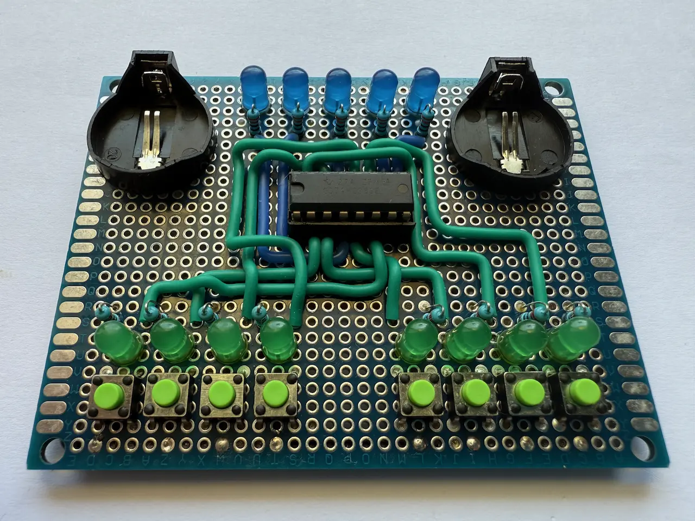
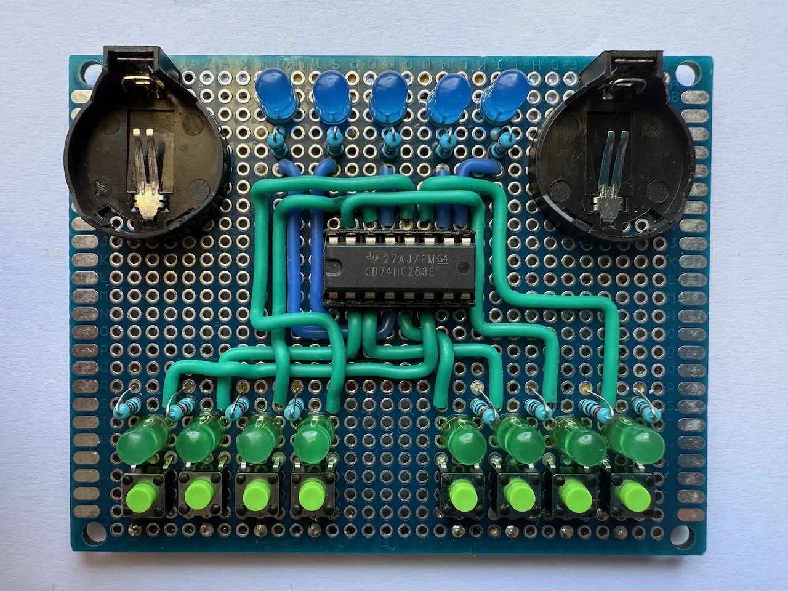
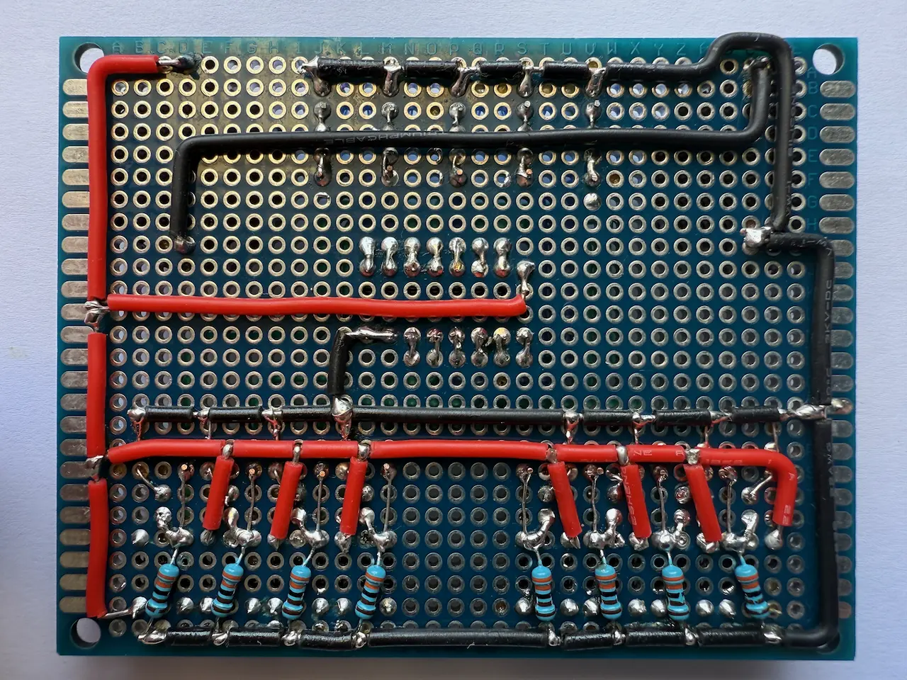

# 4 Bit Adder

The [Adder](https://en.wikipedia.org/wiki/Adder_(electronics)) is a digital circuit that adds two 4-bit numbers.
Logically, it is built from four [Half Adders](/articles/2026/half-adder-using-transistors). It has 8 inputs (4 bits for each number) and 5 outputs (4 sum bits and 1 carry bit). The carry signal represents an overflow into the next digit in a multi-digit addition.

### Implementation

For the implementation, Binary Full Adder `CD74HC283E` was used.

|
:---:|:---:
 | 

The video demonstrates the circuit behavior for all input states.

<iframe class="rounded" src="https://youtube.com/embed/92jnn1aR-Oc" title="YouTube video player" frameborder="0" allow="accelerometer; autoplay; clipboard-write; encrypted-media; gyroscope; picture-in-picture; web-share" referrerpolicy="strict-origin-when-cross-origin" allowfullscreen></iframe>
