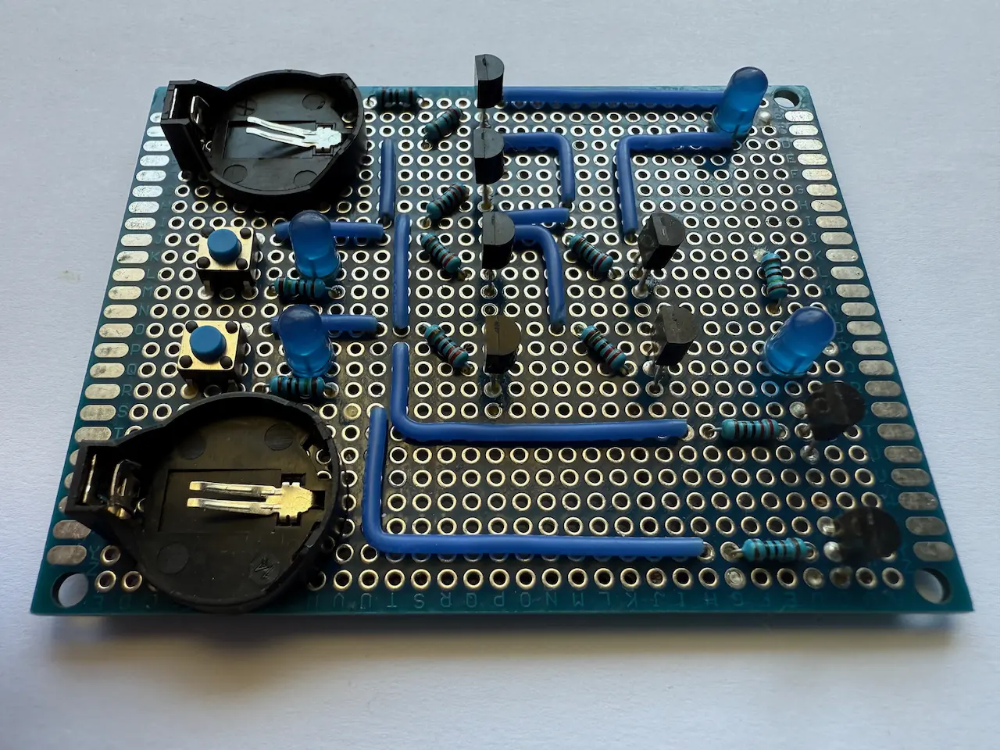
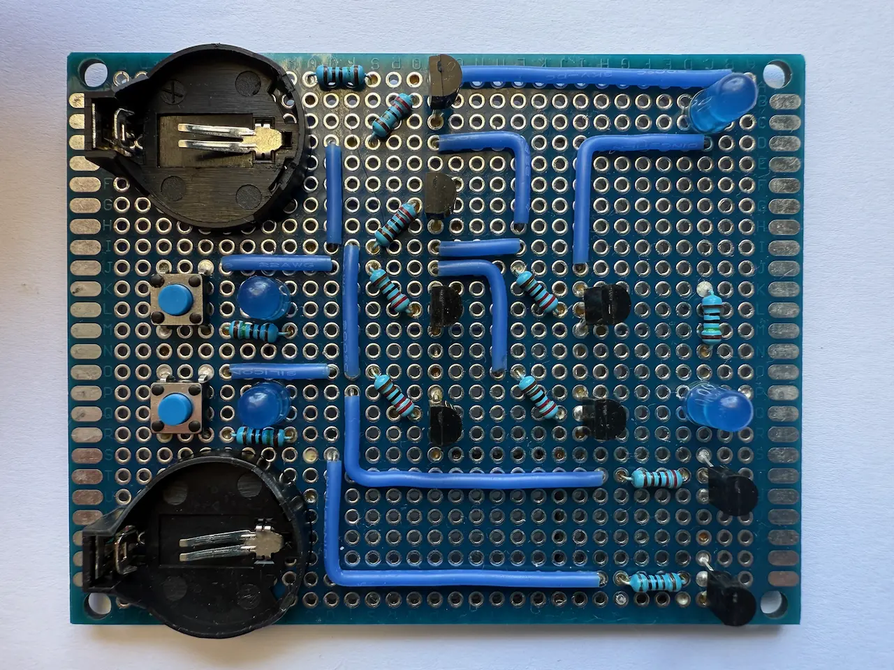

# Half Adder using transistors

The [Half Adder](https://en.wikipedia.org/wiki/Adder_(electronics)#Half_adder) is a digital circuit that adds two single binary digits. It has two inputs and two outputs (sum and carry). The carry signal represents an overflow into the next digit in a multi-digit addition.
The XOR gate can be built using a combination of [XOR](/articles/2026/xor-gate-using-transistors/) and [AND](/articles/2026/and-gate-using-transistors/) gates.
The full truth table, showing all input and output states, can be found below. Each row represents a physical state of the circuit.

### Truth table

| Input A | Input B | Sum S | Carry C |
|---------|---------|-------|---------|
| 0       | 0       | 0     | 0       |
| 0       | 1       | 1     | 0       |
| 1       | 0       | 1     | 0       |
| 1       | 1       | 0     | 1       |

### Logic scheme

The inputs and outputs in the scheme correspond to the truth table headers.

### Implementation

For the implementation, NPN 2N2222A transistors were used.

|
:---:|:---:
 | 
