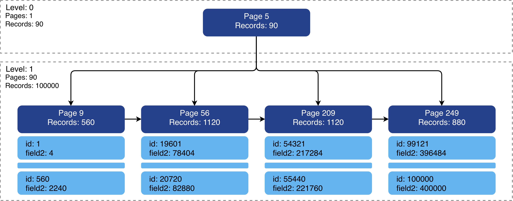
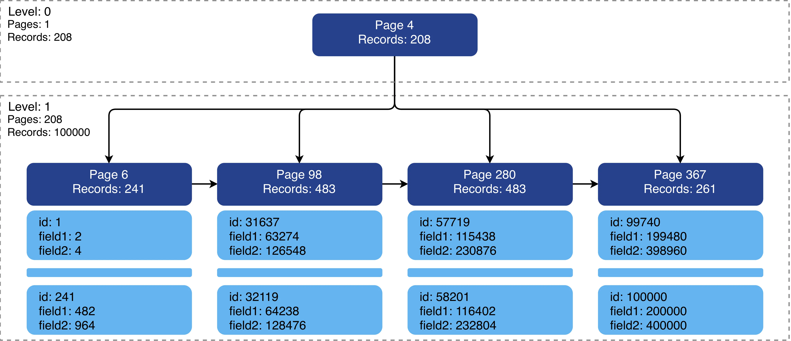

# MySQL Indexes and OFFSET Pagination

Recently, I came across an unusual way to optimize a MySQL query that uses OFFSET. I then decided to investigate the structure of MySQL InnoDB indexes, as I had previously [done for SQLite](/articles/2024/sqlite-index-visualization-structure/).
This short article describes that investigation. 


First, I created a test table with 100,000 rows, a `Primary Index`, and one `Secondary Index`.

```sql
CREATE TABLE test_table
(
    id     INT AUTO_INCREMENT,
    field1 INT,
    field2 INT,
    PRIMARY KEY (id),
    INDEX (field2)
) ENGINE=InnoDB;
```

| id     | field1 | field2 |
|:-------|:-------|:-------|
| 1      | 2      | 4      |
| 2      | 4      | 8      |
| 3      | 6      | 12     |
| 4      | 8      | 16     |
| 5      | 10     | 20     |
| ...    | ...    | ...    |
| 100000 | 200000 | 400000 |


Then, I found a MySQL system table that contains information about the indexes in my test table. It shows index IDs, B-tree pages count, and tablespaces.

```sql
SELECT i.NAME,
       i.INDEX_ID,
       i.PAGE_NO,
       i.SPACE,
       t.NAME
FROM INFORMATION_SCHEMA.INNODB_INDEXES i
         JOIN INFORMATION_SCHEMA.INNODB_TABLES t ON t.TABLE_ID = i.TABLE_ID
WHERE t.NAME = 'main/test_table';
```

There are exactly the two indexes I created for the table.

| NAME    | INDEX\_ID | PAGE\_NO | SPACE | NAME             |
|:--------|:----------|:---------|:------|:-----------------|
| PRIMARY | 2305      | 4        | 455   | main/test\_table |
| field2  | 2306      | 5        | 455   | main/test\_table |


I found two tools ([innodb_space]([https://github.com/jeremycole/innodb_ruby/blob/main/bin/innodb_space](https://github.com/jeremycole/innodb_ruby/tree/main)) and [innodb-java-reader](https://github.com/alibaba/innodb-java-reader)) to parse idb data. Unfortunately, they don't work with my MySQL version 8.0.
So I wrote Python scripts to parse the specific indexes I needed.

The following information about the `Secondary Index` `INDEX (field2)`.
```bash
python bin/scan.py test_table.ibd 2306
{'page': 5, 'level': 1, 'records': 90, 'prev': '-', 'next': '-'}
{'page': 9, 'level': 0, 'records': 560, 'prev': '-', 'next': 10}
...
{'page': 248, 'level': 0, 'records': 1120, 'prev': 247, 'next': 249}
{'page': 249, 'level': 0, 'records': 880, 'prev': 248, 'next': '-'}
```

```bash
python bin/parse.py test_table.ibd 9 2305 2306
{'offset': 126, 'field2': 4, 'id': 1}
{'offset': 140, 'field2': 8, 'id': 2}
..
{'offset': 7938, 'field2': 2236, 'id': 559}
{'offset': 7952, 'field2': 2240, 'id': 560}
```

There is a graphical version of this index. It has 2 levels, 209 pages, 100,000 data records, and 90 records for searching only. Only leaf pages contain data.



Secondary indexes contain Primary ID. This means that a `Secondary Index` can serve as a covering index when selecting the id column.

```sql
SELECT field2, id
FROM test_table
WHERE field2 = 100;
```

#### EXPLAIN

| id | select\_type | table       | partitions | type | possible\_keys | key    | key\_len | ref   | rows | filtered | Extra       |
|:---|:-------------|:------------|:-----------|:-----|:---------------|:-------|:---------|:------|:-----|:---------|:------------|
| 1  | SIMPLE       | test\_table | null       | ref  | field2         | field2 | 5        | const | 1    | 100      | Using index |

`Using index` in `Extra` means MySQL uses only this index to retrieve the requested data.

This brings us to the problem with OFFSET.

```sql
SELECT field2
FROM test_table
WHERE field2 > 10
ORDER BY field2 ASC LIMIT 10
OFFSET 1000;
```

#### EXPLAIN

| id | select\_type | table       | partitions | type  | possible\_keys | key    | key\_len | ref  | rows  | filtered | Extra                    |
|:---|:-------------|:------------|:-----------|:------|:---------------|:-------|:---------|:-----|:------|:---------|:-------------------------|
| 1  | SIMPLE       | test\_table | null       | range | field2         | field2 | 5        | null | 50128 | 100      | Using where; Using index |

#### EXPLAIN ANALYZE

```bash
-> Limit/Offset: 10/1000 row(s)  (cost=10039.62 rows=10) (actual time=0.286..0.288 rows=10 loops=1)
    -> Filter: (test_table.field2 > 10)  (cost=10039.62 rows=50128) (actual time=0.026..0.257 rows=1010 loops=1)
        -> Covering index range scan on test_table using field2 over (10 < field2)  (cost=10039.62 rows=50128) (actual time=0.021..0.195 rows=1010 loops=1)
```

The query uses `Secondary Index` only, but because of OFFSET it works very slowly. 
First, MySQL finds the record with `id: 12` because it's the first record that meets `WHERE field2 > 10` condition. It must then read and count all records until it reaches OFFSET 1000. 

| id   | field2 |          |
|:-----|:-------|:---------|
| 1    | 4      |          |
| 2    | 8      |          |
| 3    | 12     | found    |
| 4    | 16     | skipped  |
| 5    | 18     | skipped  |
| ...  | ...    | skipped  |
| 1003 | 4012   | returned |

To avoid this unnecessary reading, we can use cursor and point MySQL directly to the target record.

```sql
SELECT field2
FROM test_table
WHERE field2 >= 4012
ORDER BY field2 ASC LIMIT 10;
```

#### EXPLAIN

| id | select\_type | table       | partitions | type  | possible\_keys | key    | key\_len | ref  | rows  | filtered | Extra                    |
|:---|:-------------|:------------|:-----------|:------|:---------------|:-------|:---------|:-----|:------|:---------|:-------------------------|
| 1  | SIMPLE       | test\_table | null       | range | field2         | field2 | 5        | null | 50128 | 100      | Using where; Using index |

#### EXPLAIN ANALYZE

```bash
-> Limit: 10 row(s)  (cost=10039.62 rows=10) (actual time=0.027..0.032 rows=10 loops=1)
    -> Filter: (test_table.field2 >= 4012)  (cost=10039.62 rows=50128) (actual time=0.025..0.030 rows=10 loops=1)
        -> Covering index range scan on test_table using field2 over (4012 <= field2)  (cost=10039.62 rows=50128) (actual time=0.019..0.023 rows=10 loops=1)
```

This cursor-based query is much faster than the OFFSET query, even on this small table.

| TYPE   | TIME                     |
|:-------|:-------------------------|
| OFFSET | actual time=0.286..0.288 |
| CURSOR | actual time=0.027..0.032 |

Now let's see what the `Primary Index` contains.

There is information about the `Primary Index`.

```bash
python bin/scan.py test_table.ibd 2305
{'page': 4, 'level': 1, 'records': 208, 'prev': '-', 'next': '-'}
{'page': 6, 'level': 0, 'records': 241, 'prev': '-', 'next': '7'}
...
{'page': 366, 'level': 0, 'records': 483, 'prev': 365, 'next': 367}
{'page': 367, 'level': 0, 'records': 261, 'prev': 366, 'next': '-'}
```

```bash
python bin/parse.py test_table.ibd 6 2305 2306
{'offset': 126, 'id': 1, 'field1': 2, 'field2': 4}
{'offset': 157, 'id': 2, 'field1': 4, 'field2': 8}
...
{'offset': 7535, 'id': 240, 'field1': 480, 'field2': 960}
{'offset': 7566, 'id': 241, 'field1': 482, 'field2': 964}
```

There is a graphical version of the `Primary Index`. It has 2 levels, 267 pages, 100,000 data records, and 208 records for searching only. Only leaf pages contain data. 
The number of pages much higher because the page size is the same, but each record contains more data.



MySQL calls this a `Clustered Index`. It contains all the table's data but is ordered by the id column only.

Let's select a column from `Cluster Index` while using `Secondary Index` for the search and OFFSET processing.

```sql
SELECT field1
FROM test_table
WHERE field2 > 10
ORDER BY field2 ASC LIMIT 10
OFFSET 1000;
```

#### EXPLAIN

| id | select\_type | table       | partitions | type  | possible\_keys | key    | key\_len | ref  | rows  | filtered | Extra                 |
|:---|:-------------|:------------|:-----------|:------|:---------------|:-------|:---------|:-----|:------|:---------|:----------------------|
| 1  | SIMPLE       | test\_table | null       | range | field2         | field2 | 5        | null | 50128 | 100      | Using index condition |

#### EXPLAIN ANALYZE

```bash
-> Limit/Offset: 10/1000 row(s)  (cost=10081.85 rows=10) (actual time=1.524..1.528 rows=10 loops=1)
    -> Index range scan on test_table using field2 over (10 < field2), with index condition: (test_table.field2 > 10)  (cost=10081.85 rows=50128) (actual time=0.214..1.487 rows=1010 loops=1)
```

First, when MySQL parses the query, it marks query as `need data from Cluster Index` because of `field1`. Event while skipping MySQL fetches data from `Cluster Index`, which make this query much slower and more expensive.

We can prevent MySQL from fetching this unnecessary data during OFFSET processing by creating a subquery that uses only columns available in the `Secondary Index` and then joining its result back to the same table.
```sql
SELECT field1
FROM test_table
         JOIN (SELECT id FROM test_table WHERE field2 > 10 ORDER BY field2 ASC LIMIT 10 OFFSET 1000) AS test_table_join
              ON test_table_join.id = test_table.id
ORDER BY field2 ASC;
```

#### EXPLAIN

| id | select\_type | table            | partitions | type    | possible\_keys | key     | key\_len | ref                  | rows  | filtered | Extra                           |
|:---|:-------------|:-----------------|:-----------|:--------|:---------------|:--------|:---------|:---------------------|:------|:---------|:--------------------------------|
| 1  | PRIMARY      | &lt;derived2&gt; | null       | ALL     | null           | null    | null     | null                 | 1010  | 100      | Using temporary; Using filesort |
| 1  | PRIMARY      | test\_table      | null       | eq\_ref | PRIMARY        | PRIMARY | 4        | test\_table\_join.id | 1     | 100      | null                            |
| 2  | DERIVED      | test\_table      | null       | range   | field2         | field2  | 5        | null                 | 50128 | 100      | Using where; Using index        |

#### EXPLAIN ANALYZE

```bash
-> Sort: test_table.field2  (actual time=0.307..0.307 rows=10 loops=1)
    -> Stream results  (cost=10296.74 rows=10) (actual time=0.282..0.296 rows=10 loops=1)
        -> Nested loop inner join  (cost=10296.74 rows=10) (actual time=0.281..0.294 rows=10 loops=1)
            -> Table scan on test_table_join  (cost=10040.88..10043.24 rows=10) (actual time=0.272..0.273 rows=10 loops=1)
                -> Materialize  (cost=10040.62..10040.62 rows=10) (actual time=0.271..0.271 rows=10 loops=1)
                    -> Limit/Offset: 10/1000 row(s)  (cost=10039.62 rows=10) (actual time=0.260..0.262 rows=10 loops=1)
                        -> Filter: (test_table.field2 > 10)  (cost=10039.62 rows=50128) (actual time=0.022..0.230 rows=1010 loops=1)
                            -> Covering index range scan on test_table using field2 over (10 < field2)  (cost=10039.62 rows=50128) (actual time=0.017..0.157 rows=1010 loops=1)
            -> Single-row index lookup on test_table using PRIMARY (id=test_table_join.id)  (cost=0.25 rows=1) (actual time=0.001..0.001 rows=1 loops=10)
```

With this approach, MySQL does not fetch data from the clustered index while skipping rows for OFFSET.

| TYPE   | TIME                     |
|:-------|:-------------------------|
| OFFSET | actual time=1.524..1.528 |
| OFFSET | actual time=0.307..0.307 |

It works much faster than previous OFFSET query. However, when possible, a cursor-based query is preferable.
