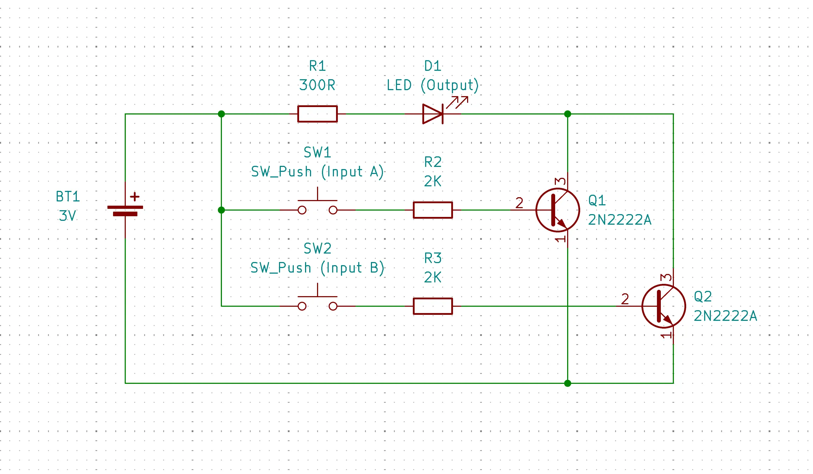
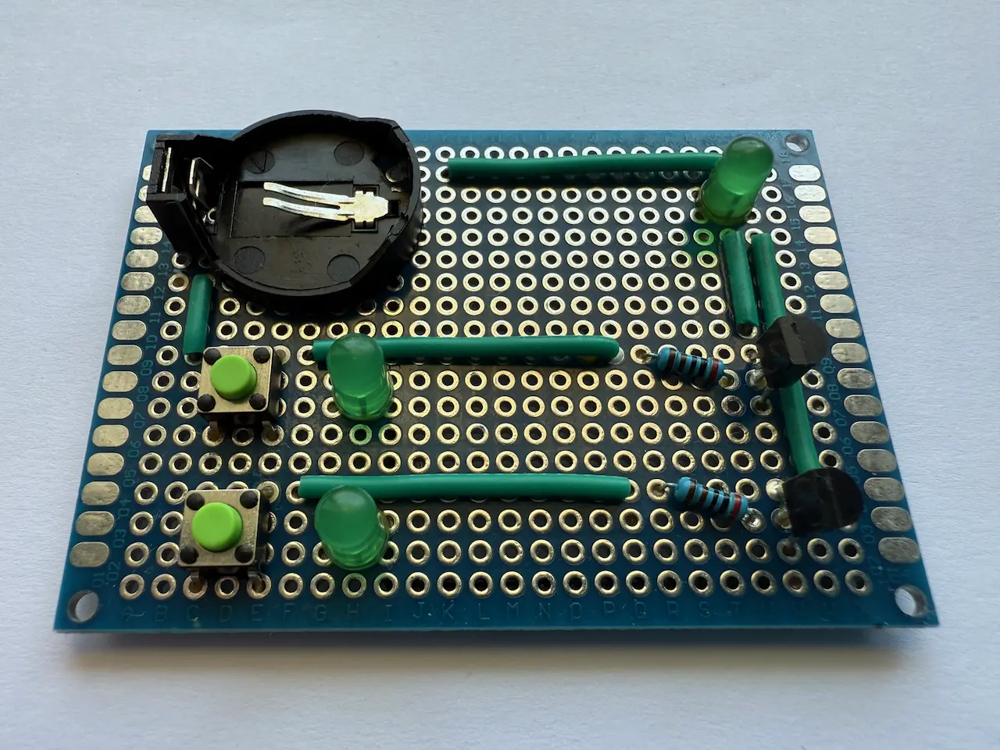
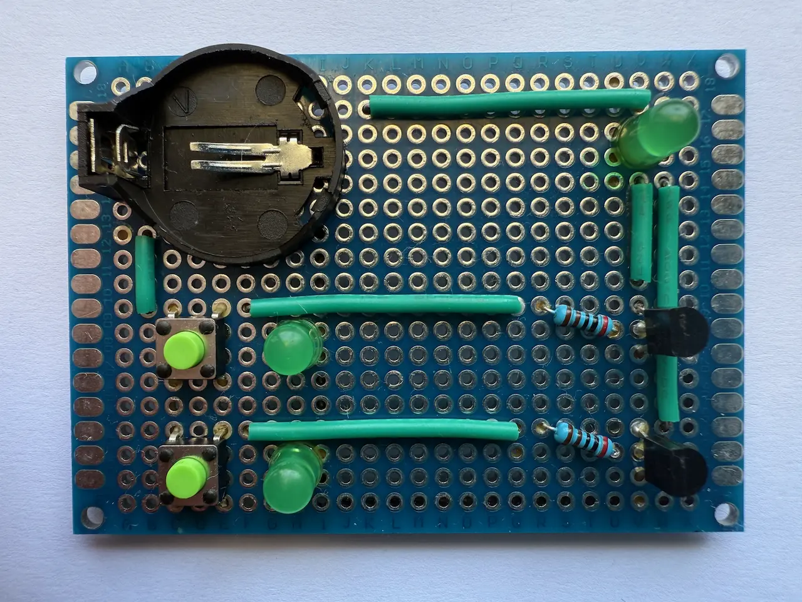
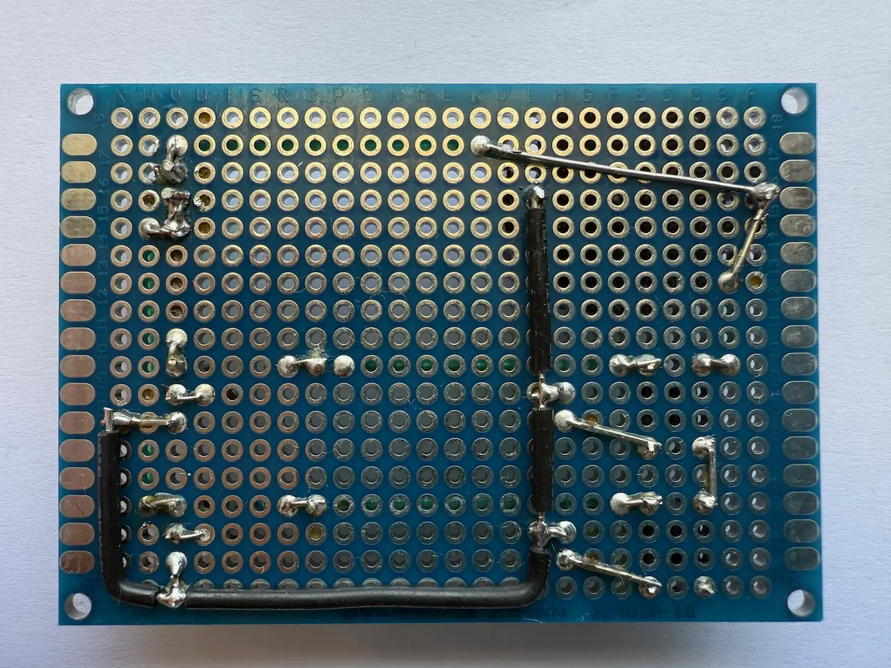

# OR Gate using transistors

The [OR Gate](https://en.wikipedia.org/wiki/OR_gate) is a basic digital logic gate that implements the logical **OR** function. It has two inputs and one output.
The full truth table showing all input and output states can be found below. Each row represents a physical state of the circuit.

### Truth table

| Input A | Input B | Output |
|---------|---------|--------|
| 0       | 0       | 0      |
| 0       | 1       | 1      |
| 1       | 0       | 1      |
| 1       | 1       | 1      |

### Circuit scheme

The inputs and output in the schematic correspond to the truth table headers.

### Implementation

For the implementation, NPN 2N2222A transistors were used.

|
:---:|:---:
 | 

The video demonstrates the circuit behavior for all input states.

<iframe class="rounded" src="https://youtube.com/embed/wrdaswq29Eg" title="YouTube video player" frameborder="0" allow="accelerometer; autoplay; clipboard-write; encrypted-media; gyroscope; picture-in-picture; web-share" referrerpolicy="strict-origin-when-cross-origin" allowfullscreen></iframe>
