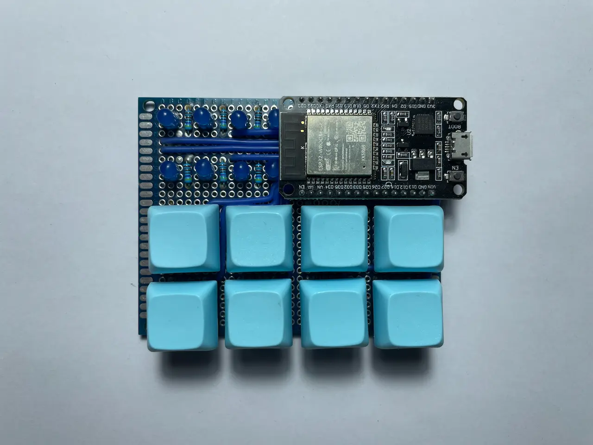
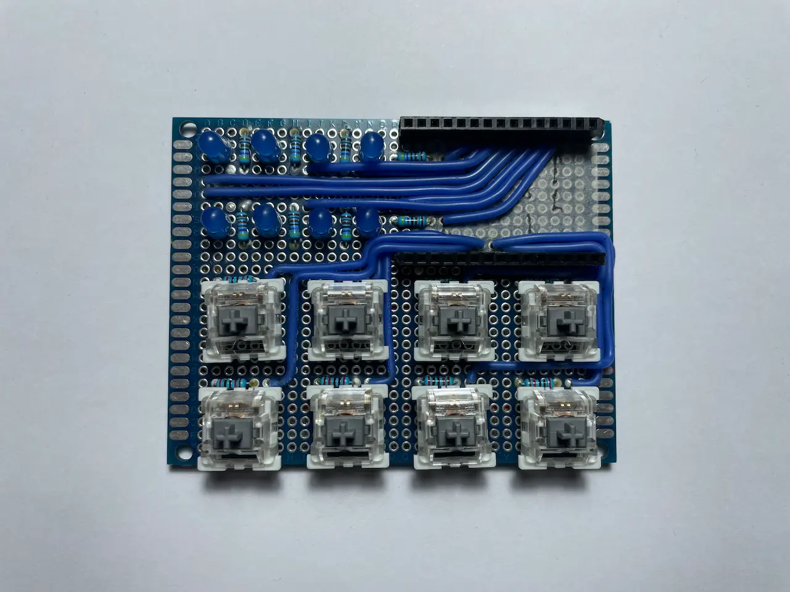
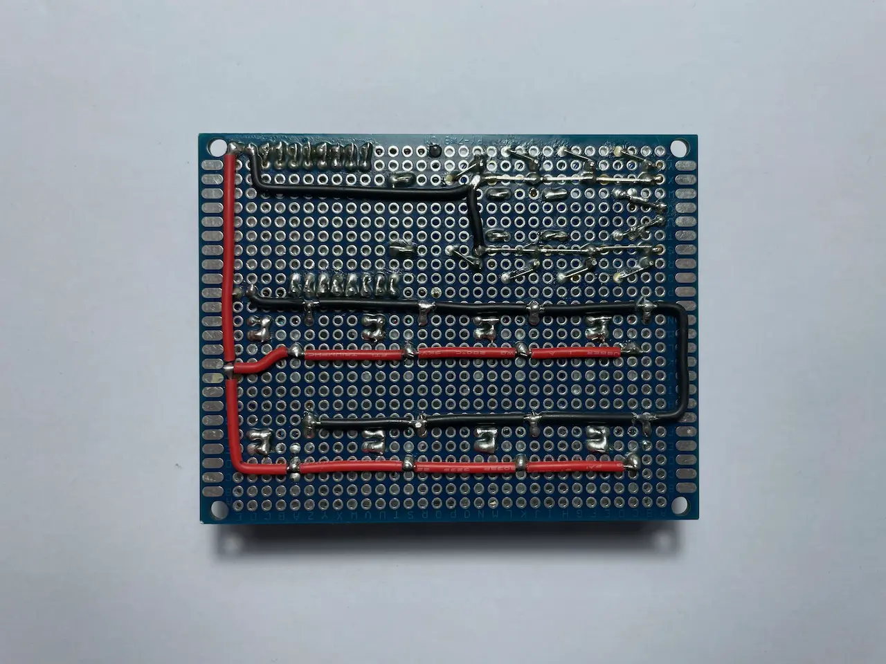

# ESP32 bluetooth mouse bot

This project showcases a bot that emulates a Bluetooth mouse using an ESP32 controller. 
It allows users to record and replay macros, automating repetitive tasks and enhancing user interaction through customizable input sequences.
You can find the source code for this bot [here](https://github.com/mrsuh/esp32-bluetooth-mouse-bot).


  


### States

The bot operates in several states:
* Init
* Not connected to a device
* Connected to a device
* Record state
* Playing state

Example logs showing state transitions:
```bash
-> Controller enabled
-> State: connected
-> State: record
-> Commands: left:48 down:87 right:4 wait:2 up:2 wait:5 click:1 scroll-down:1 wait:9 click:1
-> Commands saved to persistent memory
-> State: play
-> Commands loaded from persistent memory
-> Commands: left:48 down:87 right:4 wait:2 up:2 wait:5 click:1 scroll-down:1 wait:9 click:1
```

### Keyboard

The keyboard layout varies depending on the bot's current state.

`Connected to device`: You can start playing saved macros or begin recording a new one.

<br>

`Recording state`: You can move the mouse and use a button to stop recording.

<br>

### Video example

<iframe class="rounded" src="https://www.youtube.com/embed/MQdhbRVM0QM" title="YouTube video player" frameborder="0" allow="accelerometer; autoplay; clipboard-write; encrypted-media; gyroscope; picture-in-picture; web-share" referrerpolicy="strict-origin-when-cross-origin" allowfullscreen></iframe>
