# ESP32 cam watcher

This project helps me to observe my pot with pine's twig. I use ESP32 controller with camera to take pictures and post it to Telegram channel.
You can find the source code for this watcher [here](https://github.com/mrsuh/esp32-cam-watcher).

## Assembling

First versions of the watcher:

version 1 | version 2
:---:|:---:
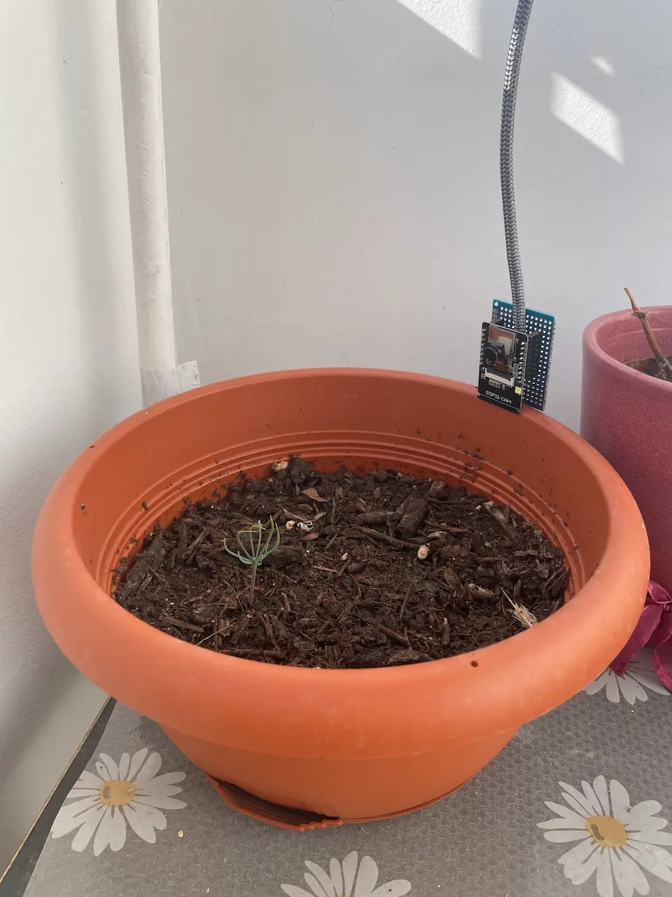 | 

Although first versions worked pretty well they had several flows:
* They didn't have indicators of power and state
* I couldn't switch states without uploading new code to controller
* I couldn't change camera position freely

To improve these flows I decided to add LEDs and buttons. 
First I assembled all the components with a plastic breadboard to test the idea:
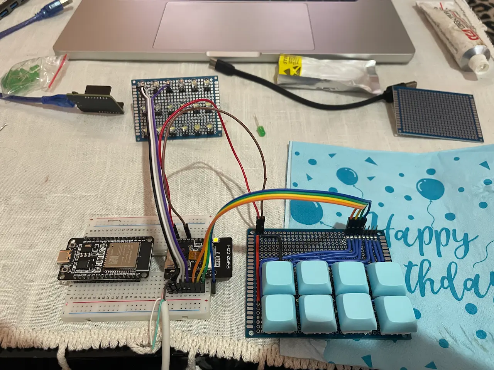

Then I soldered all the components:
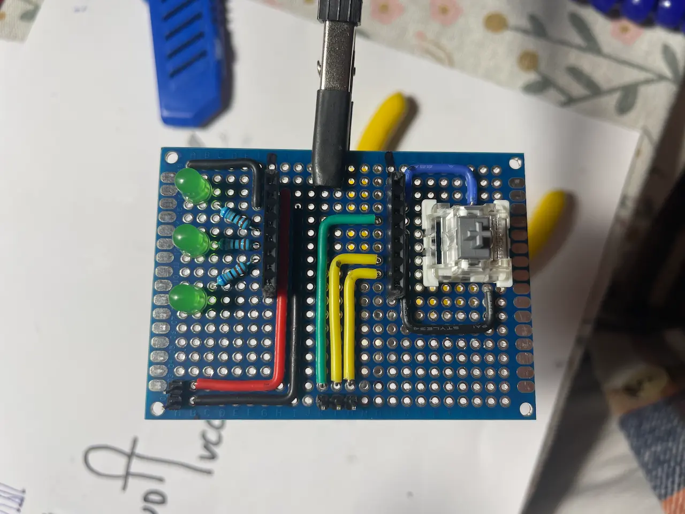
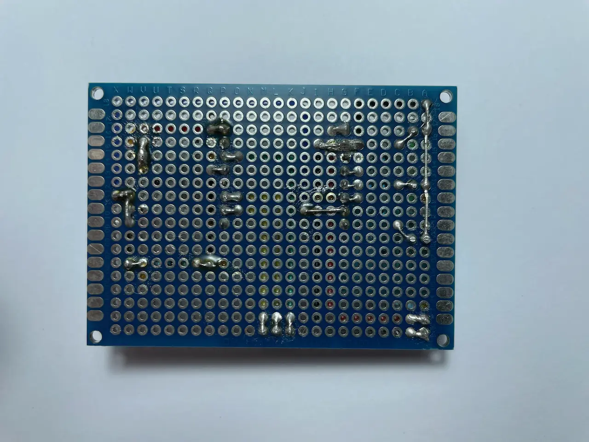
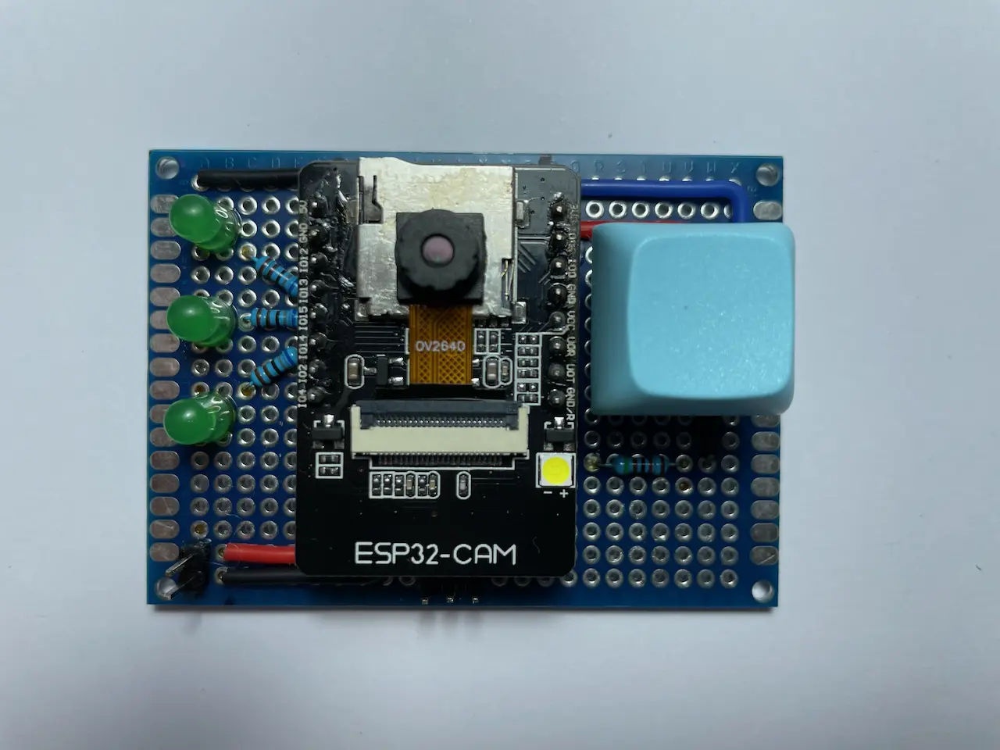

Schema of LEDs, buttons, and pins:


Now the watcher has:
* three LEDs to show power supply and state
* one button to switch between states
* several pins to power supply (VCC,GND) and debug controller (IO0,RX,TX)

## States

The watcher has 2 states:
* `setup`
* `watcher`

In the `setup` state you can connect to a local HTTP server and get a picture from the camera online. I need it to set up the camera position.

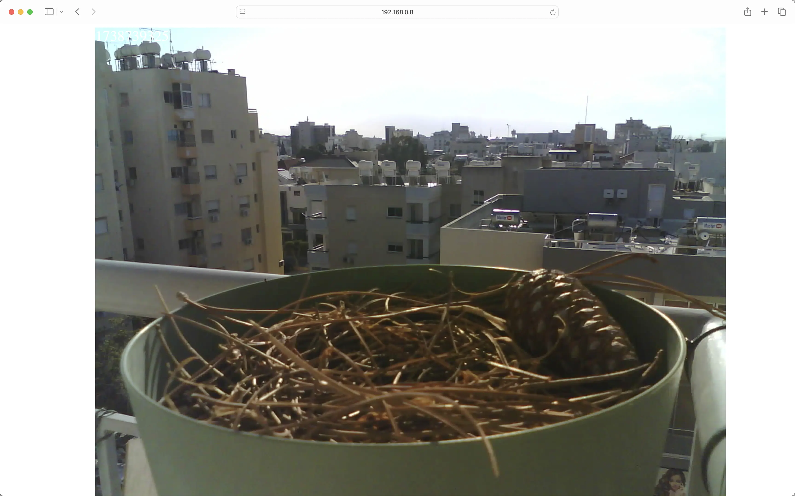

I bought a special stand to change the camera position freely:

front | side
:---:|:---:
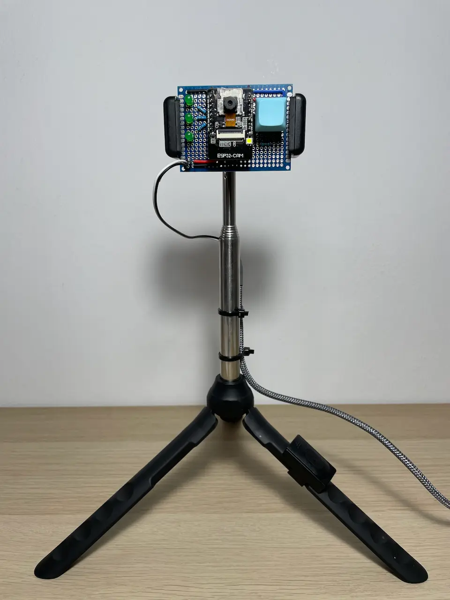 | 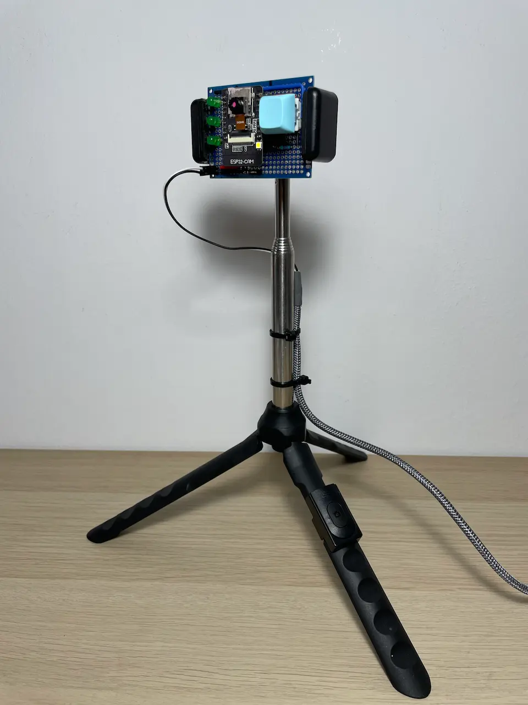

In the `watcher` state the camera gets an actual timestamp by NTP protocol from `pool.ntp.org`, takes a picture, and sends it to "hourly" and "daily" Telegram channels.
The controller stores the last sent time in a persistent memory. As a result there are no problems with sending schedule even after power outage.

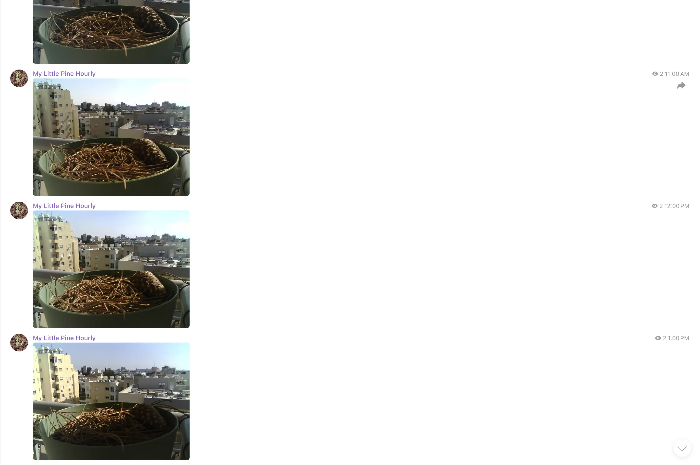

## Debug

You can connect to the controller with debug pins and read logs. There are logs in the `setup` state:
```bash
-> Controller enabled
-> Camera initializing
-> Camera initialized
-> WiFi connecting
-> .
-> WiFi connected: 192.168.0.8
-> Controller initialized
-> State: setup 
-> HTTP client connected
-> HTTP request GET /
-> HTTP response sended
-> HTTP client disconnected
-> HTTP client connected
-> HTTP request GET /picture
-> HTTP response sended
-> HTTP client disconnected
```

There are logs in the `watcher` state:
```bash
-> State: watcher
-> Sending a photo to an hourly channel
-> Current: timestamp:1735989368 hours:28933156
-> Last sended: hours:28933148
-> Connecting to api.telegram.org
-> Connection successful
-> Sending HTTP request
-> ....
-> Sending HTTP request done
-> HTTP Response: {"ok":true,"result":{...}}
```

## Conclusion

Currently, the camera is installed on the balcony and works pretty well.
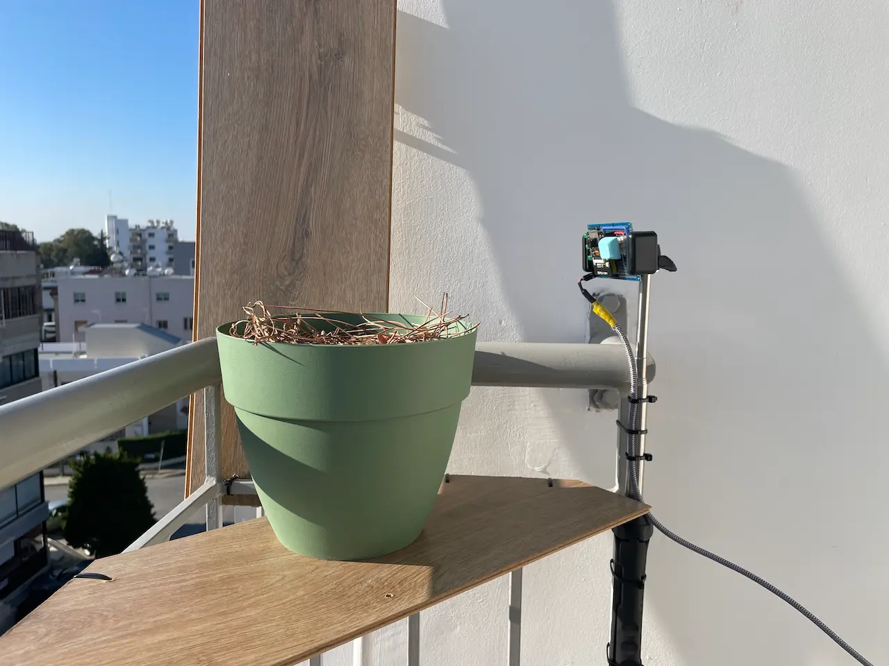
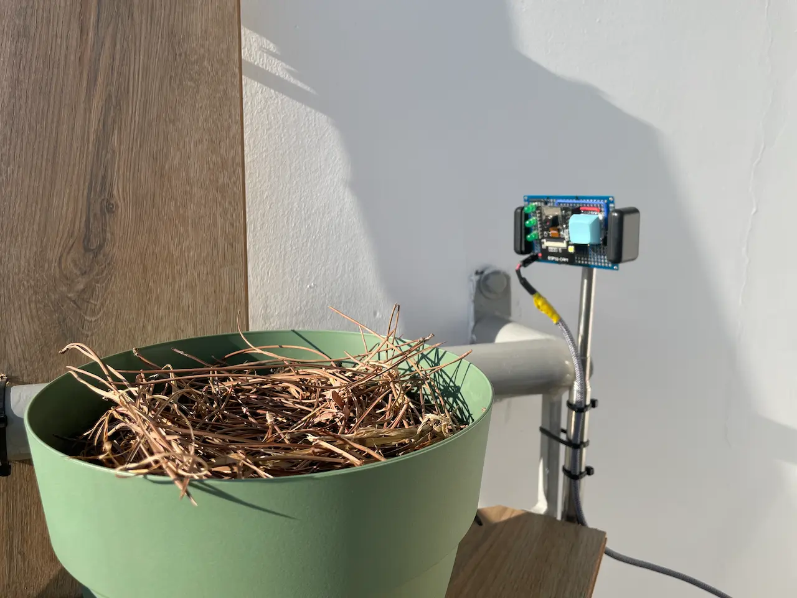
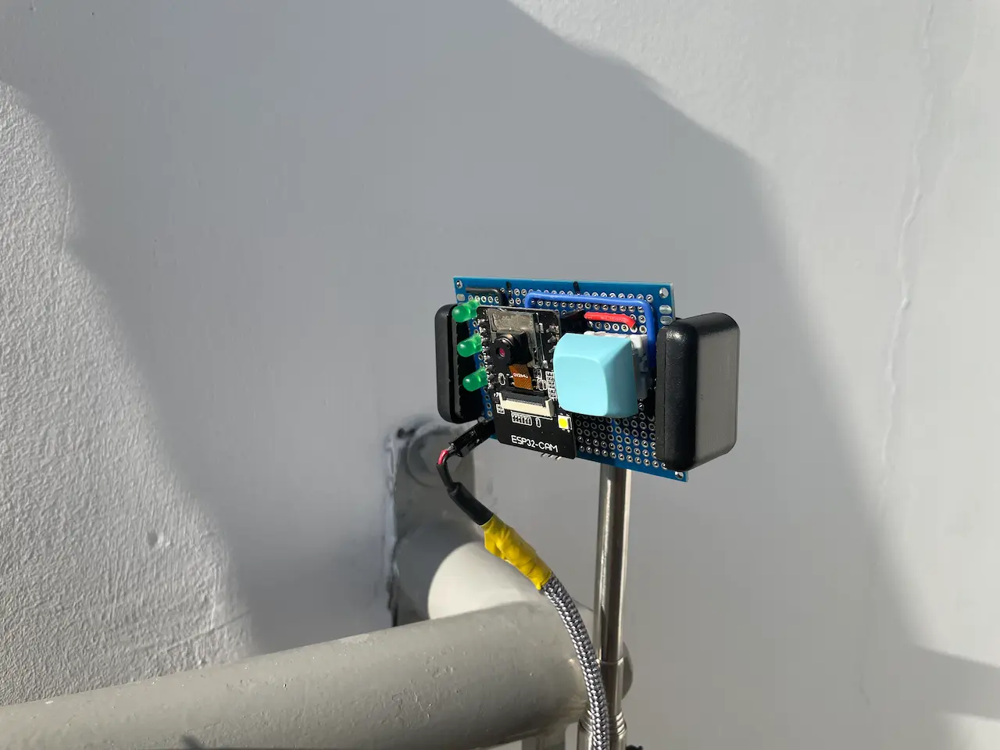

Growing pine from a seed is very hard for me. It's my the 3rd attempt for now. You can watch video I assembled from my hourly channel's photos.

<iframe class="rounded" src="https://www.youtube.com/embed/7hh2q1jP7Ew" title="YouTube video player" frameborder="0" allow="accelerometer; autoplay; clipboard-write; encrypted-media; gyroscope; picture-in-picture; web-share" referrerpolicy="strict-origin-when-cross-origin" allowfullscreen></iframe>
