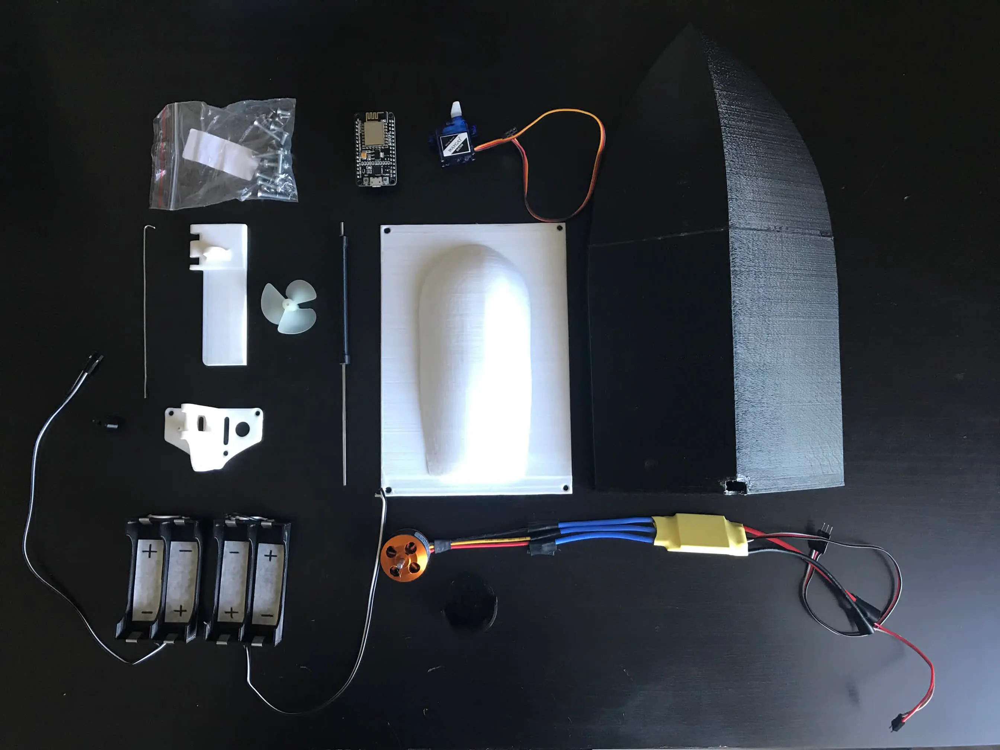
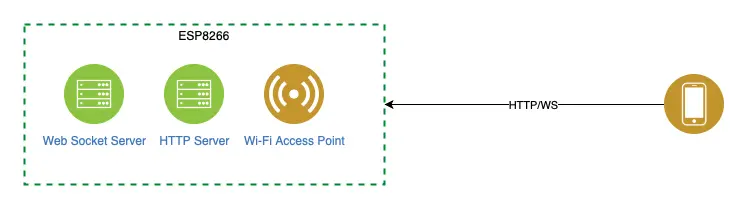
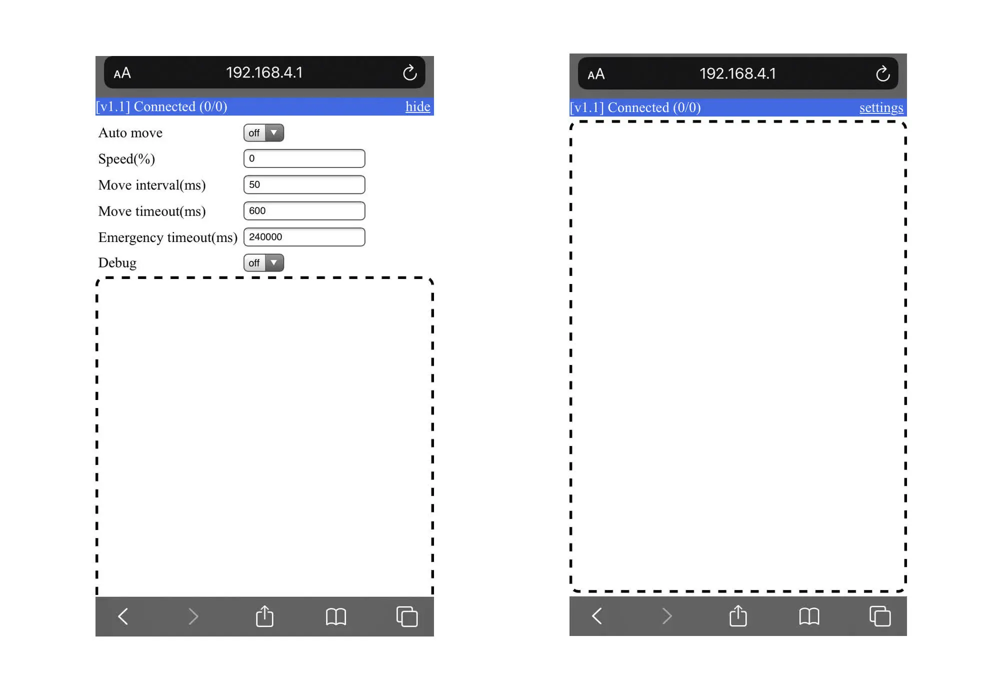
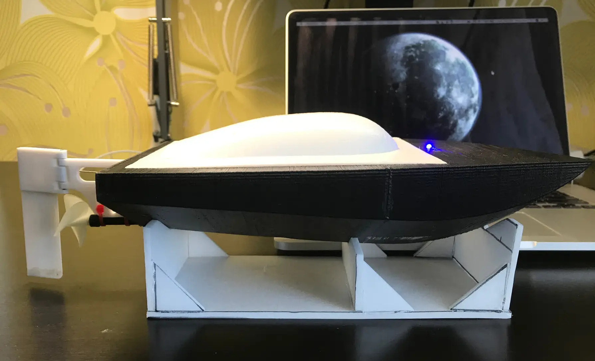

# ESP8266 RC boat

<iframe class="rounded" src="https://www.youtube.com/embed/2OwbVLAE5oU?si=AvKhG8UcZBwuWP8w" title="YouTube video player" frameborder="0" allow="accelerometer; autoplay; clipboard-write; encrypted-media; gyroscope; picture-in-picture; web-share" referrerpolicy="strict-origin-when-cross-origin" allowfullscreen></iframe>
 

## Materials:

* 3D printed boat
* ESP8266 NodeMCU;
* SG90 servo motor for the rudder (simple and affordable);
* Brushless motor (fast and powerful);
* Batteries
* 3 LEDs for debugging:
    + Power supply to the controller
    + Client connection to the WebSocket server
    + Command received from the client

## How it works

On the ESP8266, I configured the following:
* A Wi-Fi access point with a static IP address, enabling smartphone connections.
* An HTTP server that served an HTML page with a user interface.
* A WebSocket server to handle requests from the UI controller.

## Client UI

*Direction control*

*Speed control*

# Final version

You can read more in [this article](/articles/2020/rc-boat-with-esp8266-nodemcu/)

