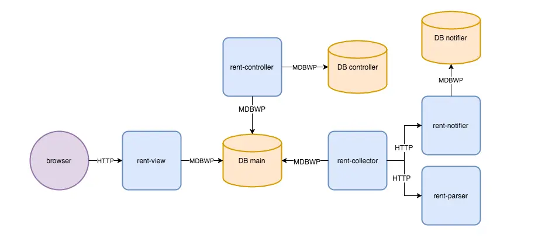
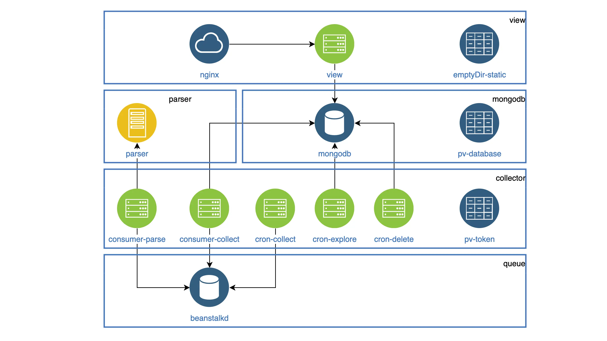

# SocRent

In March 2017, I launched a service for parsing and classifying apartment rental ads from vk.com.
You can read more [here](/articles/2017/classifying-housing-ads-in-search-of-the-best-solution/) about how I experimented with different methods to classify ads and ultimately chose the Yandex Tomita Parser as a lexical parser.
Developing the first version of the service took about a year.

## Architecture

* [rent-view](https://github.com/mrsuh/rent-view/tree/master) - the service renders HTML pages and serves it
* [rent-collector](https://github.com/mrsuh/rent-collector) - the service collects ads, classifies them, and saves them to the database
* [rent-parser](https://github.com/mrsuh/rent-parser) - the service extracts structured data from text using Tomita parser 
* [rent-control](https://github.com/mrsuh/rent-control) - admin panel
* [rent-notifier](https://github.com/mrsuh/rent-notifier) - notification service

You can also read [here](/articles/2017/architecture-of-a-service-for-collecting-and-classifying-housing-ads/) about the project's architecture and the technologies.

## Technologies

* PHP
* NodeJS
* Golang
* MongoDB
* Beanstalk Queue

## CI 

CI is set up for all services using Travis-CI and Ansible. 
More details about automated deployment can be found in [this article](/articles/2017/continuous-delivery-with-travis-ci-and-ansible/).

## Kubernetes

In 2020, I migrated my hobby project to Kubernetes.
You can read more in [this article](/articles/2020/how-i-migrated-my-hobby-project-to-k8s/)

